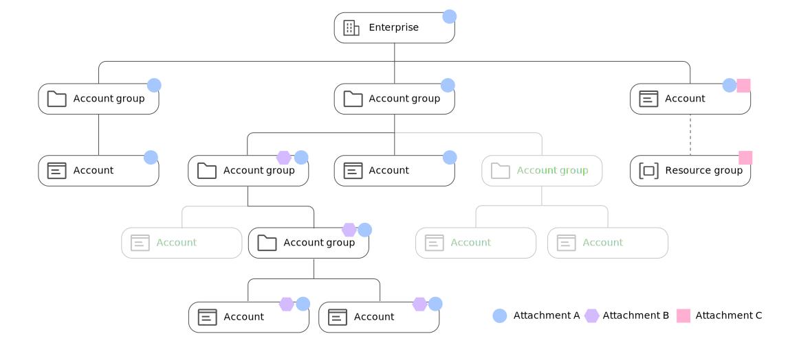

---

copyright:
  years: 2020, 2024
lastupdated: "2024-01-04"

keywords: scc best practices, enterprise, scc access

subcollection: security-compliance

---

{{site.data.keyword.attribute-definition-list}}

# Best practices for working with {{site.data.keyword.compliance_short}}
{: #best-practices}

As you start working with {{site.data.keyword.compliance_short}}, there are a few best practices that you can follow to have the best experience meeting your goal of continuous compliance and being audit ready.
{: shortdesc}

## Providing the correct access to the correct people
{: #bp-access}

There are several people in your organization who might require varying levels of access to {{site.data.keyword.compliance_short}} or integrations. To ensure that you're following best practices, be sure that you create access groups and assign only the minimum required permissions for team members to perform their duties. To manage compliance for an individual account, a compliance focal needs access to the {{site.data.keyword.compliance_short}} service, {{site.data.keyword.en_short}}, and Cloud Object Storage by using IAM access policies assign to the access group. To manage compliance for an enterprise, additional permissions are required. For more information, see [Assigning access](/docs/security-compliance?topic=security-compliance-assign-roles).

## Managing profiles
{: #bp-profiles}

In {{site.data.keyword.compliance_short}}, a [profile](/docs/security-compliance?topic=security-compliance-posture-management) is the collection of controls that you use to evaluate your compliance. When you work with {{site.data.keyword.compliance_short}}, you have the option to use a predefined profile or create a custom profile. There are pros and cons to both. 

### Working with predefined profiles
{: #bp-predefined}

Predefined profiles are versioned and periodically updated with bug fixes, more checks, or changes to the compliance program. If you are monitoring compliance for a specific program, such as {{site.data.keyword.cloud_notm}} Framework for Financial Services, it is recommended that you work with a predefined profile. This way you can take advantages of new versions of the profile as they become available. [Learn more about versioning](/docs/security-compliance?topic=security-compliance-predefined-profiles#profile-update-levels).

To avoid having to create and maintain a fully customized profile, you can customize a predefined profile by using [parameters](/docs/security-compliance?topic=security-compliance-posture-management). A parameter is the actual value that your resource is evaluated against. Each parameter is assigned a default value that can be edited at the time of attachment. Each attachment can be assigned a different parameter value, which then changes the evaluation that is completed. However, when a new version of a profile is released, you need to ensure that your customizations are made for the new profile version.

### Working with custom profiles
{: #bp-custom} 

If you want total control over your profile - the number of assessments, versioning, or naming, you might want to create a custom profile. With custom profiles, you can mix and match controls from different libraries or only select the assessments that apply to your use case. Or, you can create your own controls.

Although it is possible to add both custom and predefined controls to a profile, it is recommended that you create a separate profile for any controls that you want to add. By keeping predefined and custom controls separate, you are able to update to new versions of the predefined profiles more easily as you won't need to redo your customizations.

You cannot create custom profiles from deprecated control library versions. To get started, work with the most recent version.
   {: tip}

## Defining scopes in enterprise accounts
{: #bp-enterprise}

When you work with {{site.data.keyword.compliance_short}} through an enterprise account, your experience is a bit different when it comes to your set up options. As an enterprise, you have more scope options than an account. You can choose to evaluate your entire enterprise, specific account groups, or single accounts. It is recommended that if you want to evaluate a single account that you do so from that account.

If you are working in an enterprise account, you must have additional permissions for the enterprise to manage and see results. For more information, see [Assigning access](/docs/security-compliance?topic=security-compliance-assign-roles).
{: note}

A scope defines which resources in your accounts are evaluated. It is defined when you create an attachment by selecting the parent account or resource group that you want to evaluate. Anything that exists within that account or group is evaluated. So, for example, if you create an attachment at the enterprise account level, then all of the account groups and accounts within them are included in your evaluation. If you don't want to evaluate an account, you can always exclude it from your scope when you create the attachment. When an account is excluded, any of its child accounts are also excluded. However, as new accounts are added to your enterprise, they are automatically evaluated according to the parent account's attachment.

Check out the following diagram to see how three attachments can co-exist within an enterprise.

{: caption="Figure 1. Attachment hierarchy" caption-side="bottom"}

Attachment A
:   In Attachment A, the target scope is the full enterprise. As you can see, all account groups and accounts that exist within the enterprise are evaluated. That is, unless they have been purposefully excluded. 

Attachment B
:   The target scope of Attachment B is a specific account group within an enterprise. As you can see, the resources in the account group are now being evaluated against the profile that is selected during Attachment A and are evaluated according to the profile selected when Attachment B was created.

Attachment C
:   The target scope of Attachment C is a child account. This attachment was created in the account, outside of the context of the enterprise. As you can see, Attachment A is monitoring the resources in the same account, but because Attachment C is created at the account level, resource groups are able to be seen and excluded.

To view the results of an evaluation, you look in the account where the attachment was created. If you use the previous image as an example, attachment A and B's results would exist within the enterprise account, and the enterprise account is charged for the evaluation. However, attachment C's results would exist within the child account. 

