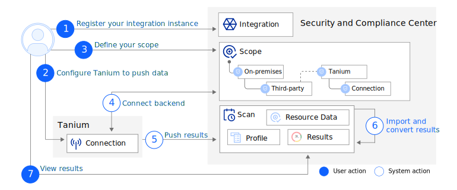

---

copyright:
  years: 2017, 2021
lastupdated: "2021-07-12"

keywords: Centralized security, tanium, compliance monitoring, compliance, 

subcollection: security-compliance

---

{:codeblock: .codeblock}
{:screen: .screen}
{:download: .download}
{:external: target="_blank" .external}
{:faq: data-hd-content-type='faq'}
{:gif: data-image-type='gif'}
{:important: .important}
{:note: .note}
{:pre: .pre}
{:tip: .tip}
{:preview: .preview}
{:deprecated: .deprecated}
{:beta: .beta}
{:term: .term}
{:shortdesc: .shortdesc}
{:script: data-hd-video='script'}
{:support: data-reuse='support'}
{:table: .aria-labeledby="caption"}
{:troubleshoot: data-hd-content-type='troubleshoot'}
{:help: data-hd-content-type='help'}
{:tsCauses: .tsCauses}
{:tsResolve: .tsResolve}
{:tsSymptoms: .tsSymptoms}
{:java: .ph data-hd-programlang='java'}
{:javascript: .ph data-hd-programlang='javascript'}
{:swift: .ph data-hd-programlang='swift'}
{:curl: .ph data-hd-programlang='curl'}
{:video: .video}
{:step: data-tutorial-type='step'}
{:tutorial: data-hd-content-type='tutorial'}
{:ui: .ph data-hd-interface='ui'}
{:cli: .ph data-hd-interface='cli'}
{:api: .ph data-hd-interface='api'}


# Connecting Tanium
{: #setup-tanium}

With [Tanium&trade; Comply](https://docs.tanium.com/comply/comply/index.html){: external}, you can evaluate your organizations endpoints for potential vulnerabilities and misconfigurations against industry security standards, vulnerability definitions, and custom compliance checks. When you integrate Tanium with the {{site.data.keyword.compliance_full}}, you can view all of your compliance data in one location in the same format.
{: shortdesc}

If you're an existing Tanium Comply on-prem user, you must contact your TAM or account team to obtain a link to the new build in order to get started with the integration. Automatic upgrades of Connect will occur for Tanium-managed customers over the next two weeks.
{: note}

To learn more about how the integration is configured, check out the following diagram.


{: caption="Figure 1. Tanium integration flow" caption-side="bottom"}

1. In your Tanium instance, create a connection that contains the compliance data that you want to see in {{site.data.keyword.cloud_notm}} so that you can see both {{site.data.keyword.cloud_notm}} and Tanium results in one view.
2. In your {{site.data.keyword.cloud_notm}} account, register your integration with the {{site.data.keyword.compliance_short}}.
3. Define a scope to link the connection that you created in Tanium with the {{site.data.keyword.compliance_short}}.
4. In the background, the {{site.data.keyword.compliance_short}} creates the backend connection when the scope is created.
5. Based on the schedule that you defined in your connection, Tanium pushes the data in your account to the {{site.data.keyword.compliance_short}}.
6. The {{site.data.keyword.compliance_short}} receives the data and converts the format to match your preferred format before calculating your compliance score.
7. You can navigate to the Scans page of the {{site.data.keyword.compliance_short}} UI to view your results.


## Before you begin
{: #before-tanium}

Before you get started, be sure that you have the following prerequisites.

* An {{site.data.keyword.cloud_notm}} account.
* A Tanium instance.
* The required level of access to create and manage integrations in {{site.data.keyword.compliance_short}}. For more information, see [Assigning access](/docs/security-compliance?topic=security-compliance-access-management).
  * To integrate with Tanium, you need the *administrator* platform role for the {{site.data.keyword.compliance_short}} service. 
  * To pull results from Tanium, you must have the *administrator* platform role or higher for the {{site.data.keyword.compliance_short}} service.
  * To complete the scan, you must have access to the resources in Tanium that you want to validate.


## Registering the integration
{: #register-tanium}

To get started, you must register an integration with the {{site.data.keyword.compliance_short}}. 

1. In the {{site.data.keyword.cloud_notm}} console, click the **Menu** icon  **> Security and compliance** to access the {{site.data.keyword.compliance_short}}.
2. In the navigation, click **Integrations**.
3. In the **Tanium** tile, click **Connect**.
4. Provide a name for your connection.
5. Enter your dashboard URL in the **Registration URL** field.
6. Click **Next**. You see that you're currently connecting using "Push" mode in order to "Validate" your resources.
6. Choose whether to receive your results in **OSCAL** or **Native** Tanium format.
7. Click **Connect**. A service ID and API key are generated on your behalf.
8. From the modal, copy the API key that is shown. You use this key later to push the results to the {{site.data.keyword.compliance_short}}.


## Exporting your data from Tanium
{: #export-tanium}

In order to see your data in the {{site.data.keyword.compliance_short}}, you need to package and export it from Tanium. You can do so by creating a saved question and using that question to create a connection.

1. Log in to your Tanium account and navigate to the **Home** page.
2. In the **Explore data** section, ask a question to obtain the data that you want to export. For example, your question might be similar to *Get computer name and comply - compliance findings from all machines*.
3. Review the results that are returned and click **Save**.
4. Give your question a name and select the settings on the page that match your preferences before you click **Save**. 
5. Confirm that you want to save the question by clicking **Yes**.
6. Go to **Modules > Connect** and click **Create Connection**. 
7. Give your connection a name. Optionally, you can add a description.
8. From the available drop-downs, make the following selection.
  <table>
  <caption>Table 1. Tanium drop-down selections</caption>
    <tr>
      <th>Drop-down</th>
      <th>Selection</th>
    </tr>
    <tr>
      <td>Source</td>
      <td>Saved Question</td>
    </tr>
    <tr>
      <td>Saved Question Name</td>
      <td>The name of the question that you previously created.</td>
    </tr>
    <tr>
      <td>Computer Group</td>
      <td>The computers that you want to include in your exported data.</td>
    </tr>
    <tr>
      <td>Destination</td>
      <td>{{site.data.keyword.compliance_full}}</td>
    </tr>
    <tr>
      <td>Frequency</td>
      <td>The frequency at which you want to export your data. Most often, <strong>One run per day, every day</strong> is selected.</td>
    </tr>
  </table>
9. Input the time at which you want to export your data.
10. Click **Save**.


## Importing your data to {{site.data.keyword.compliance_short}}
{: #import-tanium}

Now that your data is prepared to export on a schedule, you can create a scope 

1. In the {{site.data.keyword.cloud_notm}} console, click the **Menu** icon  **> Security and compliance** to access the {{site.data.keyword.compliance_short}}.
2. Navigate to **Manage posture > Configure > Scopes** and click **Create** to define a new scope.
3. Give your scope a name and optionally provide a description.
4. From the available drop-downs, make the following selections and then click **Next**.
  <table>
  <caption>Table 2. {{site.data.keyword.cloud_notm}} selections</caption>
    <tr>
      <th>Drop-down</th>
      <th>Selection</th>
    </tr>
    <tr>
      <td>Environment</td>
      <td>On-premises</td>
    </tr>
    <tr>
      <td>Discovery method</td>
      <td>Connect third-party resources</td>
    </tr>
    <tr>
      <td>Third-party service</td>
      <td>Tanium</td>
    </tr>
    <tr>
      <td>Connection</td>
      <td>The connection that you previously created.</td>
    </tr>
  </table>
5. You see a note that says *Collectors not required*. In this case, Tanium acts as the collector. Click **Next** again.
6. Review your scope's configuration and click **Create**.
7. On your scope details page, you see a URL. By using the API key that was generated when you registered your integration, run the POST request to import your data. Your request should look similar to the following example.

  ```
  curl -X POST "https://<region>.compliance.cloud.ibm.com/exchangeprotocol/v1/scope/<scope_id>/results?account_id=<account_id>&result_type=VALIDATION" -H 'Authorization: Bearer <IAM_token>' -H 'Content-type: application/json'
  ```
  {: codeblock}

Forgot to copy the API key? No problem. By using the IAM UI, find the service ID that was generated with the API key and create a new API key for that ID. You can then use that API key to make the request.
{: tip}


## Viewing your results
{: #view-tanium}

When your data is imported to the {{site.data.keyword.compliance_short}}, it is reformatted and a validation scan is run that identifies any potential issues in your resources. As part of the scan, a calculation is run that evaluates your level of compliance and provides you with a score so that you can easily see how you are adhering to requirements as an organization.

A profile is added to your list of available profiles that contains the goals that were scanned as part of your Tanium scan when you post your results.
{: tip}

When your scan is complete, you can return the {{site.data.keyword.compliance_short}} UI to view your results.

1. In the {{site.data.keyword.cloud_notm}} console, click the **Menu** icon  **> Security and compliance** to access the {{site.data.keyword.compliance_short}}.
2. Navigate to **Manage posture > Assess > Scans**.
3. Click the name of the scan that corresponds to your Tanium results. 

  A scan details page opens. On your scan details page, you can view any potential issues by control or by resource and view your compliance score. You can also see a history of scans that were previously run on your data. The formatting of your results might vary depending on the format that you selected as part of set up.
