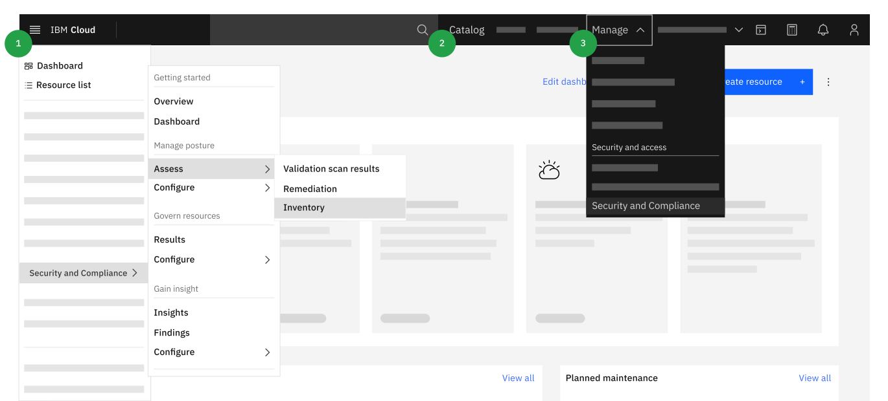

---

copyright:
  years: 2020, 2022
lastupdated: "2022-10-04"

keywords: getting started with the security and compliance center, get started, security, compliance

subcollection: security-compliance

---

{:codeblock: .codeblock}
{:screen: .screen}
{:download: .download}
{:external: target="_blank" .external}
{:faq: data-hd-content-type='faq'}
{:gif: data-image-type='gif'}
{:important: .important}
{:note: .note}
{:pre: .pre}
{:tip: .tip}
{:preview: .preview}
{:deprecated: .deprecated}
{:beta: .beta}
{:term: .term}
{:shortdesc: .shortdesc}
{:script: data-hd-video='script'}
{:support: data-reuse='support'}
{:table: .aria-labeledby="caption"}
{:troubleshoot: data-hd-content-type='troubleshoot'}
{:help: data-hd-content-type='help'}
{:tsCauses: .tsCauses}
{:tsResolve: .tsResolve}
{:tsSymptoms: .tsSymptoms}
{:java: .ph data-hd-programlang='java'}
{:javascript: .ph data-hd-programlang='javascript'}
{:swift: .ph data-hd-programlang='swift'}
{:curl: .ph data-hd-programlang='curl'}
{:video: .video}
{:step: data-tutorial-type='step'}
{:tutorial: data-hd-content-type='tutorial'}
{:ui: .ph data-hd-interface='ui'}
{:cli: .ph data-hd-interface='cli'}
{:api: .ph data-hd-interface='api'}
{:release-note: data-hd-content-type='release-note'}

# Getting started with {{site.data.keyword.compliance_short}}
{: #getting-started}

With {{site.data.keyword.compliance_full}}, you can promote a culture of compliance within your organization that begins with resource configuration and holds through the collection of audit evidence. With automation in place to stop mistakes, you're able to build and scale your workloads with full control while your teams are able to code with accountability and confidence. All while saving your business time and money.
{: shortdesc}

## What is the {{site.data.keyword.compliance_short}}?
{: #gs-what-scc}

Security and compliance are two concepts that are often spoken of interchangeably. But, there are some significant differences between them. For example, compliance regulations change slowly and are generally measured as a snapshot in time. Whereas security threats are constant and always changing. Depending on the role that you fill in your organization, you might focus on ensuring compliance to industry regulations or you might focus more on mitigating incoming security threats.

The {{site.data.keyword.compliance_short}} is comprised of two components - Posture Management and Configuration Governance that are directly integrated with the platform and designed to help you achieve a continuously secure and compliant development environment in different ways. For example, you can:

* Work with predefined controls that are implemented across your {{site.data.keyword.cloud_notm}} accounts
* Define configuration rules and templates that prevent unsecure configuration of {{site.data.keyword.cloud_notm}} resources
* Monitor your resource configurations in a single dashboard for any potential risk
* Investigate the evaluation results to see which accounts or services are most at risk
* Retain and access your results to prepare for internal and external audits

### Prevent misconfiguration of your resources
{: #govern-resources}

The ability to standardize how resources are provisioned and configured across your {{site.data.keyword.cloud_notm}} accounts is the key to the success of your organization's security policies. By using the Configuration Governance component of the {{site.data.keyword.compliance_short}}, you can create rules and templates that set guardrails around the way that your resources can be configured. Through rule enforcement and customized defaults, you can code with confidence that your configurations follow the guidelines that you put in place, which significantly decreases the likelihood of a misconfiguration-related security issue.

To get started, choose whether to create [a rule](/docs/security-compliance?topic=security-compliance-rules-define) or [a template](/docs/security-compliance?topic=security-compliance-templates-define).

&ast;*Configuration Governance is available for {{site.data.keyword.cloud_notm}} only.*

### Monitor for and prove compliance
{: #prove-compliance}

Ensuring that all the teams in your organization are adhering to best practices and external regulations or laws at all times can be a time consuming process. With the Posture Management component of the {{site.data.keyword.compliance_short}}, you can scan the available resources in your environments on a schedule and create an inventory that can be used as part of an audit. As part of the scan, the {{site.data.keyword.compliance_short}} validates your configurations against a predefined set of control implementations called goals before calculating a compliance score. Your score can help you to know which issues that you need to address first. Then, when you're ready, you can download a detailed evidence report that you can provide to internal stakeholders or external auditors.

To start monitoring your IBM Cloud resources for compliance, you'll need to configure credentials, deploy a collector, and schedule a scan. For help getting set up, see the turtorial series - [Monitoring {{site.data.keyword.cloud_notm}} resources](/docs/security-compliance?topic=security-compliance-ibm-credential).

&ast;*Posture Management is available for {{site.data.keyword.cloud_notm}}, Amazon Web Services, Microsoft Azure, Google Cloud Platform, and on-premises environments. To enable monitoring for other cloud providers, see [Manually administering collectors](/docs/security-compliance?topic=security-compliance-collector-manual).*

## How do I access the {{site.data.keyword.compliance_short}}?
{: #gs-access-scc}

Because the {{site.data.keyword.compliance_short}} is built into the platform and available by default, you can access the UI in several different ways.

{: caption="Figure 1. How to access {{site.data.keyword.compliance_short}}" caption-side="bottom"}

After signing into {{site.data.keyword.cloud_notm}}, you can access the {{site.data.keyword.compliance_short}}:

1. By clicking the **Menu** icon  **> Security and Compliance** in the navigation.
2. By searching for **Security and Compliance Center** in the {{site.data.keyword.cloud_notm}} catalog.
3. By selecting **Security and Compliance** from the **Manage** drop-down.

