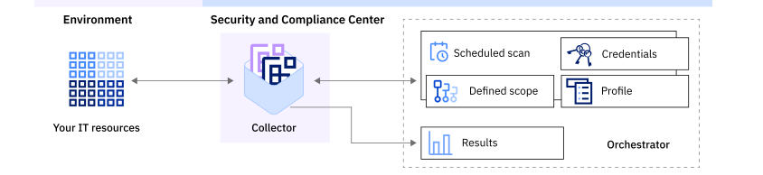

---

copyright:
  years: 2020, 2022
lastupdated: "2022-06-13"

keywords: collector, security and compliance, security, compliance, install, resource monitoring, configuration monitoring, security, approve collector, register collector, use credentials

subcollection: security-compliance

---

{:codeblock: .codeblock}
{:screen: .screen}
{:download: .download}
{:external: target="_blank" .external}
{:faq: data-hd-content-type='faq'}
{:gif: data-image-type='gif'}
{:important: .important}
{:note: .note}
{:pre: .pre}
{:tip: .tip}
{:preview: .preview}
{:deprecated: .deprecated}
{:beta: .beta}
{:term: .term}
{:shortdesc: .shortdesc}
{:script: data-hd-video='script'}
{:support: data-reuse='support'}
{:table: .aria-labeledby="caption"}
{:troubleshoot: data-hd-content-type='troubleshoot'}
{:help: data-hd-content-type='help'}
{:tsCauses: .tsCauses}
{:tsResolve: .tsResolve}
{:tsSymptoms: .tsSymptoms}
{:java: .ph data-hd-programlang='java'}
{:javascript: .ph data-hd-programlang='javascript'}
{:swift: .ph data-hd-programlang='swift'}
{:curl: .ph data-hd-programlang='curl'}
{:video: .video}
{:step: data-tutorial-type='step'}
{:tutorial: data-hd-content-type='tutorial'}
{:ui: .ph data-hd-interface='ui'}
{:cli: .ph data-hd-interface='cli'}
{:api: .ph data-hd-interface='api'}
{:release-note: data-hd-content-type='release-note'}

# What is a collector?
{: #collector}

A collector is used by {{site.data.keyword.compliance_full}} to gather the configuration information of your resources and then validate it against your specific security standards. 
{: shortdesc}

A collector is a software module, which is packaged as a container image, and is installed on infrastructure that has access to your resources. Check out the following image to see how the collector fits into the {{site.data.keyword.compliance_short}} workflow.

{: caption="Figure 1. Collector deployment" caption-side="bottom"}

When it is time for a scheduled scan to run, the orchestrator sends a signal to the collector to initiate the scan. Using the credentials that are stored in the orchestrator, the collector gathers the configuration information from the resources in your defined scope. Then, the collector validates the information by using your selected profile and calculates a compliance score before the results are returned to the orchestrator.

If you're working with VPC, you can keep a history of all network connections that a collector initiates for future audits, by enabling [Flow Logs](/docs/vpc?topic=vpc-ordering-flow-log-collector).
{: tip}

## Understanding collector deployment
{: #collector-deployment}

When you work with collectors, you can either manage the lifecycle yourself or you can have IBM manage it on your behalf.

IBM-managed collectors
:   When you choose to have IBM manage your collector, it is installed on IBM infrastructure as a Universal Base Image (UBI). IBM is responsible for the installation and management for the lifecycle of the collector. This option gives you the ability to focus on just the health and security of your resources. Before you get started, be sure that you understand [the limitations](/docs/security-compliance?topic=security-compliance-known-issues-limits#ibm-collector-limits).

Customer-managed collectors
:  In some situations, an IBM-managed collector might not be possible. If your organization has policies about the ownership of infrastructure or specific security constraints, you can always continue to manage your own collector. If your organization chooses to manage your own collectors, you are responsible for the installation and management of the collector. You own the infrastructure and you have total control over where the collector is installed.

You can install the collector as a UBI or Ubuntu container image. Ubuntu images are disk-images that are designed to run on the Ubuntu OS. The Ubuntu image is not compliant with the Federal Information Processing Standards (FIPS).

### Working with multiple collectors
{: #collector-multiple}

If you're working with more than one cloud provider or an on-premises environment, you might need to install more than one collector. A collector is only able to access the subnets that it has appropriate access to. For example, the collector might need to have `icmp ping` access to run an Nmap scan, `SSH` access for accessing VMs or `winrm` access to access a windows machine. One collector is able to access multiple subnets, but you must be sure that it is correctly sized to scan a specified environment.

If your collector needs to access multiple subnets, you must add them to the subnet list for the collector. The filename that you need to update is `<collector_dir_path>/config/discovery_subnet_list.cfg`.

### Understanding the Watchtower image
{: #collector-watchtower}

When you install a collector, you install two images both the collector image and a Watchtower image. The Watchtower image continuously monitors the Container Registry where the collector image is stored to detect updates to the image. If an update is detected, the Watchtower image forces an update to the collector. For more information about Watchtower, see the [open source docs](https://github.com/containrrr/watchtower){: external}.

### Understanding your responsibilities
{: #collector-responsibilities}

If you choose to work with an IBM-managed collector, you are responsible only for providing the credentials that a collector needs to access your resources. 

If you choose to create and install your own collector, you are responsible for the stability of the virtual machine. Your responsibilities include processing power, disk space, clearing logs, controlling access, and opening ports. You are also responsible for updating or patching the Watchtower image if a new vulnerability is exposed.

With collectors that run on UBI, you cannot collect facts from computers that use Windows OS. However, collectors that run on Ubuntu support Windows OS and they are not FIPS-compliant.
{: note}

## Understanding communication
{: #collector-communication}

The collector acts as an intermediary between your resources and the service. The following sections detail how the communication takes place and how it is secured.

### Between the collector and the {{site.data.keyword.compliance_short}}
{: #collector-comm-service}

All communication between the collector and the service is TLS 1.2+ encrypted and signed with the collector's public key. All traffic is transported over the public internet by using Cloud Internet Services with TLS termination, DDoS protection, and a Web Application Firewall (WAF). Although the transportation takes place through a trusted intermediary, be sure that you consider the communication path as part of your security and risk assessment when you deploy collectors.

The collector sends a regular heartbeat every minute to notify the service that it is active and ready to run commands. As a response to that heartbeat, the service might send a command for the collector to run, such as running a discovery scan.

### Between the collector and your resources
{: #collector-comm-resource}

To gather information about your resources, the collector must be able to connect to them by using a combination of methods, including API calls, SSH, Shell commands, and Windows PowerShell. The communication is able to occur only because the collector uses credentials that you associate with it through the {{site.data.keyword.compliance_short}} UI. To communicate with them, the collector needs to use credentials that have `read` access to your resources.

Working with an account that restricts access to specific IPs? If you're using an IBM-managed collector, you must update your account settings to allow the collector to access and collect data. For more information, see [Updating your IP address restrictions](/docs/security-compliance?topic=security-compliance-ibm-collector#before-collector-ip-address).
{: note}

Collectors that run in an on-premises environment use Nmap to scan and discover resources. The collector uses SSH or the equivalent to connect to and query the resources for the configurations. The network and ports on the VMs must allow for the connectivity.

For more information about granting the authorization between a collector and your resources, see [Managing credentials](/docs/security-compliance?topic=security-compliance-credentials).
{: tip}

## Understanding how collected data is used
{: #collector-data}

The collector uses the data that is collected to validate the controls before it sends the results to the {{site.data.keyword.compliance_short}} for storage and reporting. The data that is collected varies depending on the environment that you're working with and the type of credentials that you provide. For cloud environments, a significant portion of the data is available as metadata. If you're working with an on-premises environment, some of the data is typically stored in configuration management databases. Collected data includes the properties and configurations for supported services, network objects, hosts, databases, Kubernetes platforms, and virtual machines. 

## Understanding collector statuses
{: #collector-status}

When you are looking at the UI, you might see the following collector statuses. You can monitor the status changes of your collectors. Additionally, you can filter your list of collectors in the UI by selecting the statuses that you want to observe.

| Status | Description |
| ------ | ----------- |
| Activating collector | Your collector is being activated. | 
| Active | Your collector is now active. |
| Approval required | You must approve the activation of your collector. |
| Deleted | Your collector was deleted. |
| Download in progress | Your collector is downloading. |
| Expired | Your collector expired. |
| Inactive | Your collector is not active. |
| Install in progress | Your collector is being installed. |
| Installation failed | Your collector failed to install. |
| Passphrase required | You must provide a passphrase. |
| Ready to install | Your collector is ready to be installed. |
| Waiting for upgrade | Your collector is waiting to be upgraded. | 
{: caption="Table 1. Description of collector statuses" caption-side="top"}

