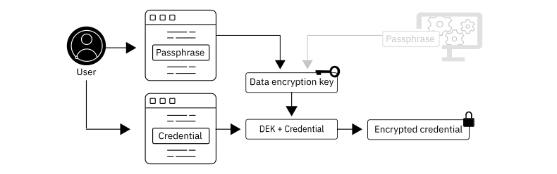

---

copyright:
  years: 2020
lastupdated: "2020-12-15"

keywords: credentials, security and compliance, collector access, collector communication, resource scan, configuration scanning, credentials stored

subcollection: security-compliance

---

{:codeblock: .codeblock}
{:screen: .screen}
{:download: .download}
{:external: target="_blank" .external}
{:faq: data-hd-content-type='faq'}
{:gif: data-image-type='gif'}
{:important: .important}
{:note: .note}
{:pre: .pre}
{:tip: .tip}
{:preview: .preview}
{:deprecated: .deprecated}
{:beta: .beta}
{:term: .term}
{:shortdesc: .shortdesc}
{:script: data-hd-video='script'}
{:support: data-reuse='support'}
{:table: .aria-labeledby="caption"}
{:troubleshoot: data-hd-content-type='troubleshoot'}
{:help: data-hd-content-type='help'}
{:tsCauses: .tsCauses}
{:tsResolve: .tsResolve}
{:tsSymptoms: .tsSymptoms}
{:java: .ph data-hd-programlang='java'}
{:javascript: .ph data-hd-programlang='javascript'}
{:swift: .ph data-hd-programlang='swift'}
{:curl: .ph data-hd-programlang='curl'}
{:video: .video}
{:step: data-tutorial-type='step'}
{:tutorial: data-hd-content-type='tutorial'}

# Managing credentials
{: #credentials}

When you work with the {{site.data.keyword.compliance_full}}, you provide the credentials that allow a collector to access and scan your IT resources.
{: shortdesc}

## Understanding credentials
{: #understand-credentials}

Credentials are used by a collector to gather information about your resource configurations, assess them, and initiate any remediation that is required.

### What types of credentials do I provide?
{: #credentials-provide}

The credentials that you provide depend upon the type of resources that you want to scan. You might provide an API key, an access key file, or a username and password to a specific resource.

### What level of access do my credentials need to have?
{: #credential-access}

The level of access that your credentials need depends upon the actions that you want the {{site.data.keyword.compliance_short}} to take. If you only want to run scans on your resources, you must provide credentials that provide the collector `read` access to your resources. This way, the service is able to scan your resource configurations. If you also want to initiate remediation from the {{site.data.keyword.compliance_short}}, then the credentials that you provide must have `write` access.

For collectors that are run in on-premises environments, credentials must have sufficient privileges to collect operating system related information and to query other services that run on the machines such as a database.

Some IBM Cloud services require [additional permissions](#additional-permissions) for their goals to be monitored, be sure to review the information to ensure that your IAM policies are correctly configured.

### How are my credentials stored?
{: #credential-storage}

Credentials are stored securely by using encryption and are not visible in clear text at any point during the storage process. For more information about the security of your stored credentials, see [Storing and encrypting data in the {{site.data.keyword.compliance_short}}](/docs/security-compliance?topic=security-compliance-data-storage).

## Before you begin
{: #before-credentials}

Before you begin, be sure that you're using a [Pay-As-You-Go or Subscription](/docs/account?topic=account-accounts) {{site.data.keyword.cloud_notm}} account where you are the owner or have [full administrator access](/docs/account?topic=account-assign-access-resources). You must also have access to the credentials that you want to add to the service. 

## Creating a credential
{: #create-credentials}

To create a new credential, you can use the {{site.data.keyword.compliance_short}} UI.

1. In the {{site.data.keyword.cloud_notm}} console, click the **Menu** icon  **> Security and compliance** to access the {{site.data.keyword.compliance_short}}.
2. In the navigation, click **Settings > Credentials**.
3. Give your credential a meaningful name and a description.
4. Choose a **Credential type** from the following options:

  * AWS Cloud
  * Azure Cloud
  * GCP Cloud
  * IBM Cloud
  * Database
  * Username - password
  * Username - PEM
  * Windows authentication

  The type of credential that you create is dependent upon the type of resources that you want to scan.
  {: note}

5. Select a purpose for your credential. Options include **Discovery/Collection**, **Remediation**, or both.   
6. Add the access information. Depending on the type of credential that you selected in step 4, the options on the page change. 

  <table>
    <caption>Table 1. Credential types and input information</caption>
    <tr>
      <th>Credential type</th>
      <th>Needed information</th>
    </tr>
    <tr>
      <td>IBM Cloud</td>
      <td>
An IBM Cloud API key with a service ID. For help with creating an API key, see [Understanding API keys](/docs/account?topic=account-manapikey). Be sure to assign your API key Viewer and Reader access to your resources. Occasionally, services require [additional access](#additional-permissions).

<strong>Note:</strong> It is possible to use an IBM Cloud API key without a service ID. Just be sure that the user who creates the key has the required permissions for all of the resources that you want to scan.
</td>
    </tr>
    <tr>
      <td>AWS Cloud</td>
      <td>An Amazon Web Services access key ID and secret access key. Your secret access key is a large binary encoded string.  To ensure the collector can access your AWS account, create an AWS user that has minimal read-only privileges. If you want to further restrict access, you can grant the user more granular read-only privileges by service.</td>
    </tr>
    <tr>
      <td>Azure Cloud</td>
      <td>An Azure client ID (application ID), client secret (authentication key), tenant ID, and subscription ID. <a href="https://docs.microsoft.com/en-us/azure/azure-resource-manager/resource-group-create-service-principal-portal#get-application-id-and-authentication-key">Learn more</a>.</td>
    </tr>
    <tr>
      <td>GCP Cloud</td>
      <td>A Google Cloud Platform access key file. <a href="https://cloud.google.com/iam/docs/creating-managing-service-account-keys">Learn more</a>.</td>
    </tr>
    <tr>
      <td>Database</td>
      <td>The name of the database and the username and password that are needed to access it.</td>
    </tr>
    <tr>
      <td>Username - password</td>
      <td>A username and password combination that is needed to gain access to an on-premises machine.</td>
    </tr>
    <tr>
      <td>Username - PEM</td>
      <td>A username and password combination and PEM file that is needed to gain access to an on-premises machine.</td>
    </tr>
    <tr>
      <td>Windows authentication</td>
      <td>A username and password combination. You must also provide the type of authentication that your credential is configured to provide. Options include: Basic, Kerberos, and Negotiate. You can also choose whether to Use SSL by checking checking the <strong>Use SSL</strong> box.</td>
    </tr>
  </table>

  The level of access that your credentials need depends upon the actions that you want the {{site.data.keyword.compliance_short}} to take. If you only want to run scans on your resources, you must provide credentials that provide the collector `read` access to your resources. [Learn more](#understand-credentials)
  {: note}

7. If a passphrase is configured, enter the passphrase. 
8. Verify your information and click **Save**. The credential is added to a list of available credentials. 

To edit or delete existing credentials, select the credential that you want to modify and click the **Edit** or **Delete** icon.
{: tip}

### Additional IBM Cloud permissions
{: #additional-permissions}

As a minimum each credential requires reader or viewer permissions for the services that you want to scan. A few of the IBM Cloud services have goals that require additional permissions to either complete the scan or to view the results. If the service is listed in the following table, be sure to assign the appropriate permissions to either your Service ID or the user that the credentials belong to.

| Service | Required role |
|---------|---------------|
| Key Protect | Manager |
| Cloud Object Storage | Writer |
| User Management - Billing | To view the results related to MFA, a user must have viewer access to the Billing service and to the {{site.data.keyword.compliance_short}}. |
{: caption="Table 2. Additional required permissions" caption-side="top"}

If you enable a control that measures a specific number of days, it is monitored by using Activity Tracker. You must create a new credential using Activity Tracker's GUID and Service_key as the username and password. Then, map the credential to a specific collector by using the format AT=resource_guid.
{: note}

## Mapping credentials to a scope
{: #map-credentials}

Occasionally, you might have a scope that requires the collector use more than one set of credentials to complete a scan. This can happen when users have credentials that are used for individual databases or servers that need to be scanned. To map credentials to your scope, complete the following steps.

To map a credential, it must exist in the service. Before you get started, be sure to [create the credential](/docs/security-compliance?topic=security-compliance-credentials).
{: note}

1. In the {{site.data.keyword.cloud_notm}} console, click the **Menu** icon  **> Security and compliance** to access the {{site.data.keyword.compliance_short}}.
2. In the navigation, click **Configure > Scopes**.
3. Select the scope that you want to map credentials for.
4. Click the **Map credentials** icon.
5. Click **Add new**.
6. Enter the criteria that you want to use.

  Criteria specifies the conditions for when a credential can be used. For example, for a specific VPC, a specific IP, or a set of IP ranges.

7. Select the credentials that you want to use.
8. Optional: Select a **Proxy**.
9. Click the check mark icon to add the credential to the scope. Repeat steps 6 - 10 until you add all your needed credentials.
10. Click **Close**.

You can also choose to edit or delete an existing entry if you made a mistake or no longer need to use that credential with that scope.
{: tip}

## Creating a passphrase
{: #passphrase}

A credential passphrase is an arbitrary string that is used to ensure the security of the credentials that you add to the service. As a user, you can choose to have IBM manage the security of your credentials, or you can choose to manage it yourself.

In most cases, IBM-managed credential security is appropriate. If your industry requires that you maintain total secrecy of your data - including from IBM, then you might choose to create and enable your own passphrase. However, if you choose to enable your own passphrase, it is important that you understand that IBM does not have access to it. This means that:

* IBM cannot help you recover your passphrase if it is ever lost or forgotten.
* There is no validation of the password when it is entered to complete an action.

For security reasons, if a passphrase is entered incorrectly, the credentials that have already been added become unusable by the service.
{: important}

Check out the following diagram to understand more about how credential security works. 

As you can see in the previous image, a user adds their credentials to the service UI. The credentials that they add might be a username and password or an API key that the {{site.data.keyword.compliance_short}} might need to scan a specific resource. Then, if a user wants to manage their own security, they enable their own passphrase. If they want to have IBM manage their security, the service generates a passphrase. Either way, the passphrase is used to create a data encryption key. That key is used to encrypt the credentials before they are stored by the service.

To enable your own passphrase:

1. In the {{site.data.keyword.cloud_notm}} console, click the **Menu** icon  > **Security and compliance** to access the {{site.data.keyword.compliance_short}}.
2. In the navigation, click **Settings > Credentials**.
3. In the **Credentials security** box, click the **Edit** icon. A sidepanel opens.
4. Enter your **New passphrase**.
5. Confirm your passphrase by retyping it.
6. Validate that you understand the risk of enabling your own passphrase by checking the box. 

  For security reasons, if the passphrase is entered incorrectly after it is enabled, any mapped credentials become unusable by the service.
  {: important}
  
7. Click **Save**.

