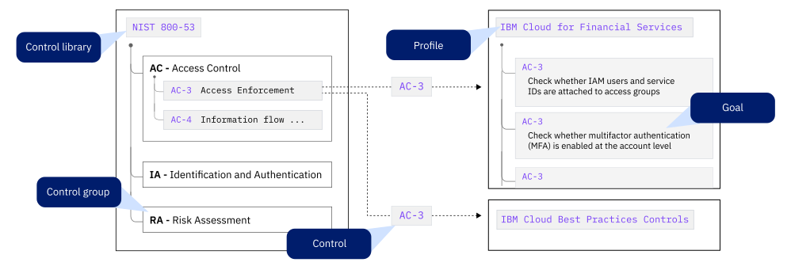
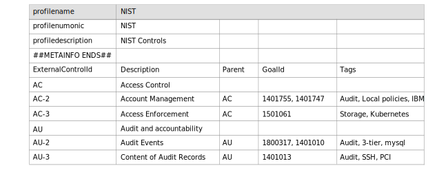

---

copyright:
  years: 2020, 2022
lastupdated: "2022-12-15"

keywords: custom profiles, user-defined, controls, goals, security, compliance

subcollection: security-compliance

---

{:codeblock: .codeblock}
{:screen: .screen}
{:download: .download}
{:external: target="_blank" .external}
{:faq: data-hd-content-type='faq'}
{:gif: data-image-type='gif'}
{:important: .important}
{:note: .note}
{:pre: .pre}
{:tip: .tip}
{:preview: .preview}
{:deprecated: .deprecated}
{:beta: .beta}
{:term: .term}
{:shortdesc: .shortdesc}
{:script: data-hd-video='script'}
{:support: data-reuse='support'}
{:table: .aria-labeledby="caption"}
{:troubleshoot: data-hd-content-type='troubleshoot'}
{:help: data-hd-content-type='help'}
{:tsCauses: .tsCauses}
{:tsResolve: .tsResolve}
{:tsSymptoms: .tsSymptoms}
{:java: .ph data-hd-programlang='java'}
{:javascript: .ph data-hd-programlang='javascript'}
{:swift: .ph data-hd-programlang='swift'}
{:curl: .ph data-hd-programlang='curl'}
{:video: .video}
{:step: data-tutorial-type='step'}
{:tutorial: data-hd-content-type='tutorial'}
{:ui: .ph data-hd-interface='ui'}
{:cli: .ph data-hd-interface='cli'}
{:api: .ph data-hd-interface='api'}
{:release-note: data-hd-content-type='release-note'}

# Managing goal-based profiles
{: #custom-profiles}

With the {{site.data.keyword.compliance_full}}, you can create your own profiles or take advantage of predefined profiles that are curated based on industry standards. A profile is a collection of related controls. After you gather the configuration information of your resources and ready your accounts for monitoring, you can create profiles to define the list of controls that you'd like to validate against.
{: shortdesc}

Running a scan against a specific profile does not ensure regulatory compliance. The scan is intended to provide a point in time statement of your current posture for a specific group of resources.
{: important}

## Before you begin
{: #before-custom-profiles}

Before you get started, be sure that you have the required level of access to view and manage profiles. To manage profiles, you need the [**Editor** platform role or higher](/docs/security-compliance?topic=security-compliance-access-management).

## Understanding profiles
{: #understand-profiles}

The basic building block of a profile is a [control](#x2018434){: term}. Controls can be broad guidelines, such as security requirements to encrypt data at rest or prevent unprivileged access to confidential systems.

You can implement a control by meeting one or more [goals](#x2117978){: term}. In {{site.data.keyword.compliance_short}}, goals are used to evaluate whether a control is being met. {{site.data.keyword.compliance_short}} maps goals to external regulatory libraries of controls, which are divided into families (groups), that are used to prove that you are compliant with the required standards for your industry. Each control can apply to one or more profiles and one or more goals might be required to be fully compliant with each control. To see how control libraries map to goals, check out the following image.

{: caption="Figure 1. Understanding profiles" caption-side="bottom"}

### Working with profiles
{: #profile-types}

When you work with profiles in the {{site.data.keyword.compliance_short}}, you interact with predefined or custom profiles that are used to evaluate a specific set of resources that are known as a scope.

Predefined profiles
:   Predefined profiles contain collections of controls that are curated based on standards for an industry. 

   {{site.data.keyword.compliance_short}} supports over 40 predefined profiles. Within each profile, you can inspect the controls and goals that are required to be fully compliant. For a complete list of supported profiles, go to the Profiles page in the {{site.data.keyword.compliance_short}} UI.

   You can't modify or remove controls from a predefined profile. But, you can [create a new profile](/docs/security-compliance?topic=security-compliance-custom-profiles) from a predefined profile so that you choose only the controls and goals that are relevant for your business.
   {: note}

Custom profiles
:   If you want to ability to customize a profile to include any combination of controls and goals, you can create a custom profile. By using the {{site.data.keyword.compliance_short}} UI, you can build a profile from an existing predefined profile, or you can create a profile with your own controls and guidelines from scratch.

Attachment
:   To start evaluating your resources for compliance by using a specific profile, you must create an attachment between your scope and the profile. To create the attachment, you [schedule a scan](/docs/security-compliance?topic=security-compliance-schedule-scan). 

## Building custom profiles
{: #build-custom-profiles}

You can build a custom profile by using the {{site.data.keyword.compliance_short}} UI.

1. In the {{site.data.keyword.cloud_notm}} console, click the **Menu** icon  **> Security and Compliance** to access {{site.data.keyword.compliance_short}}.
2. In the navigation, click **Hybrid cloud configurations > Profiles > Create**.
3. Give your profile a name and optionally provide a description.
4. Determine whether you want to create a profile from scratch or start from a predefined profile.

	* If you chose to **Start from a predefined profile**:

		1. Select a profile from the drop-down.
		2. Select the controls that apply to your organization.

	* If you chose to **Start from scratch**:

		1. Enter an ID and description for your control.
		2. Click the Goal ID box to view a list of the existing goals that you can choose from.
		3. Select the goal that applies to your control and click **Done**.
		4. Click the save icon to save your update.
		4. Click the **+** plus icon to add more controls.

5. Click **Next**.
6. Review your controls and click **Create**.

## Locally editing profiles
{: #edit-profile-locally}
{: ui}

If you prefer to work with profiles in a CSV format, you can export a profile and make changes locally. Then, you can import the profile to the {{site.data.keyword.compliance_short}} to start validating scopes.

As a compliance focal, you might also choose to export profiles with specific configurations that you want to ensure are used by every member of your team. Be sure to have each member of your team import the same version of the profile to ensure consistency across individual accounts and team accounts.

### Exporting a profile
{: #export-profile}

To export a profile, you can use the {{site.data.keyword.compliance_short}} UI.

1. In the {{site.data.keyword.cloud_notm}} console, click the **Menu** icon  **> Security and Compliance** to access {{site.data.keyword.compliance_short}}.
2. In the navigation, click **Hybrid cloud configurations > Profiles**. 
3. From the list of profiles, select the profile that you want to export.
4. Click the export profile icon.

### Formatting your CSV file
{: #CSV-format}

When you're working with profiles locally, it's important that you stay within the format parameters so that the service is able to parse the information that you import. For example, if you were working with NIST controls, your CSV file would look similar to the following image.

{: caption="Figure 2. CSV formatting" caption-side="bottom"}

External Control ID and Parent
:   An external ID is used along with the parent to structure how a control tree is shown in the UI when the file is imported. Be sure that you use a sequential pattern for your external control ID and that the parent is mapped to the correct level.

Goal ID
:   Goal IDs are provided by the {{site.data.keyword.compliance_short}}. To find the goal ID, you must log in to the console and go to **Security and compliance > Hybrid cloud configurations > Goals**.

Tags
:   For more information about tags, see [Mapping tags](/docs/security-compliance?topic=security-compliance-custom-goals#tags).

### Importing a profile
{: #import-profile}

To import a profile, you can use the {{site.data.keyword.compliance_short}} UI.

1. In the {{site.data.keyword.cloud_notm}} console, click the **Menu** icon  **> Security and Compliance** to access the {{site.data.keyword.compliance_short}}.
2. In the navigation, click **Hybrid cloud configurations > Profiles**. 
3. Click **Import profile**.
4. Upload the CSV version of the profile that you want to import.
5. Click **Submit**.

