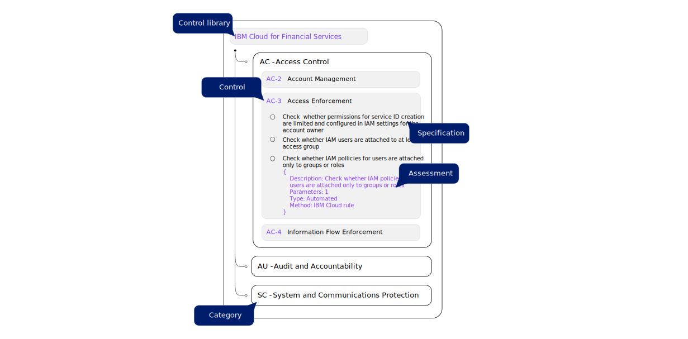

---

copyright:
  years: 2020, 2024
lastupdated: "2024-08-12"

keywords: custom profiles, user-defined, controls, goals, security, compliance

subcollection: security-compliance

---

{{site.data.keyword.attribute-definition-list}}


# Creating custom control libraries
{: #custom-library}

With {{site.data.keyword.compliance_full}}, you can create a custom control library that is specific to your organization's needs. You define the controls and specifications before you map previously created assessments.
{: shortdesc}

{: caption="Figure 1. Understanding control libraries" caption-side="bottom"}


A control library is a grouping of controls that are added to {{site.data.keyword.compliance_short}}. The service offers several predefined libraries that are designed to help meet compliance for a specific use case. Each control has several specifications and assessments that are mapped to it. A specification is a defined requirement that is specific to a component. When met by an organization, the specification helps to ensure that they are compliant with the control. An assessment, or several, are mapped to each specification with a detailed evaluation that is done to check whether the specification is compliant. For more information, see [Key Concepts](/docs/security-compliance?topic=security-compliance-posture-management).


## Before you begin
{: #before-custom-library}

Before you get started, be sure that you have the required level of access to create and manage libraries. To manage libraries, you need the [**Editor** platform role or higher](/docs/security-compliance?topic=security-compliance-access-management).


## Creating a library
{: #create-custom-library-ui}
{: ui}

You can create a custom library by using the {{site.data.keyword.compliance_short}} UI.

1. In the {{site.data.keyword.cloud_notm}} console, click the **Menu** icon  **> Security and Compliance** to access the {{site.data.keyword.compliance_short}}.
2. In the navigation, click **Controls > Control libraries**. 
3. Click **Create**. A side panel opens.
4. Provide a name, description, and version for your library.
5. Click **Create**. Your library opens in a new page but is empty.
6. To start adding controls, click **Create**.
	1. Provide the details for your control by including a **Name**, **Description**, and **Category**.
	2. Click **Add** to start adding existing specifications to your control.
	3. Provide a **Description** for your specification.
	4. Select a **Component**.
	5. Select the existing assessments that can help to evaluate your specification, then click **Create**.

	If you don't see an assessment that is specific to your use case, you can create a rule. When the rule is created, it shows in the assessment section.
	{: tip}

	6. When you are finished adding specifications to your control, click **Create**.
	7. Repeat these steps until you add all your controls.


## Creating a library with the API
{: #create-custom-library-api}
{: api}

You can create a custom library by using the {{site.data.keyword.compliance_short}} API.

```bash
curl -X POST 
	--location --header "Authorization: Bearer {iam_token}" 
	--header "Accept: application/json" 
	--header "Content-Type: application/json" 
	--data '{ 
				"id": "60351ac6-2dba-495e-9c98-057601069723", 
				"account_id": "cg3335893hh1428692d6747cf300yeb5", 
				"control_library_name": "IBM Cloud for Financial Services", 
				"control_library_description": "IBM Cloud for Financial Services", 
				"control_library_type": "predefined", 
				"version_group_label": "33fc7b80-0fa5-4f16-bbba-1f293f660f0d", 
				"control_library_version": "1.1.0", 
				"controls": [ { "control_name": "SC-7", 
				"control_id": "1fa45e17-9322-4e6c-bbd6-1c51db08e790", 
				"control_description": "Boundary Protection", 
				"control_category": "System and Communications Protection", 
				"control_parent": "", "control_requirement": false, 
				"control_tags": [ 
					"1fa45e17-9322-4e6c-bbd6-1c51db08e790" 
					], 
				"control_specifications_count": 0, 
				"control_specifications": [
					 {
						"control_specification_id": "5c7d6f88-a92f-4734-9b49-bd22b0900184", 
						"responsibility": "user", 
						"component_id": "iam-identity", 
						"component_name": "IAM Identity Service", 
						"environment": "ibm-cloud", 
						"control_specification_description": "IBM cloud", 
						"assessments_count": 0 
						} 
					], 
				"control_docs": { 
					"control_docs_id": "sc-7", 
					"control_docs_type": "ibm-cloud" 
					} 
				} 
			] 
		}' 
	"https://us-south.compliance.cloud.ibm.com/instances/{instance_id}/v3/control_libraries"
```
{: pre}
{: curl}


```go
(securityAndComplianceCenterApi *SecurityAndComplianceCenterApiV3) CreateCustomControlLibrary(createCustomControlLibraryOptions *CreateCustomControlLibraryOptions) (result *ControlLibrary, response *core.DetailedResponse, err error)
```
{: codeblock}
{: go}


```java
ParameterInfo parameterInfoModel = new ParameterInfo.Builder()
  .parameterName("session_invalidation_in_seconds")
  .parameterDisplayName("Sign out due to inactivity in seconds")
  .parameterType("numeric")
  .build();
Implementation implementationModel = new Implementation.Builder()
  .assessmentId("rule-a637949b-7e51-46c4-afd4-b96619001bf1")
  .assessmentMethod("ibm-cloud-rule")
  .assessmentType("automated")
  .assessmentDescription("Check that there is an Activity Tracker event route defined to collect global events generated by IBM Cloud services")
  .parameters(java.util.Arrays.asList(parameterInfoModel))
  .build();
ControlSpecifications controlSpecificationsModel = new ControlSpecifications.Builder()
  .controlSpecificationId("5c7d6f88-a92f-4734-9b49-bd22b0900184")
  .componentId("iam-identity")
  .componentName("IAM Identity Service")
  .environment("ibm-cloud")
  .controlSpecificationDescription("IBM cloud")
  .assessments(java.util.Arrays.asList(implementationModel))
  .build();
ControlDocs controlDocsModel = new ControlDocs.Builder()
  .controlDocsId("sc-7")
  .controlDocsType("ibm-cloud")
  .build();
ControlsInControlLib controlsInControlLibModel = new ControlsInControlLib.Builder()
  .controlName("SC-7")
  .controlId("1fa45e17-9322-4e6c-bbd6-1c51db08e790")
  .controlDescription("Boundary Protection")
  .controlCategory("System and Communications Protection")
  .controlTags(java.util.Arrays.asList("1fa45e17-9322-4e6c-bbd6-1c51db08e790"))
  .controlSpecifications(java.util.Arrays.asList(controlSpecificationsModel))
  .controlDocs(controlDocsModel)
  .controlRequirement(true)
  .build();
CreateCustomControlLibraryOptions createCustomControlLibraryOptions = new CreateCustomControlLibraryOptions.Builder()
  .controlLibraryName("IBM Cloud for Financial Services")
  .controlLibraryDescription("IBM Cloud for Financial Services")
  .controlLibraryType("custom")
  .controls(java.util.Arrays.asList(controlsInControlLibModel))
  .versionGroupLabel("33fc7b80-0fa5-4f16-bbba-1f293f660f0d")
  .controlLibraryVersion("1.0.0")
  .build();

Response<ControlLibrary> response = securityAndComplianceCenterApiService.createCustomControlLibrary(createCustomControlLibraryOptions).execute();
ControlLibrary controlLibrary = response.getResult();

System.out.println(controlLibrary);
```
{: codeblock}
{: java}


```bash
// Request models needed by this operation.

// ParameterInfo
const parameterInfoModel = {
  parameter_name: 'session_invalidation_in_seconds',
  parameter_display_name: 'Sign out due to inactivity in seconds',
  parameter_type: 'numeric',
};

// Implementation
const implementationModel = {
  assessment_id: 'rule-a637949b-7e51-46c4-afd4-b96619001bf1',
  assessment_method: 'ibm-cloud-rule',
  assessment_type: 'automated',
  assessment_description: 'Check that there is an Activity Tracker event route defined to collect global events generated by IBM Cloud services',
  parameters: [parameterInfoModel],
};

// ControlSpecifications
const controlSpecificationsModel = {
  control_specification_id: '5c7d6f88-a92f-4734-9b49-bd22b0900184',
  component_id: 'iam-identity',
  environment: 'ibm-cloud',
  control_specification_description: 'IBM cloud',
  assessments: [implementationModel],
};

// ControlDocs
const controlDocsModel = {
  control_docs_id: 'sc-7',
  control_docs_type: 'ibm-cloud',
};

// ControlsInControlLib
const controlsInControlLibModel = {
  control_name: 'SC-7',
  control_id: '1fa45e17-9322-4e6c-bbd6-1c51db08e790',
  control_description: 'Boundary Protection',
  control_category: 'System and Communications Protection',
  control_parent: 'testString',
  control_tags: ['1fa45e17-9322-4e6c-bbd6-1c51db08e790'],
  control_specifications: [controlSpecificationsModel],
  control_docs: controlDocsModel,
  control_requirement: true,
};

const params = {
  controlLibraryName: 'IBM Cloud for Financial Services',
  controlLibraryDescription: 'IBM Cloud for Financial Services',
  controlLibraryType: 'custom',
  controls: [controlsInControlLibModel],
  versionGroupLabel: '33fc7b80-0fa5-4f16-bbba-1f293f660f0d',
  controlLibraryVersion: '1.0.0',
};

let res;
try {
  res = await securityAndComplianceCenterApiService.createCustomControlLibrary(params);
  console.log(JSON.stringify(res.result, null, 2));
} catch (err) {
  console.warn(err);
}
```
{: codeblock}
{: node}


```python
create_custom_control_library(
        self,
        control_library_name: str,
        control_library_description: str,
        control_library_type: str,
        controls: List['ControlsInControlLib'],
        *,
        version_group_label: str = None,
        control_library_version: str = None,
        latest: bool = None,
        controls_count: int = None,
        x_correlation_id: str = None,
        x_request_id: str = None,
        **kwargs,
    ) -> DetailedResponse
```
{: codeblock}
{: python}


A successful response returns a boolean that confirms that `success` is `true`. For more information about the required and optional request parameters, check out the [API docs](/apidocs/security-compliance#create-custom-control-library).


## Creating a library with the CLI
{: #create-custom-library-cli}
{: cli}

You can create a custom library by using the {{site.data.keyword.compliance_short}} CLI. See the [CLI reference](/docs/security-compliance?topic=security-compliance-security-compliance-cli&interface=cli#security-compliance-cli-control-libraries-create-command) for more information.

```sh
ibmcloud security-compliance control-library create
--control-library-name='IBM Cloud for Financial Services'
--control-library-description='IBM Cloud for Financial Services'
--control-library-type=custom
--controls='[
  {
    "control_name": "SC-7",
    "control_id": "1fa45e17-9322-4e6c-bbd6-1c51db08e790",
    "control_description": "Boundary Protection",
    "control_category": "System and Communications Protection",
    "control_parent": "exampleString",
    "control_tags": [
      "1fa45e17-9322-4e6c-bbd6-1c51db08e790"
      ],
    "control_specifications": [
      {
        "control_specification_id": "5c7d6f88-a92f-4734-9b49-bd22b0900184",
        "responsibility": "user",
        "component_id": "iam-identity",
        "component_name": "exampleString",
        "environment": "ibm-cloud",
        "control_specification_description": "IBM cloud",
        "assessments_count": 38,
        "assessments": [
          {
            "assessment_id": "rule-a637949b-7e51-46c4-afd4-b96619001bf1",
            "assessment_method": "ibm-cloud-rule",
            "assessment_type": "automated",
            "assessment_description": "Check that there is an Activity Tracker event route defined to collect global events generated by IBM Cloud services",
            "parameter_count": 38,
            "parameters": [
              {
                "parameter_name": "session_invalidation_in_seconds",
                "parameter_display_name": "Sign out due to inactivity in seconds",
                "parameter_type": "numeric",
                "parameter_value": "public"
                }
              ]
            }
          ]
        }
      ],
    "control_docs": {
      "control_docs_id": "sc-7",
      "control_docs_type": "ibm-cloud"
      },
    "control_requirement": true,
    "status": "enabled"
    }
  ]'
--version-group-label=33fc7b80-0fa5-4f16-bbba-1f293f660f0d
--control-library-version=1.0.0
--latest=true
--controls-count=38
--x-correlation-id=exampleString
--x-request-id=exampleString
```
{: pre}


## Creating a library with Terraform
{: #create-custom-library-terraform}
{: terraform}

You can create a custom library by using Terraform.

```hcl
resource "ibm_scc_control_library" "scc_control_library_instance" {
  control_library_description = "My control library's description."
  control_library_name = "control_library_new"
  control_library_type = "predefined"
  controls {
		control_name = "control_name"
		control_id = "1fa45e17-9322-4e6c-bbd6-1c51db08e790"
		control_description = "My control's description."
		control_category = "control_category"
		control_parent = "control_parent"
		control_tags = [ "control_tags" ]
		control_specifications {
			control_specification_id = "f3517159-889e-4781-819a-89d89b747c85"
			responsibility = "user"
			component_id = "f3517159-889e-4781-819a-89d89b747c85"
			component_name = "componenet_name"
			environment = "environment"
			control_specification_description = "My control specification's description."
			assessments_count = 1
			assessments {
				assessment_id = "assessment_id"
				assessment_method = "assessment_method"
				assessment_type = "assessment_type"
				assessment_description = "My assessment's descriptions."
				parameter_count = 1
				parameters {
					parameter_name = "parameter_name"
					parameter_display_name = "parameter_display_name"
					parameter_type = "string"
				}
			}
		}
		control_docs {
			control_docs_id = "control_docs_id"
			control_docs_type = "control_docs_type"
		}
		control_requirement = true
		status = "enabled"
  }
  version_group_label = "e0923045-f00d-44de-b49b-6f1f0e8033cc"
}
```
{: pre}

For more information, check out the [Terraform reference](https://registry.terraform.io/providers/IBM-Cloud/ibm/latest/docs/resources/scc_rule){: external}.


## Next steps
{: #library-next}

After your library is added to the service, you can use it to create a profile. From your library details, click **Actions > Create profile** to start evaluating your resources.
