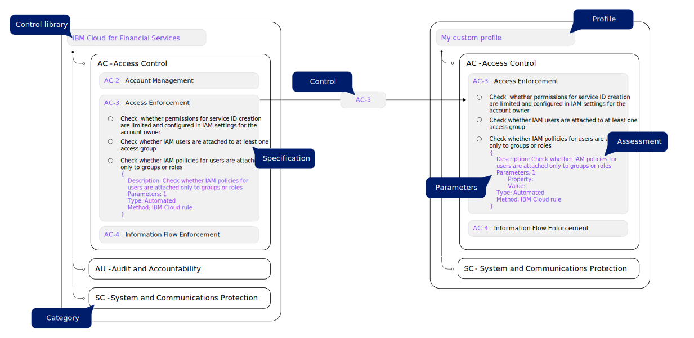

---

copyright:
  years: 2020, 2023
lastupdated: "2023-12-07"

keywords: custom profiles, user-defined, controls, goals, security, compliance

subcollection: security-compliance

---

{{site.data.keyword.attribute-definition-list}}


# Building custom profiles
{: #build-custom-profiles}

With {{site.data.keyword.compliance_full}}, you can take advantage of predefined profiles that are curated based on industry standards, or you can choose to create one specific to your usecase from an existing library.
{: shortdesc}


{: caption="Figure 1. Understanding profiles" caption-side="bottom"}


A profile is a grouping of controls that can be evaluated for compliance. In {{site.data.keyword.compliance_short}}, you can work with predefined profiles, or you can create a profile by selecting controls that have already been added to a control library. Controls already have specifications and assessments that are associated with them, but you can choose to create your own. To learn more about each entity, see [Key Concepts](/docs/security-compliance?topic=security-compliance-posture-management).


## Before you begin
{: #before-profiles}

Before you get started, be sure that you have the required level of access to create and manage profiles. To manage profiles, you need the [**Editor** platform role or higher](/docs/security-compliance?topic=security-compliance-access-management).


## Building a profile
{: #create-profile-ui}
{: ui}

You can create a profile through the console by using a control library as a guide.

1. In the {{site.data.keyword.cloud_notm}} console, click the **Menu** icon  **> Security and Compliance > Profiles**, and click **Create**.
2. Provide your profile details, including a **Name**, **Version**, and optionally a **Description**.

	The version of your profile must be specified in SemVer format. For example, `1.0.2` or `2.1.3-alpha`.

3. Click **Next**.
4. Add controls.
	1.  Click **Add** to view the available control libararies. 
	2. Select the library that you want to pull controls from.
	
		
		
		Because you cannot create custom profiles from deprecated control library versions, work with the most recent version. If you don't see exactly what you're looking for, you can always create a custom control library and it will display in the screen.
		{: tip}
		
		

	3. Select the controls that you want to evaluate. To view the associated assessments, you can click eye icon.
	4. When you have all of your controls selected, click **Add**.
	5. Optional: If you want to pull controls from another library into your profile, repeat the previous steps and select another profile.
	6. Review your selected controls, and then click **Next**.
5. Define the parameter values by expanding each row to view the input that is required for each specification. 

	Your selected controls might not have any assessments that require parameter input. If that is the case, a message will tell you to skip to the next step.

6. Review your selections, and then click **Create**.

## Building a profile with the API
{: #create-profile-api}
{: api}

You can create a profile with the API by using a control library as a guide.

```bash
curl -X POST 
	--location --header "Authorization: Bearer {iam_token}" 
	--header "Accept: application/json" 
	--header "Content-Type: application/json" 
	--data '{ 
				"profile_name": "test_profile1", 
				"profile_description": "test_description1", 
				"profile_type": "custom", 
				"profile_version": "1.0.0", 
				"version_group_label": "58a5922f-0763-485b-91ef-92cca4125d9d", 
				"controls": [ 
					{ 
						"control_library_id": "e98a56ff-dc24-41d4-9875-1e188e2da6cd", 
						"control_id": "1fa45e17-9322-4e6c-bbd6-1c51db08e790" 
						} 
					], 
				"default_parameters": [ 
					{ 
						"assessment_type": "Automated", 
						"assessment_id": "rule-a637949b-7e51-46c4-afd4-b96619001bf1", 
						"parameter_name": "session_invalidation_in_seconds", 
						"parameter_default_value": "120", 
						"parameter_display_name": "Sign out due to inactivity in seconds", 
						"parameter_type": "numeric" 
					} 
				] 
			}'
		"https://us-south.compliance.cloud.ibm.com/instances/{instance_id}/v3/profiles"
```
{: pre}
{: curl}


```go
(securityAndComplianceCenterApi *SecurityAndComplianceCenterApiV3) CreateProfile(createProfileOptions *CreateProfileOptions) (result *Profile, response *core.DetailedResponse, err error)
```
{: codeblock}
{: go}


```java
ProfileControlsPrototype profileControlsPrototypeModel = new ProfileControlsPrototype.Builder()
  .controlLibraryId(controlLibraryIdLink)
  .controlId("1fa45e17-9322-4e6c-bbd6-1c51db08e790")
  .build();
DefaultParametersPrototype defaultParametersPrototypeModel = new DefaultParametersPrototype.Builder()
  .assessmentType("Automated")
  .assessmentId("rule-a637949b-7e51-46c4-afd4-b96619001bf1")
  .parameterName("session_invalidation_in_seconds")
  .parameterDefaultValue("120")
  .parameterDisplayName("Sign out due to inactivity in seconds")
  .parameterType("numeric")
  .build();
CreateProfileOptions createProfileOptions = new CreateProfileOptions.Builder()
  .profileName("test_profile1")
  .profileDescription("test_description1")
  .profileType("custom")
  .controls(java.util.Arrays.asList(profileControlsPrototypeModel))
  .defaultParameters(java.util.Arrays.asList(defaultParametersPrototypeModel))
  .build();

Response<Profile> response = securityAndComplianceCenterApiService.createProfile(createProfileOptions).execute();
Profile profile = response.getResult();

System.out.println(profile);
```
{: codeblock}
{: java}


```bash
// Request models needed by this operation.

// ProfileControlsPrototype
const profileControlsPrototypeModel = {
  control_library_id: controlLibraryIdLink,
  control_id: '1fa45e17-9322-4e6c-bbd6-1c51db08e790',
};

// DefaultParametersPrototype
const defaultParametersPrototypeModel = {
  assessment_type: 'Automated',
  assessment_id: 'rule-a637949b-7e51-46c4-afd4-b96619001bf1',
  parameter_name: 'session_invalidation_in_seconds',
  parameter_default_value: '120',
  parameter_display_name: 'Sign out due to inactivity in seconds',
  parameter_type: 'numeric',
};

const params = {
  profileName: 'test_profile1',
  profileDescription: 'test_description1',
  profileType: 'custom',
  controls: [profileControlsPrototypeModel],
  defaultParameters: [defaultParametersPrototypeModel],
};

let res;
try {
  res = await securityAndComplianceCenterApiService.createProfile(params);
  console.log(JSON.stringify(res.result, null, 2));
} catch (err) {
  console.warn(err);
}
```
{: codeblock}
{: node}


```python
profile_controls_prototype_model = {
  'control_library_id': control_library_id_link,
  'control_id': '1fa45e17-9322-4e6c-bbd6-1c51db08e790',
}

default_parameters_prototype_model = {
  'assessment_type': 'Automated',
  'assessment_id': 'rule-a637949b-7e51-46c4-afd4-b96619001bf1',
  'parameter_name': 'session_invalidation_in_seconds',
  'parameter_default_value': '120',
  'parameter_display_name': 'Sign out due to inactivity in seconds',
  'parameter_type': 'numeric',
}

response = security_and_compliance_center_api_service.create_profile(
  profile_name='test_profile1',
  profile_description='test_description1',
  profile_type='custom',
  controls=[profile_controls_prototype_model],
  default_parameters=[default_parameters_prototype_model],
)
profile = response.get_result()

print(json.dumps(profile, indent=2))
```
{: codeblock}
{: python}


A successful response returns a boolean that confirms that `success` is `true`. For more information about the required and optional request parameters, check out the [API docs](/apidocs/security-compliance#create-profile).


## Building a profile with Terraform
{: #create-profile-terraform}
{: terraform}

You can create a profile with Terraform by using a control library as a guide.

```hcl
resource "ibm_scc_profile" "scc_profile_instance" {
  controls {
		control_library_id = "e98a56ff-dc24-41d4-9875-1e188e2da6cd"
		control_id = "5C453578-E9A1-421E-AD0F-C6AFCDD67CCF"
		control_library_version = "control_library_version"
		control_name = "control_name"
		control_description = "control_description"
		control_category = "control_category"
		control_parent = "control_parent"
		control_requirement = true
		control_docs {
			control_docs_id = "control_docs_id"
			control_docs_type = "control_docs_type"
		}
		control_specifications_count = 1
		control_specifications {
			control_specification_id = "f3517159-889e-4781-819a-89d89b747c85"
			responsibility = "user"
			component_id = "f3517159-889e-4781-819a-89d89b747c85"
			componenet_name = "componenet_name"
			environment = "environment"
			control_specification_description = "control_specification_description"
			assessments_count = 1
			assessments {
				assessment_id = "assessment_id"
				assessment_method = "assessment_method"
				assessment_type = "assessment_type"
				assessment_description = "assessment_description"
				parameter_count = 1
				parameters {
					parameter_name = "parameter_name"
					parameter_display_name = "parameter_display_name"
					parameter_type = "string"
				}
			}
		}
  }
  default_parameters {
		assessment_type = "assessment_type"
		assessment_id = "assessment_id"
		parameter_name = "parameter_name"
		parameter_default_value = "parameter_default_value"
		parameter_display_name = "parameter_display_name"
		parameter_type = "string"
  }
  profile_description = "profile_description"
  profile_name = "profile_name"
  profile_type = "predefined"
}
```
{: pre}

For more information, check out the [Terraform reference](https://registry.terraform.io/providers/IBM-Cloud/ibm/latest/docs/resources/scc_rule){: external}.


## Next steps
{: #profile-next}

Now that you have a profile, start evaluating your resources by creating an attachment. From the profile details page, click the overflow menu for the profile that you want to evaluate. Then, click **Attach**.

