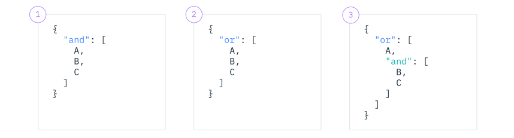

---

copyright:
  years: 2020, 2023
lastupdated: "2023-09-14"

keywords: custom profiles, user-defined, controls, goals, security, compliance

subcollection: security-compliance

---

{{site.data.keyword.attribute-definition-list}}


# Defining custom rules
{: #rules-define}

With {{site.data.keyword.compliance_full}}, you can create a custom rule in order to target the exact configuration properties that you need to ensure compliance for.
{: shortdesc}


## Before you begin 
{: #before-custom-rules}

Before you get started, be sure that you have the required level of access to view and manage rules. To create a rule, you need the [**Editor** platform role or higher](/docs/security-compliance?topic=security-compliance-access-management). You must also have an instance of {{site.data.keyword.at_short}} that exists in the same region where you provision your resources.


## Formatting rules
{: #format-rule}

Rules are composed of several different building blocks, including a target, one or more property conditions, and a value. As an example, say you want to create a rule that evaluates whether network access to your Cloud Object Storage buckets in the US South region is restricted to specific IP addresses. 

To build the rule, first you target Cloud Object Storage as the service, by using the CRN-qualified name, and then define bucket as the type of resource. To ensure that your rule is configured for only those buckets in US-South, provide an additional attribute. 

```json
"target": {
		"service_name": "cloud-object-storage",
		"resource_kind": "bucket",
		"additional_target_attributes": [
			{
				"name": "location",
				"operator": "string_equals",
				"value": "us-south"
			}
		]
	}
```
{: screen}


In the required config object, you provide the specific conditions that you want to evaluate for. You provide a `property`, `operator`, and `value` for each of the configurations that you want to evaluate. The `property` is a configuration variable that applies to a specific resource and the options available depend on the service and resource type that you want to target. The `value` is the variable that is used during the evaluation of your `property`. An `operator` is how the `property` is compared to the `value`. Sometimes you don't need to provide a `value` - for example, when an `operator` is a boolean.


```json
"required_config": {
   "and": [
      {
         "property": "firewall.allowed_ip",
         "operator": "ips_in_range",
         "value": [
            "10.0.0.0/8",
            "172.16.0.0/12",
            "192.168.0.0/16"
         ]
      }
   ]
}
```
{: screen}


### Available operators
{: #operators}

An operator is the type of comparison that you want to make between a property and its value. Check out the following table to learn more about each type.

String-based operators are case-sensitive.
{: note}

| Operator | Type | Description | Requires `value` parameter |
|:--------|:-----------|:-----------|:------------------------|
| `is_empty`  | General | The property value is not specified, null, or an empty string | No |
| `is_not_empty`  | General |  The property value is specified, not null, and not an empty string (any value). | No |
| `is_true`  | Boolean | The property value is true. | No |
| `is_false`  | Boolean | The property value is false. | No |
| `string_equals`[^string_equals] | String |  The property value is an exact match to the condition value. | Yes |
| `string_not_equals`[^string_not_equals] | String |  The property value is not an exact match to the condition value. |Yes|
| `string_match` | String |  The property value matches the condition value by using the [Krauss wildcarding algorithm](https://en.wikipedia.org/wiki/Krauss_wildcard-matching_algorithm){: external}. | Yes |
| `string_not_match` | String |  The property value does not match the condition value by using [Krauss wildcarding algorithm](https://en.wikipedia.org/wiki/Krauss_wildcard-matching_algorithm){: external}.| Yes |
| `string_contains` | String | The property value contains part of the condition value. | Yes |
| `string_not_contains` | String | The property value contains part of the condition value. | Yes |
| [Deprecated]{: tag-deprecated} `strings_in_list`[^strings_in_list] | String list |  All property values are in the condition value list. | Yes |
| `strings_allowed`[^strings_allowed] | String list |  All property values are in the condition value list. | Yes |
| `strings_required`[^strings_required] | String list | All condition values are in the property value list. | Yes |
| `ips_in_range`[^ips_in_range] | IP list |  All property values, in IPv4 or IPv6 format, are in the condition value list. | Yes |
| `ips_equals`[^ips_equals] | String | The property value is an exact match to the condition value. | Yes |
| `ips_not_equals`[^ips_not_equals]| String | The property value is not an exact match to the condition value. | Yes |
| `num_equals`[^num_equals] | Numeric | The property value numerically matches to the condition value. | Yes |
| `num_not_equals`[^num_not_equals] | Numeric | The property value does not numerically match the condition value.| Yes |
| `num_less_than` | Numeric | The property value is numerically less than the condition value.| Yes |
| `num_less_than_equals` | Numeric | The property value is numerically less than or equal to the condition value. | Yes |
| `num_greater_than` | Numeric | The property value is numerically greater than the condition value. | Yes |
| `num_greater_than_equals` | Numeric | The property value is numerically greater than or equal to the condition value. | Yes |
| `days_less_than` | Numeric | The property value is less than the condition value. | Yes |
{: caption="Table 3. Supported operator types" caption-side="top"}

[^string_equals]: To include multiple values, use an array. For example, `{"value": ["A", "B," "C"]}`.

[^string_not_equals]: To include multiple values, use an array. For example, `{"value": ["A", "B," "C"]}`.

[^strings_in_list]: To create a rule with a property that supports the `strings_in_list` operator, include a list of strings for the `value` parameter. For example, `{"value": ["A", "B," "C"]}`.

[^strings_required]: To create a rule with a property that supports the `strings_in_list` operator, include a list of strings for the `value` parameter. For example, `{"value": ["A", "B," "C"]}`.

[^strings_allowed]: To create a rule with a property that supports the `strings_in_list` operator, include a list of strings for the `value` parameter. For example, `{"value": ["A", "B," "C"]}`.

[^ips_in_range]: To create a rule with a property that supports the `ips_in_range` operator, include a list of CIDR or IP addresses for the `value` parameter. For example, `{"value": ["10.168.175.0/24", "2000:db8:ffff:ffff:ffff:ffff:ffff:ffff"]}`.

[^num_equals]: To include multiple values, use an array. For example, `{"value": ["1", "2," "3"]}`.

[^num_not_equals]: To include multiple values, use an array. For example, `{"value": ["1", "2," "3"]}`.

[^ips_equals]: To create a rule with a property that supports the `ips_equals` operator, include a list of CIDR or IP addresses for the `value` parameter. For example, `{"value": ["10.168.175.0/24", "2000:db8:ffff:ffff:ffff:ffff:ffff:ffff"]}`.

[^ips_not_equals]: To create a rule with a property that supports the `ips_not_equals` operator, include a list of CIDR or IP addresses for the `value` parameter. For example, `{"value": ["10.168.175.0/24", "2000:db8:ffff:ffff:ffff:ffff:ffff:ffff"]}`.


### Formatting complex rules
{: #format-complex-rules}

Most often, rules are more complex than a single property. To create more complex scenarios, you can include multiple conditions. To define multiple property conditions in a single rule, you can use the logical operators `and` and `or` to express the relationship between them. For example, the following scenarios would all evaluate as compliant.

1. If all three - A, B, and C are true.
2. If any of the three options are true.
3. If A is true or if B and C are both true.

{: caption="Figure 1. The ways in which properties can relate to each other." caption-side="bottom"}


## Creating a rule
{: #create-rules-ui}
{: ui}

You can use the {{site.data.keyword.compliance_short}} UI to define the configuration rules that you want monitor for your {{site.data.keyword.cloud_notm}} resources. For more information about which services you can configure rules for, see [What can I evaluate?](/docs/security-compliance?topic=security-compliance-scannable-components#evaluate-services).

You can either use the rule builder or edit the JSON directly.
{: tip}

1. In the {{site.data.keyword.cloud_notm}} console, click the **Menu** icon  **> Security and Compliance > Controls > Rules**, and click **Create**.
2. Give your rule a meaningful name and description.
3. Optional: Add one or more labels that you can use to organize and search for similar rules and click **Next**.
4. Target your resource.
   1. From the **Target service** drop-down, select a service. For example, *Cloud Object Storage*.
   2. From the **Resource type** drop-down, select the type of resource that you want to create a rule for. For example, *Bucket*.
   3. Optional: Add additional target attributes to further qualify the resources that you want to target.

      For example, to target all of your Cloud Object Storage buckets in the US South location, you would make the following selections: **Attribute**: `Location`, **Value**: `string_equals`, and enter `us_south` for **Value**.
   4. Click **Add to rule**.
5. Configure your properties. 

	To add additional properties to your rule, repeat this step. You can select up to 5 different conditions and 16 properties to create your rule. 

   1. Select a **Condition**.

      * **And**: When you select *And* as your condition, all the property configurations that you add to your rule must evaluate to true in order for the rule to be compliant.
      * **Or**: When you select *Or* as your condition, only part of your rule must evaluate to true for it to be compliant.
   2. Define the rule by specifying a **Property**, **Operator**, and **Value**.

		To see all the properties that are available for the service that you selected, you can click **Available Properties** in the **Definition** step.

   3. Click **Add to rule**.

6. Click **Next**.
7. Review your selections and click **Create**.


## Creating a rule with the API
{: #create-rules-api}
{: api}

You can use the {{site.data.keyword.compliance_short}} API to define the configuration rules that you want monitor for your {{site.data.keyword.cloud_notm}} resources. For more information about which services you can configure rules for, see [What can I evaluate?](/docs/security-compliance?topic=security-compliance-scannable-components#evaluate-services).

```bash
curl -X POST 
   --location --header "Authorization: Bearer {iam_token}" 
   --header "Accept: application/json" 
   --header "Content-Type: application/json" 
   --data '{ 
               "account_id": "130003ea8bfa43c5aacea07a86da3000", 
               "description": "Example rule", 
               "rule_type": "user_defined", 
               "import": { 
                  "parameters": [ 
                     { 
                        "name": "hard_quota", 
                        "display_name": "The Cloud Object Storage bucket quota.", 
                        "description": "The maximum bytes that are allocated to the Cloud Object Storage bucket.", 
                        "type": "numeric" 
                        } 
                     ] 
                  }, 
               "target": { 
                  "service_name": "cloud-object-storage", 
                  "resource_kind": "bucket", 
                  "additional_target_attributes":  ] 
               }, 
               "required_config": { 
                  "description": "The Cloud Object Storage rule.", 
                  "and": [ 
                     { 
                        "property": "hard_quota", 
                        "operator": "num_equals", 
                        "value": "{hard_quota}" 
                        } 
                     ] 
                  }, 
               "labels":  
            ], 
            "version": "1.0.0" 
         }' 
"https://us-south.compliance.cloud.ibm.com/instances/{instance_id}/v3/rules"

```
{: pre}
{: curl}


```go
(securityAndComplianceCenterApi *SecurityAndComplianceCenterApiV3) CreateRule(createRuleOptions *CreateRuleOptions) (result *Rule, response *core.DetailedResponse, err error)
```
{: codeblock}
{: go}


```java
AdditionalTargetAttribute additionalTargetAttributeModel = new AdditionalTargetAttribute.Builder()
  .name("location")
  .operator("string_equals")
  .value("us-east")
  .build();
TargetPrototype targetPrototypeModel = new TargetPrototype.Builder()
  .serviceName("cloud-object-storage")
  .resourceKind("bucket")
  .additionalTargetAttributes(java.util.Arrays.asList(additionalTargetAttributeModel))
  .build();
RequiredConfigItemsRequiredConfigBase requiredConfigItemsModel = new RequiredConfigItemsRequiredConfigBase.Builder()
  .property("hard_quota")
  .operator("num_equals")
  .value("{hard_quota}")
  .build();
RequiredConfigAnd requiredConfigModel = new RequiredConfigAnd.Builder()
  .description("The Cloud Object Storage rule.")
  .and(java.util.Arrays.asList(requiredConfigItemsModel))
  .build();
Parameter parameterModel = new Parameter.Builder()
  .name("hard_quota")
  .displayName("The Cloud Object Storage bucket quota.")
  .description("The maximum bytes that are allocated to the Cloud Object Storage bucket.")
  .type("numeric")
  .build();
Import importModel = new Import.Builder()
  .parameters(java.util.Arrays.asList(parameterModel))
  .build();
CreateRuleOptions createRuleOptions = new CreateRuleOptions.Builder()
  .description("Example rule")
  .target(targetPrototypeModel)
  .requiredConfig(requiredConfigModel)
  .version("1.0.0")
  .xImport(importModel)
  .labels(java.util.Arrays.asList())
  .build();

Response<Rule> response = securityAndComplianceCenterApiService.createRule(createRuleOptions).execute();
Rule rule = response.getResult();

System.out.println(rule);
```
{: codeblock}
{: java}


```node
// Request models needed by this operation.

// AdditionalTargetAttribute
const additionalTargetAttributeModel = {
  name: 'location',
  operator: 'string_equals',
  value: 'us-east',
};

// Target
const targetModel = {
  service_name: 'cloud-object-storage',
  resource_kind: 'bucket',
  additional_target_attributes: [additionalTargetAttributeModel],
};

// RequiredConfigItemsRequiredConfigBase
const requiredConfigItemsModel = {
  property: 'hard_quota',
  operator: 'num_equals',
  value: '{hard_quota}',
};

// RequiredConfigRequiredConfigAnd
const requiredConfigModel = {
  description: 'The Cloud Object Storage rule.',
  and: [requiredConfigItemsModel],
};

// Parameter
const parameterModel = {
  name: 'hard_quota',
  display_name: 'The Cloud Object Storage bucket quota.',
  description: 'The maximum bytes that are allocated to the Cloud Object Storage bucket.',
  type: 'numeric',
};

// Import
const importModel = {
  parameters: [parameterModel],
};

const params = {
  description: 'Example rule',
  target: targetModel,
  requiredConfig: requiredConfigModel,
  version: '1.0.0',
  _import: importModel,
  labels: [],
};

let res;
try {
  res = await securityAndComplianceCenterApiService.createRule(params);
  console.log(JSON.stringify(res.result, null, 2));
} catch (err) {
  console.warn(err);
}
```
{: codeblock}
{: node}


```python
profile_controls_prototype_model = {
  'control_library_id': control_library_id_link,
  'control_id': '1fa45e17-9322-4e6c-bbd6-1c51db08e790',
}

default_parameters_prototype_model = {
  'assessment_type': 'Automated',
  'assessment_id': 'rule-a637949b-7e51-46c4-afd4-b96619001bf1',
  'parameter_name': 'session_invalidation_in_seconds',
  'parameter_default_value': '120',
  'parameter_display_name': 'Sign out due to inactivity in seconds',
  'parameter_type': 'numeric',
}

response = security_and_compliance_center_api_service.create_profile(
  profile_name='test_profile1',
  profile_description='test_description1',
  profile_type='custom',
  controls=[profile_controls_prototype_model],
  default_parameters=[default_parameters_prototype_model],
)
profile = response.get_result()

print(json.dumps(profile, indent=2))
```
{: codeblock}
{: python}


A successful response returns the list of rules, along with other metadata. For more information about the required and optional request parameters, check out the [API docs](/apidocs/security-compliance#create-rule).


## Next steps
{: #next-rule}

Now that you created a rule, add it to a library by associating it with a specification. Then, start monitoring by attaching it to a scope.

