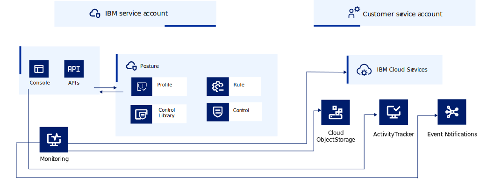

---

copyright:
  years: 2020, 2023
lastupdated: "2023-03-31"

keywords: public isolation for {{site.data.keyword.compliance_short}}, compute isolation for {{site.data.keyword.compliance_short}}, {{site.data.keyword.compliance_short}} architecture, workload isolation in {{site.data.keyword.compliance_short}} 

subcollection: security-compliance

---

{{site.data.keyword.attribute-definition-list}}

# Learning about {{site.data.keyword.compliance_short}} architecture and workload isolation
{: #compute-isolation}

Review the following architecture for {{site.data.keyword.compliance_full}}, and learn more about different isolation levels, so that you can choose the solution that best meets the requirements of the workloads that you want to run in the cloud.
{: shortdesc}

## {{site.data.keyword.compliance_short}} architecture
{: #architecture}

{{site.data.keyword.compliance_short}} is a multi-tenant, regional service that is fully integrated with the {{site.data.keyword.cloud_notm}} platform. The IBM-managed components of the {{site.data.keyword.compliance_short}} are organized to provide compute isolation between workloads. 

Check out the following image to see how the service workloads are isolated and managed.

{: caption="Figure 1. Workload isolation" caption-side="bottom"}

| Component | Description |
|:----------|:------------|
| Control plane | The microservices that make up the individual components of the service run in the control plane, where they are isolated from the other components. Additionally, internal dependencies are run and isolated as part of the control plane. |
| Data plane | Your resource configurations are validated by [IBM-managed collectors](/docs/security-compliance?topic=security-compliance-collector) as part of the data plane before the results are forwarded to the control plane. |
{: caption="Table 1. IBM-managed components of the {{site.data.keyword.compliance_short}}" caption-side="top"}
{: #ibm-managed}
{: tab-title="IBM"}
{: tab-group="arch-manage"}
{: class="simple-tab-table"}

| Component | Description |
|:----------|:------------|
| {{site.data.keyword.cloud_notm}} services | As you interact with {{site.data.keyword.compliance_short}}, you are responsible for the instances of the other services that you chose to interact with through the service. For example, if you create a rule, you are responsible for ensuring that the collector has access to your resource by using an API key. |
| Collectors | Your resource configurations are processed by a [collector](/docs/security-compliance?topic=security-compliance-collector) that you are responsible for installing on infrastructure that you own and manage. |
| {{site.data.keyword.at_short}} | As you interact with the service, a log of the events that are generated can be found in your instance of {{site.data.keyword.at_short}}. |
{: caption="Table 1. Customer-managed components of the {{site.data.keyword.compliance_short}}" caption-side="top"}
{: #customer-managed}
{: tab-title="Customer"}
{: tab-group="arch-manage"}
{: class="simple-tab-table"}

## {{site.data.keyword.compliance_short}} workload isolation
{: #workload-isolation}

Each regional deployment of the {{site.data.keyword.compliance_short}} serves multiple tenants and can be accessed through public endpoints. By default, all data at rest is encrypted by IBM keys, but you can [bring your own keys](/docs/security-compliance?topic=security-compliance-mng-data). Data in transit is encrypted by using TLS. Your data is isolated from other customer's data but does share physical resources such as CPU, memory, and I/O devices. 

