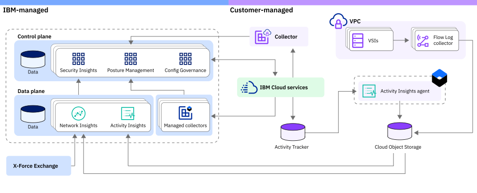

---

copyright:
  years: 2021
lastupdated: "2021-07-20"

keywords: public isolation for {{site.data.keyword.compliance_short}}, compute isolation for {{site.data.keyword.compliance_short}}, {{site.data.keyword.compliance_short}} architecture, workload isolation in {{site.data.keyword.compliance_short}} 

subcollection: security-compliance

---

{:codeblock: .codeblock}
{:screen: .screen}
{:download: .download}
{:external: target="_blank" .external}
{:faq: data-hd-content-type='faq'}
{:gif: data-image-type='gif'}
{:important: .important}
{:note: .note}
{:pre: .pre}
{:tip: .tip}
{:preview: .preview}
{:deprecated: .deprecated}
{:beta: .beta}
{:term: .term}
{:shortdesc: .shortdesc}
{:script: data-hd-video='script'}
{:support: data-reuse='support'}
{:table: .aria-labeledby="caption"}
{:troubleshoot: data-hd-content-type='troubleshoot'}
{:help: data-hd-content-type='help'}
{:tsCauses: .tsCauses}
{:tsResolve: .tsResolve}
{:tsSymptoms: .tsSymptoms}
{:java: .ph data-hd-programlang='java'}
{:javascript: .ph data-hd-programlang='javascript'}
{:swift: .ph data-hd-programlang='swift'}
{:curl: .ph data-hd-programlang='curl'}
{:video: .video}
{:step: data-tutorial-type='step'}
{:tutorial: data-hd-content-type='tutorial'}
{:ui: .ph data-hd-interface='ui'}
{:cli: .ph data-hd-interface='cli'}
{:api: .ph data-hd-interface='api'}

# Learning about {{site.data.keyword.compliance_short}} architecture and workload isolation
{: #compute-isolation}

Review the following sample architecture for {{site.data.keyword.compliance_full}}, and learn more about different isolation levels so that you can choose the solution that best meets the requirements of the workloads that you want to run in the cloud.
{: shortdesc}

## {{site.data.keyword.compliance_short}} architecture
{: #architecture}

{{site.data.keyword.compliance_short}} is a multi-tenant, regional service that is fully integrated with the {{site.data.keyword.cloud_notm}} platform. The IBM-managed components of the {{site.data.keyword.compliance_short}} are organized to provide compute isolation between workloads. Check out the following image to see how the service workloads are isolated and managed.

{: caption="Figure 1. Workload isolation" caption-side="bottom"}

| Component | Description |
|:----------|:------------|
| Control plane | The microservices that make up the individual components of the service run in the control plane, where they are isolated from the other components. Additionally, internal dependencies are run and isolated as part of the control plane. |
| Data plane | Your data is processed by Network Insights and Activity Insights in the data plane before any findings are forwarded to the control plane. Your resource configurations are also validated by [IBM-managed collectors](/docs/security-compliance?topic=security-compliance-ibm-collector) as part of the data plane before the results are forwarded to the control plane. |
| X-Force Exchange | The service pulls directly from the IBM X-Force Exchange intelligence platform to quickly alert you to the latest global security threats related to IP reputation as part of the integration with Network Insights. |
{: caption="Table 1. IBM-managed components of the {{site.data.keyword.compliance_short}}" caption-side="top"}
{: #ibm-managed}
{: tab-title="IBM"}
{: tab-group="arch-manage"}
{: class="simple-tab-table"}

| Component | Description |
|:----------|:------------|
| {{site.data.keyword.cloud_notm}} services | As you interact with {{site.data.keyword.compliance_short}}, you are responsible for the instances of the other services that you chose to interact with through the service. For example, if you create a rule, you are responsible for ensuring that the collector has access to your resource via an API key. |
| Collector | Your resource configurations are processed by a [collector](/docs/security-compliance?topic=security-compliance-collector-manual) that you are responsible for installing on infrastructure that you own and manage. |
| Virtual Private Cloud and Flow Logs | If you choose to work with Network Insights, you must have a Virtual Private Cloud instance that is configured collect your Flow Logs so that they can be evaluated. |
| {{site.data.keyword.containershort}} | If you choose to work with Activity Insights, you must install an agent on your {{site.data.keyword.containershort}} cluster to collect the data that you want to analyze. |
| Cloud Object Storage | Your Insights data is stored in a Cloud Object Storage bucket that is created in your account and you manage. |
| {{site.data.keyword.at_short}} | Services log events in {{site.data.keyword.at_short}} that you can use as part of your evidence in a compliance audit. It is also a dependency of the Activity Insights feature. |
{: caption="Table 1. Customer-managed components of the {{site.data.keyword.compliance_short}}" caption-side="top"}
{: #customer-managed}
{: tab-title="Customer"}
{: tab-group="arch-manage"}
{: class="simple-tab-table"}

## {{site.data.keyword.compliance_short}} workload isolation
{: #workload-isolation}

Each regional deployment of the {{site.data.keyword.compliance_short}} serves multiple tenants and can be accessed through public endpoints. By default, all data at rest is encrypted by IBM keys, but you can [bring your own keys](/docs/security-compliance?topic=security-compliance-mng-data). Data in transit is encrypted by using TLS. Your data is isolated from other customer's data but does share the same physical resources such as CPU, memory, and I/O devices. 

