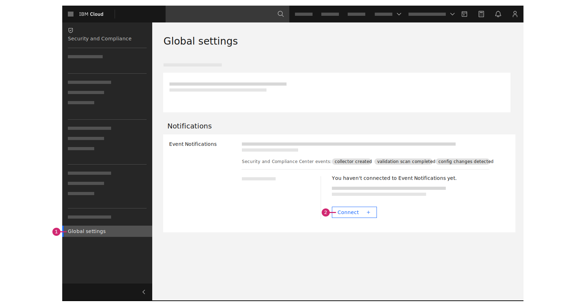

---

copyright:
  years: 2020, 2023
lastupdated: "2023-08-29"

keywords: event notifications for {{site.data.keyword.compliance_short}}, event notifications integration for {{site.data.keyword.compliance_short}}, alerts for {{site.data.keyword.compliance_short}}

subcollection: security-compliance

---

{{site.data.keyword.attribute-definition-list}}

# Enabling event notifications for {{site.data.keyword.compliance_short}}
{: #event-notifications}

As an administrator of {{site.data.keyword.compliance_full}}, you might want to send notifications of events in {{site.data.keyword.compliance_short}} to other users, or human destinations, by using email, SMS, or other supported delivery channels. Additionally, you might want to send these notifications of events to other applications to build logic by using event-driven programming that uses webhooks, for example. This action is made possible by the integration between {{site.data.keyword.compliance_short}} and {{site.data.keyword.en_full}}.
{: shortdesc}

## Events for {{site.data.keyword.compliance_short}}
{: #event-notifications-list}

Review the following sections to learn about the events that are generated by specific {{site.data.keyword.compliance_short}} components.

| Event type    | Subtype | Description   |
|:--------------|:---------------|:--------------|
| `com.ibm.cloud.compliance.test` |  | An event is sent when you test the connection between {{site.data.keyword.compliance_short}} and a connected {{site.data.keyword.en_short}} service instance. |
| `com.ibm.cloud.compliance.posture` | `posture-scan-completed` | An event is sent when a scan is complete. |
| `com.ibm.cloud.compliance.posture` | `posture-scan-failure-threshold-limit-exceeds` | An event is sent when your specified threshold of failed controls is met. |
| `com.ibm.cloud.compliance.posture` | `posture-scan-new-resource-in-inventory` | An event is sent when a new resource is found in your inventory. |
{: caption="Table 1. List of events that apply to {{site.data.keyword.compliance_short}}" caption-side="top"}


## Enabling notifications
{: #event-notifications-enable}

Events that are generated by the {{site.data.keyword.compliance_short}} can be forwarded to an {{site.data.keyword.en_short}} service instance that is available in the same account. To get started, be sure that you have:

- [**Administrator** platform access](/docs/security-compliance?topic=security-compliance-access-management) for {{site.data.keyword.compliance_short}}.
- [**Manager** service access](/docs/event-notifications?topic=event-notifications-service-access-management) for the {{site.data.keyword.en_short}} service. To view an existing {{site.data.keyword.en_short}} service instance in your account, you also need **Viewer** platform access or higher.

### Connecting to {{site.data.keyword.en_short}} in the console
{: #event-notifications-enable-ui}
{: ui}

Before you can enable notifications for {{site.data.keyword.compliance_short}}, be sure that you have an [{{site.data.keyword.en_short}} service instance](/catalog/services/event-notifications){: external} that is in the same account. Then, you can use the **Settings > Event Notifications** section in the {{site.data.keyword.compliance_short}} UI to connect the services.

{: caption="Figure 1. Connecting to {{site.data.keyword.en_short}}" caption-side="bottom"}

1. In the console, click the **Menu** icon  **> Security and Compliance**.
2. In the {{site.data.keyword.compliance_short}} navigation, click **Settings**.
3. In the {{site.data.keyword.en_short}} section, and click **Connect**.
4. In the side panel, review the source details for the connection. Optionally, provide a description.
5. Select the resource group and {{site.data.keyword.en_short}} service instance that you want to connect.

    If an IAM authorization between {{site.data.keyword.compliance_short}} and {{site.data.keyword.en_short}} doesn't exist in your account, a dialog is displayed. Follow the prompts to grant access between the services.

    1. To grant access between {{site.data.keyword.compliance_short}} and {{site.data.keyword.en_short}}, click **Authorize**.
    2. In the side panel, select **{{site.data.keyword.en_short}}** as the target service.
    3. From the list of instances, select the {{site.data.keyword.en_short}} service instance that you want to authorize.
    4. Select the **Event Source Manager** role.
    5. Click **Review**.
    6. Click **Assign**.

6. To confirm the connection, click **Connect**.

   A success message is displayed to indicate that {{site.data.keyword.compliance_short}} is now connected to {{site.data.keyword.en_short}}. If you need to disconnect from {{site.data.keyword.en_short}} later, you can use the options menu  **> Disconnect** to remove the {{site.data.keyword.compliance_short}} as a source service in the {{site.data.keyword.en_short}} instance.

   If you choose to disconnect {{site.data.keyword.en_short}}, do not delete the IAM authorization between {{site.data.keyword.compliance_short}} and {{site.data.keyword.en_short}}. The {{site.data.keyword.compliance_short}} uses the existing authorization to unregister from {{site.data.keyword.en_short}}. If an {{site.data.keyword.en_short}} instance is deleted, any authorizations that exist between the service and {{site.data.keyword.compliance_short}} are also deleted by IAM.
   {: important}


### Connecting to {{site.data.keyword.en_short}} with the API
{: #event-notifications-enable-api}
{: api}

Before you can enable notifications for {{site.data.keyword.compliance_short}}, be sure that you have an [{{site.data.keyword.en_short}} service instance](/catalog/services/event-notifications){: external} that is in the same account. Then, you can connect to {{site.data.keyword.en_short}} programmatically by calling the {{site.data.keyword.compliance_short}} API.

The following example shows a query that you can use to register your {{site.data.keyword.compliance_short}} source details with {{site.data.keyword.en_short}}. 
{: curl}

You can find the `event_notifications_instance_crn` value in the console by going to the **Resource list** and clicking the {{site.data.keyword.en_short}} instance row.
{: tip}


```bash
curl -X PATCH 
  --location --header "Authorization: Bearer {IAM_token}" 
  --header "Accept: application/json" 
  --header "Content-Type: application/json-patch+json" 
  --data '{ 
            "event_notifications": { 
              "instance_crn": "crn:v1:staging:public:event-notifications:us-south:a/130003ea8bfa43c5aacea07a86da3000:1c858449-3537-45b8-9d39-2707115b4cc7::" 
              }, 
            "object_storage": { 
              "instance_crn": "crn:v1:staging:public:cloud-object-storage:global:a/130003ea8bfa43c5aacea07a86da3000:1c858449-3537-45b8-9d39-2707115b4cc7::", 
              "bucket": "scc-bucket" 
            } 
          }' "
  https://us-south.compliance.cloud.ibm.com/instances/{instance_id}/v3/settings"
```
{: pre}
{: curl}


```go
eventNotificationsModel := &securityandcompliancecenterapiv3.EventNotifications{
  InstanceCrn: &eventNotificationsCrnForUpdateSettingsLink,
  SourceDescription: core.StringPtr("This source is used for integration with IBM Cloud Security and Compliance Center."),
  SourceName: core.StringPtr("compliance"),
}

objectStorageModel := &securityandcompliancecenterapiv3.ObjectStorage{
  InstanceCrn: &objectStorageCrnForUpdateSettingsLink,
  Bucket: &objectStorageBucketForUpdateSettingsLink,
  BucketLocation: &objectStorageLocationForUpdateSettingsLink,
}

updateSettingsOptions := securityAndComplianceCenterApiService.NewUpdateSettingsOptions()
updateSettingsOptions.SetEventNotifications(eventNotificationsModel)
updateSettingsOptions.SetObjectStorage(objectStorageModel)
updateSettingsOptions.SetXCorrelationID("1a2b3c4d-5e6f-4a7b-8c9d-e0f1a2b3c4d5")

settings, response, err := securityAndComplianceCenterApiService.UpdateSettings(updateSettingsOptions)
if err != nil {
  panic(err)
}
b, _ := json.MarshalIndent(settings, "", "  ")
fmt.Println(string(b))
```
{: codeblock} 
{: go}


A successful response returns the CRN value of your connected {{site.data.keyword.en_short}} and Cloud Object Storage service instances. For more information about the required and optional request parameters, see the [API docs](/apidocs/security-compliance#update-settings).


### Sending a test event to {{site.data.keyword.en_short}} from the UI
{: #event-notifications-test-ui}
{: ui}

After you enable notifications for {{site.data.keyword.compliance_short}}, test your connection to ensure that the events that are generated by {{site.data.keyword.compliance_short}} are being forwarded to {{site.data.keyword.en_short}}.

Before you can send a test {{site.data.keyword.compliance_short}} event, you must have [topics, destinations, and subscriptions](/docs/event-notifications?topic=event-notifications-en-create-en-topic) created in your {{site.data.keyword.en_short}} instance. Be sure that the **Test configuration** event type (`com.ibm.cloud.compliance.test`) is included as a condition in your {{site.data.keyword.en_short}} topic.
{: note}

1. In the {{site.data.keyword.compliance_short}} UI, click **Settings**.
2. In the Event Notifications section, click **Send test event**.

   A success message is displayed to indicate that the test event was forwarded successfully to {{site.data.keyword.en_short}}.


### Sending a test event to {{site.data.keyword.en_short}} by using the API
{: #event-notifications-test-api}
{: api}

After you enable notifications for {{site.data.keyword.compliance_short}}, test your connection to ensure that the events that are generated by {{site.data.keyword.compliance_short}} are being forwarded to {{site.data.keyword.en_short}}.

Before you can send a test {{site.data.keyword.compliance_short}} event, you must have [topics, destinations, and subscriptions](/docs/event-notifications?topic=event-notifications-en-create-en-topic) created in your {{site.data.keyword.en_short}} instance. Be sure that the **Test configuration** event type (`com.ibm.cloud.compliance.test`) is included as a condition in your {{site.data.keyword.en_short}} topic.
{: note}

The following example shows a query that you can use to send a test event from the {{site.data.keyword.compliance_short}} to {{site.data.keyword.en_short}}. 
{: curl}

```sh
curl -X POST 
  --location --header "Authorization: Bearer {iam_token}" 
  --header "Accept: application/json"
  "https://us-south.compliance.cloud.ibm.com/instances/{instance_id}/v3/test_event"
```
{: codeblock}
{: curl}

A successful response returns `{"success": true}` to indicate that a test event was forwarded successfully to your connected {{site.data.keyword.en_short}} service instance. For more information, see the [API docs](/apidocs/security-compliance#post-test-event).


## Delivering notifications to select destinations
{: #event-notifications-destinations}

After you enable notifications for {{site.data.keyword.compliance_short}}, create topics and subscriptions in {{site.data.keyword.en_short}} so alerts can be forwarded and delivered to your selected destinations.

For a complete list of supported destinations, see the [{{site.data.keyword.en_short}} documentation](/docs/event-notifications?topic=event-notifications-en-destination).
{: tip}

### Email notifications
{: #event-notifications-email}

You can use the [{{site.data.keyword.cloud_notm}} email service](/docs/event-notifications?topic=event-notifications-en-destinations-email) as a delivery channel for {{site.data.keyword.compliance_short}} event notifications. [Create an {{site.data.keyword.en_short}} subscription](/docs/event-notifications?topic=event-notifications-en-create-en-subscription) between an existing topic and the {{site.data.keyword.cloud_notm}} email service to forward your alerts to various recipients by email.

An email from {{site.data.keyword.cloud_notm}} that contains information about a {{site.data.keyword.compliance_short}} event resembles the following example:

```plaintext
Subject: Validation completed: my-test-validation-scan
Body: The following validation scan was successfully completed in the Security and Compliance Center: my-test-validation-scan. You can view the scan results from the Security and Compliance Center in the console. For more information, check out the docs.
```
{: screen}

To receive detailed information about an event notification in your email, select the **Add notification payload** option when you create an {{site.data.keyword.en_short}} subscription. Your email displays the [notification payload details](#event-notifications-payload) that are associated with the event.
{: tip}

### Webhooks
{: #event-notifications-webhook}

You can configure a webhook destination so that the properties of an incoming notification can be used programmatically by an app or service. For more information, check out the [{{site.data.keyword.en_short}} documentation](/docs/event-notifications?topic=event-notifications-en-destinations-webhook).

## Notification payload details
{: #event-notifications-payload}

Successful events that are generated by a {{site.data.keyword.compliance_short}} component contain various fields that help you to identify the source and details of an event.

Event notifications from {{site.data.keyword.compliance_short}} contain only metadata properties, such as names or identifiers of resources. Sensitive data, for example API keys or passwords, are not included in generated events.
{: note}

The metadata properties that are sent to {{site.data.keyword.en_short}} vary depending on the event type and subtype. For example, if an `com.ibm.cloud.compliance.posture:posture-scan-completed` event takes place, {{site.data.keyword.compliance_short}} sends a notification payload to {{site.data.keyword.en_short}} that is similar to the following example.

```json
{
    "action": "Validation completed",
    "summary": "my-test-scan",
    "scope": "my-test-scope",
    "profile": "CIS IBM Foundations Benchmark 1.0.0",
    "start_time": "2021-11-24 13:46:21.672",
    "end_time": "2021-11-24 13:46:21.672"
}
```
{: screen}

Review the following table for more information about event notification properties.

| Property | Description |
| ---- | ---- |
| `action` | The [type of event](#event-notifications-list) that triggered a notification. |
| `summary` |  The name of the validation scan. |
| `scope` | The name of the scope that is associated with the scan.|
| `profile` | The name of the profile that is associated with the scan.|
| `start_time` | The date and time the scan started. |
| `end_time` | The date and time the scan completed. |
{: caption="Table 2. Properties in an event notification payload" caption-side="bottom"}


