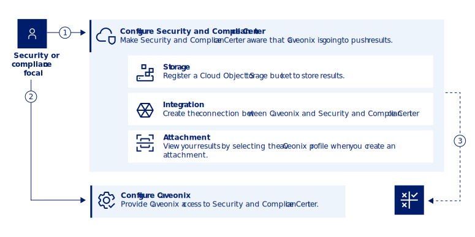

---

copyright:
  years: 2024
lastupdated: "2024-01-10"

keywords: Centralized security, workload protection, compliance monitoring, compliance, scan, sysdig, multicloud, multi-cloud, azure, amazon, aws

subcollection: security-compliance

---

{{site.data.keyword.attribute-definition-list}}

# Connecting Caveonix Cloud Platform
{: #setup-caveonix}

You can configure Caveonix Cloud Platform to send results to {{site.data.keyword.compliance_short}} so that you can view all of your results in one place. Caveonix can transmit infrastructure findings that are found when a copmliance scan is run that evaluates VMware environments. For more information about using VMware solutions with {{site.data.keyword.cloud_notm}}, see [Caveonix RiskForesight on {{site.data.keyword.cloud_notm}} Overview](/docs/vmwaresolutions?topic=vmwaresolutions-caveonix_considerations).
{: shortdesc}

To learn more about how the integration is configured, check out the following diagram.

{: caption="Figure 1. Caveonix integration flow" caption-side="bottom"}

1. Configure {{site.data.keyword.compliance_short}} by creating an instance, connecting a Cloud Object Storage bucket to store results, and registering Caveonix as an integration. Then, create an attachment to start seeing results.
2. Configure Caveonix to send results to {{site.data.keyword.compliance_short}}.
3. View your results in the {{site.data.keyword.compliance_short}} dashboard.

## Before you begin
{: #caveonix-before}

Before you get started, be sure that you have the following prerequisites:

* An {{site.data.keyword.cloud_notm}} account. For more information, see [Setting up your {{site.data.keyword.cloud_notm}} account](/docs/account?topic=account-account-getting-started).
* An instance of the {{site.data.keyword.compliance_short}} service. For more information, see [Create an instance](/docs/security-compliance?topic=security-compliance-getting-started).
* A Cloud Object Storage bucket to store results. For more information, see [Setting up data storage and processing for {{site.data.keyword.compliance_short}}](/docs/security-compliance?topic=security-compliance-storage).
* The required level of access to create and manage integrations in {{site.data.keyword.compliance_short}}. To pull results from Workload Protection, you must have the administrator platform role or higher for the {{site.data.keyword.compliance_short}} service. For more information, see [Assigning access](/docs/security-compliance?topic=security-compliance-access-management).
* A Caveonix account.
* You must have version 5.0 of Caveonix Cloud deployed with an organization created.
* VMware asset repositories.

## Creating an API key
{: #caveonix-create-key}

A service ID API key is required for Caveonix to send data to {{site.data.keyword.compliance_short}}. To generate an API key, you can use the following steps.

1. Create your service ID.

	1. In the {{site.data.keyword.cloud_notm}} console, go to **Manage > Access (IAM)**.
	2. On the **Service IDs** page, click **Create**.
	3. Provide a **Name** and **Description** for your service ID. Then, click **Create**. A page with the details of your newly created service ID loads.

2. Assign the proper permissions to your ID.

	1. Click **Assign access**.
	2. In the **Service** section, select **{{site.data.keyword.compliance_short}}**. Then, click **Next**.
	3. You can choose to specify a specific resource or select **All resources**. Then, click **Next**.
	4. In the **Roles and Actions** section, select **Data Provider**. Then, click **Next**.
	5. Skip the **Conditions** section. Then, click **Add**.
	6. Click **Assign**.

3. Create a new API key for your service ID.

	1. Select the API key tab.
	2. Click **Create**.
	3. Provided a **Name** and **Description** for your API key.
	4. Click **Create**.
	5. Copy or download your key to be able to use it later in the flow.

Now that you have a key, you're ready to start the connection flow in {{site.data.keyword.compliance_short}}.

## Creating a connection
{: #caveonix-create-connection}

To create a connection with Caveonix with {{site.data.keyword.compliance_short}}, you need to register Caveonix as an integration through the {{site.data.keyword.compliance_short}} UI.

1. In the {{site.data.keyword.cloud_notm}} console, click the **Menu** icon  **> Security and Compliance** to access the {{site.data.keyword.compliance_short}}.
1. In the navigation, click **Integrations**.
1. In the **Caveonix** tile, click **Connect**. A side panel opens.
1. Provide a **Name** for your connection and click **Connect**.

## Creating an attachment
{: #caveonix-attachment}

To evaluate your resources, you create an attachment. An attachment is the association between the set of resources that you want to evaluate and a profile that contains the specific controls that you want to evaluate. When you create an attachment you must select the **Caveonix** related profile to enable the connection correctly.

To help creating an attachment, see [Scanning your resources](/docs/security-compliance?topic=security-compliance-scan-resources).

Be sure to copy your attachment ID as you will need it in the next step.
{: tip}

## Configure Caveonix to send results
{: #configure-caveonix}

As your final configuration step, you must provide information to Caveonix about the integration through the Caveonix dashboard. You must also have scans configured to run through Caveonix.

You must provide the following information from {{site.data.keyword.compliance_short}} to complete the configuration:

* Your provider type instance ID. You can find this in the details panel of your Caveonix integration on the **Integrations** page.
* The endpoint for pushing results. This can be found in the details panel of your Caveonix integration on the **Integrations** page.
* The API key that you created in step 1.
* The ID of your {{site.data.keyword.compliance_short}} instance. You can find this on the **Plan** page of the {{site.data.keyword.compliance_short}} UI.

For help accessing the console, see [Managing Caveonix RiskForesight](/docs/vmwaresolutions?topic=vmwaresolutions-managingcaveonix). For step-by-step help setting up the configuration through the Caveonix dashboard, see the [Caveonix documentation](https://support.caveonix.com/hc/en-us/articles/19326049643281-Caveonix-Cloud-Integration-with-IBM-Cloud-SCC){: external}. 

You must log in to Caveonix to view the Caveonix documentation. If you run into issues accessing the documentation, contact support@caveonix. Be sure to specify your project name.
{: tip}

## Viewing the results
{: #caveonix-results}

To view the results of your scan, go to the dashboard in the UI of the {{site.data.keyword.compliance_short}} instance that you are working with. For more information about the details in your results, see [Viewing results](/docs/security-compliance?topic=security-compliance-results).

