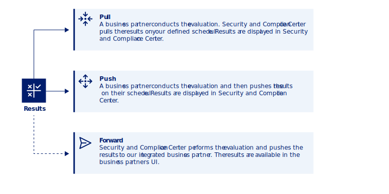

---

copyright:
  years: 2023
lastupdated: "2023-12-15"

keywords: Centralized security, compliance monitoring, compliance, integration

subcollection: security-compliance

---

{{site.data.keyword.attribute-definition-list}}

# Understanding integrations
{: #integrations}

To fully understand your security and compliance landscape across multiple cloud environments, you can integrate other products with {{site.data.keyword.compliance_short}}.
{: shortdesc}

## Understanding the data models
{: #data-models}

Depending on the integration, {{site.data.keyword.compliance_short}} obtains the data surrounding your current compliance posture differently. The data model used might require you to configure the integration in the other product, or it might be automatically pulled after the configuration is in place. Check out the following image to learn more about the potential ways that you results data is gathered and forwarded. 

Note: This version of the image can go external starting after review.

{: caption="Figure 1. Data model options" caption-side="bottom"}

## Available integrations
{: #integrations-available}

The following integrations are available in {{site.data.keyword.compliance_short}}. 

| Product | Description | Data model | Getting started |
|---------|-------------|------------|-----------------|
| {{site.data.keyword.sysdigsecure_short}} |  | {{site.data.keyword.compliance_short}} pulls results from {{site.data.keyword.sysdigsecure_short}} |  |
| Toolchain | | The Toolchain service pushes results to {{site.data.keyword.compliance_short}} and {{site.data.keyword.compliance_short}} pulls results from Toolchain depending on the configuration. |  |
| Caveonix | | Caveonix pushes results to {{site.data.keyword.compliance_short}} |  |
| CyberStrong |  | {{site.data.keyword.compliance_short}} forwards results |  |
{: caption="Table 1. Available integrations" caption-side="bottom"}

## Finding existing integrations
{: #integrations-existing}

After you create integrations between {{site.data.keyword.compliance_short}} and another product, you can easily find all existing integrations. To find a particular integration what is already registered with {{site.data.keyword.compliance_short}}, navigate to the **Integrations** page in the {{site.data.keyword.compliance_short}} UI. 

