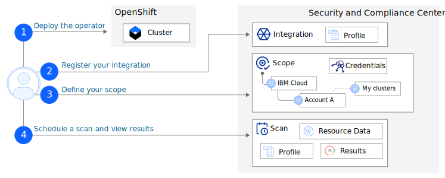

---

copyright:
  years: 2020, 2022
lastupdated: "2022-10-18"

keywords: Centralized security, osco, {{site.data.keyword.openshiftshort}} Compliance Operator, compliance monitoring, compliance, 

subcollection: security-compliance

---

{:codeblock: .codeblock}
{:screen: .screen}
{:download: .download}
{:external: target="_blank" .external}
{:faq: data-hd-content-type='faq'}
{:gif: data-image-type='gif'}
{:important: .important}
{:note: .note}
{:pre: .pre}
{:tip: .tip}
{:preview: .preview}
{:deprecated: .deprecated}
{:beta: .beta}
{:term: .term}
{:shortdesc: .shortdesc}
{:script: data-hd-video='script'}
{:support: data-reuse='support'}
{:table: .aria-labeledby="caption"}
{:troubleshoot: data-hd-content-type='troubleshoot'}
{:help: data-hd-content-type='help'}
{:tsCauses: .tsCauses}
{:tsResolve: .tsResolve}
{:tsSymptoms: .tsSymptoms}
{:java: .ph data-hd-programlang='java'}
{:javascript: .ph data-hd-programlang='javascript'}
{:swift: .ph data-hd-programlang='swift'}
{:curl: .ph data-hd-programlang='curl'}
{:video: .video}
{:step: data-tutorial-type='step'}
{:tutorial: data-hd-content-type='tutorial'}
{:ui: .ph data-hd-interface='ui'}
{:cli: .ph data-hd-interface='cli'}
{:api: .ph data-hd-interface='api'}
{:release-note: data-hd-content-type='release-note'}

# Connecting OSCO
{: #setup-osco}

When you integrate the [{{site.data.keyword.openshiftshort}} Compliance Operator (OSCO)](https://github.com/openshift/compliance-operator){: external} with the {{site.data.keyword.compliance_short}}, you can run scans that validate your level of compliance to a specific predefined profile. Then, you can view all the results and a history of those results in a single location.
{: shortdesc}

To learn more about how the integration is configured, check out the following diagram.

{: caption="Figure 1. OSCO integration flow" caption-side="bottom"}

1. Before you can start scanning your {{site.data.keyword.openshiftshort}} clusters by using the {{site.data.keyword.compliance_short}}, you must first deploy the OSCO to your cluster.
2. In your {{site.data.keyword.cloud_notm}} account, register your integration with the {{site.data.keyword.compliance_short}}.
3. Define a scope that contains your {{site.data.keyword.openshiftshort}} clusters.
4. Schedule a scan by selecting the scope that you previously created. When the scan is complete, you can go to the **Scan results** page of the {{site.data.keyword.compliance_short}} UI to view your results.

## Before you begin
{: #before-osco}

Before you get started, be sure that you have the following prerequisites.

* An {{site.data.keyword.cloud_notm}} account.
* A {{site.data.keyword.openshiftlong}} cluster.
* The required level of access to create and manage integrations in {{site.data.keyword.compliance_short}}. For more information, see [Assigning access](/docs/security-compliance?topic=security-compliance-access-management).
   * To deploy the operator and complete the scan, you must have *manager* access to the {{site.data.keyword.openshiftshort}} resources that you want to validate.
   * To integrate the OSCO operator, you need the *administrator* platform role for the {{site.data.keyword.compliance_short}} service.

## Deploying the operator
{: #deploy-osco}

Before you can start scanning your resources for compliance, the Compliance Operator must be deployed in your {{site.data.keyword.openshiftshort}} cluster. To deploy the operator, follow the steps in the [documentation](/docs/openshift?topic=openshift-compliance-operator). When you deploy the OSCO, a bundle of predefined profiles is automatically installed and available for you to scan your resources with. In the next section, you select the profile that you want to use.

## Registering the integration
{: #register-osco}

To get started, you must register an integration with the {{site.data.keyword.compliance_short}}. 

1. In the {{site.data.keyword.cloud_notm}} console, click the **Menu** icon  **> Security and compliance** to access the {{site.data.keyword.compliance_short}}.
2. In the navigation, click **Integrations**.
3. In the **{{site.data.keyword.openshiftshort}} Compliance Operator** tile, click **Connect**. A side pane opens.
4. Select a profile that you want to scan your clusters against.
5. Click **Connect**. The connection is added to your list of integrations.

## Creating a scope and mapping credentials
{: #scope-osco}

To start scanning your {{site.data.keyword.openshiftshort}} clusters, you must target a scope that contains them and have completed the required credential mapping.

1. [Create a scope.](/docs/security-compliance?topic=security-compliance-scopes#create-scope)

   Be sure to target the area of your organization that contains your {{site.data.keyword.openshiftshort}} clusters. It is ok to include additional resources in your scope.

2. Add your credential to the service.

   1. In the **Manage posture** section of the navigation, click **Configure > Credentials**. Click **Create**.
   2. Give your credential a name and optionally add a description.
   3. Select **Discovery / Collection** and then click **Next**.
   4. Select **IBM Cloud** as the credential type and enter your **API key**.
   5. Click **Create**.

3. Map your {{site.data.keyword.openshiftshort}} credentials.

   1. In the **Manage posture** section of the navigation, click **Configure > Scopes**. Select the scope that you previously created in step 1.
   2. In the **Credentials** section, click **Add**.
   3. Select your credential from the **Credential** drop-down.
   4. Leave **Remediation credential** empty.
   5. For **Resource**, enter the ID of your cluster in the following format: `ROKS=<cluster_id>`
   6. If you're using a proxy, select it from the drop-down.
   7. Click **Add**.

## Scheduling a scan that includes {{site.data.keyword.openshiftshort}} cluster results
{: #scan-osco}

Now that the OSCO integration is connected, you must create a scan that targets a scope that includes your {{site.data.keyword.openshiftshort}} clusters to start evaluating your resources for compliance.

If you have {{site.data.keyword.openshiftshort}} clusters that are already part of an existing scope, be sure that you have completed the required credential mapping before scheduling your scan.
{: tip}

1. In the navigation, click **Configure > Scans**. 
2. Click **Schedule**. A side pane opens.
3. Give your scan a name and optionally, a description.
4. For **Scan type**, select **Validation**.
5. Select a scope that includes your {{site.data.keyword.openshiftshort}} clusters.
6. If your scope contains additional resources, select a profile that you would like to scan them against. 

   This profile does not have to be the same as the profile that you selected when creating the connection with OSCO.
   {: note} 

7. Toggle **Integrations** to **Enable** and click **Next**.
8. Select the frequency at which you want the scan to run.
9. Select when you want the scan to stop. Options include never, a specific number of scans, or on a set date.
10. Click **Create**.

## Viewing your results
{: #view-osco}

To validate your data a scan is run that identifies any potential issues in your resources. As part of the scan, a calculation is run that evaluates your level of compliance and provides you with a score that you can use as a quick visual check to see how your organization is doing.

When your scan is complete, you can return to the {{site.data.keyword.compliance_short}} UI to view your results.

1. In the {{site.data.keyword.cloud_notm}} console, click the **Menu** icon  **> Security and compliance** to access {{site.data.keyword.compliance_short}}.
2. Go to **Manage posture > Assess > Scans**.
3. Click the name of the scan that you created in the previous step.

   A scan details page opens. On your scan details page, you can view any potential issues by control or by resource and see your compliance score. You can also see a history of scans that were previously run on your data. You can toggle between profiles to see your results.

