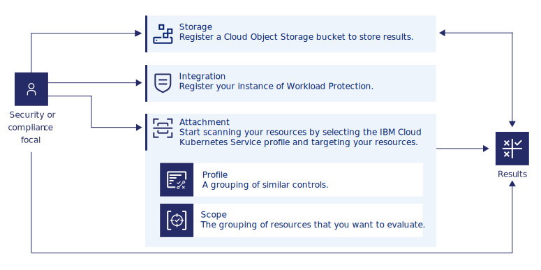

---

copyright:
  years: 2023
lastupdated: "2023-07-14"

keywords: Centralized security, workload protection, compliance monitoring, compliance, scan, sysdig, multicloud, multi-cloud, azure, amazon, aws

subcollection: security-compliance

---

{{site.data.keyword.attribute-definition-list}}

# Connecting {{site.data.keyword.sysdigsecure_short}}
{: #setup-workload-protection}

When you integrate an instance of {{site.data.keyword.sysdigsecure_full}} with {{site.data.keyword.compliance_short}}, you can run scans that validate your level of compliance to a specific predefined profile. Then, you can view all the results and a history of those results in a single location.
{: shortdesc}

In your {{site.data.keyword.sysdigsecure_full_notm}} instance, create a connection that contains the compliance data that you want to see so that you can see both {{site.data.keyword.cloud_notm}} and {{site.data.keyword.sysdigsecure_short}} results in one view.

To learn more about how the integration is configured, check out the following diagram.

{: caption="Figure 1. {{site.data.keyword.sysdigsecure_short}} integration flow" caption-side="bottom"}

1. Register an {{site.data.keyword.cos_full}} bucket to store results.
1. Create an instance of {{site.data.keyword.sysdigsecure_short}} from the {{site.data.keyword.cloud_notm}} catalog.
1. In your {{site.data.keyword.compliance_short}} instance, register your {{site.data.keyword.sysdigsecure_short}} integration.
1. Create an attachment between the scope and the profile. A scope is the set of resources that you want to evaluate, and the profile contains the controls that you want to evaluate. For AWS and Azure, you specify the filters that you want to get fine-grained results.
1. Navigate to the dashboard in the {{site.data.keyword.compliance_short}} UI to view your results.

## Before you begin
{: #wp-before}

Before you get started, be sure that you have the following prerequisites:

* An {{site.data.keyword.cloud_notm}} account. For more information, see [Setting up your {{site.data.keyword.cloud_notm}} account](/docs/account?topic=account-account-getting-started).
* An instance of the {{site.data.keyword.compliance_short}} service. For more information, see [Create an instance](/docs/security-compliance?topic=security-compliance-getting-started#gs-instance).
* A {{site.data.keyword.cos_short}} bucket to store results. For more information, see [Setting up data storage and processing for {{site.data.keyword.compliance_short}}](/docs/security-compliance?topic=security-compliance-storage).
* An instance of {{site.data.keyword.sysdigsecure_full_notm}}. For more information about creating an instance from the {{site.data.keyword.cloud_notm}} catalog, see [Getting started with {{site.data.keyword.sysdigsecure_short}}](/docs/workload-protection?topic=workload-protection-getting-started).

   

* The required level of access to create and manage integrations in {{site.data.keyword.compliance_short}}. To pull results from {{site.data.keyword.sysdigsecure_short}}, you must have the *administrator* platform role or higher for the {{site.data.keyword.compliance_short}} service. For more information, see [Assigning access](/docs/security-compliance?topic=security-compliance-access-management).

## Registering the integration
{: #wp-register}

Register an integration with the {{site.data.keyword.compliance_short}}.

1. In the {{site.data.keyword.cloud_notm}} console, click the **Menu** icon  > **Security and Compliance** to access the {{site.data.keyword.compliance_short}}.
1. In the navigation, click **Integrations**.
1. In the **{{site.data.keyword.sysdigsecure_short}}** tile, click **Connect**.
1. On the Connect your {{site.data.keyword.sysdigsecure_short}} account page, provide a name for your connection.
1. Set up service-to-service authorization, which allows {{site.data.keyword.compliance_short}} to communicate with {{site.data.keyword.sysdigsecure_short}}.
   1. When you are prompted for service authorization, click **Authorize**.
   1. For the target service, select {{site.data.keyword.sysdigsecure_short}}. {{site.data.keyword.compliance_short}} is the source service. Reader access is automatically selected. Click **Review**.
   1. On the Review page, ensure that the target service and role are correct, and then click **Assign**.

   Alternatively, you can use IAM to create an authorization to allow the {{site.data.keyword.compliance_short}} service instance access to the {{site.data.keyword.sysdigsecure_short}} service instance.
   {: note}

1. Select the {{site.data.keyword.sysdigsecure_short}} instance, and then click **Connect**.

After the connection is successfully created, click the **Connected** tab. If you want to open the {{site.data.keyword.sysdigsecure_short}} instance dashboard, click **Dashboard URL**.

## Creating the attachment
{: #wp-attachment}

To evaluate your resources, you create an attachment. An attachment is the association between the set of resources that you want to evaluate and a profile that contains the specific controls that you want to evaluate. An attachment is how you target a specific grouping of your resources to evaluate against a specific profile.

You must have already have a {{site.data.keyword.cos_short}} bucket available. Be sure to use a bucket that's located in the same region that your data is processed.

To create an attachment, complete these steps:

1. In the {{site.data.keyword.compliance_short}} UI, navigate to the **Attachments** page. A list of all of the attachments in your account is displayed.
1. Click **Create**.
1. Provide a name and description for your attachment. Be as descriptive as possible so that it's easy for other members of your team to understand what is being evaluated. Then, click **Next**.
1. If you don't already have Cloud Object Storage bucket configured, click **Connect**. You must connect a Cloud Object Storage bucket to store your evaluation results. As a best practice, it is recommended that you use a bucket that is located in the same region in which your data is processed.
1. On the Connect Storage page, select the {{site.data.keyword.cos_short}} instance. Then, select the {{site.data.keyword.cos_short}} bucket, and click **Connect**.

1. Select the **Profile** and **Profile version** that you want to use for your evaluation, and then click **Next**.

   Predefined profiles are available, but you can create a custom profile that uses only the controls that you want. In other words, create a custom profile if you don’t want to use all the controls in the predefined profile. 
   {: tip}

1. For some profiles, you can customize the underlying evaluations in your scan by editing the default parameters to match your specific use case, and then click **Next**.
1. Select your {{site.data.keyword.sysdigsecure_short}} instance. If you select an IKS, EKS, or AKS profile, define a **Scope** to identify the resources that you want to evaluate and the resources that you want to **Exclude**. Then, click **Next**.

   This step is where you enter the resource values that you noted when you created your {{site.data.keyword.sysdigsecure_short}} instance.
   {: tip}

1. Select the frequency at which you want to evaluate your attachment. Options include every day, every 7 days, and every 30 days. Additionally, you can pause your scans if you need to. Then, click **Next**.
1. Indicate whether you want to be notified if evaluations fail during a scan. For more information about setting up the notifications, see [Running an evaluation](/docs/security-compliance?topic=security-compliance-scan-resources).
1. Review your settings, and ensure that all of the configurations are correct for your targeted scope. Then, click **Create**.

Based on the schedule that you defined in your connection, {{site.data.keyword.sysdigsecure_short}} pulls the data in your account to the {{site.data.keyword.compliance_short}}.

## Viewing the results
{: #wp-results}

To view the scan results, go to the {{site.data.keyword.compliance_short}} dashboard.

{: caption="Figure 2. Example dashboard" caption-side="bottom"}

When you visit the {{site.data.keyword.compliance_short}} dashboard, three graphical representations of data are aggregated from your scans. The following data is displayed:

Success rate
:   The rate at which your configurations pass the evaluation that is conducted.

The number of evaluations that are conducted does not always match the number of billable evaluations because no charge occurs for assessments that are evaluated as unable to perform. Be sure to look for the billable evaluations in each scan result if you need to estimate your cost.
{: note}

Total controls
:   The total number of controls that were evaluated in the past 30 days. 

Total evaluations
:   The total number of evaluations that ran in the past 30 days. An evaluation is the check of one resource against one assessment.

For more information, see [Viewing detailed results in the dashboard](/docs/security-compliance?topic=security-compliance-results&interface=ui#view-detailed-results).
