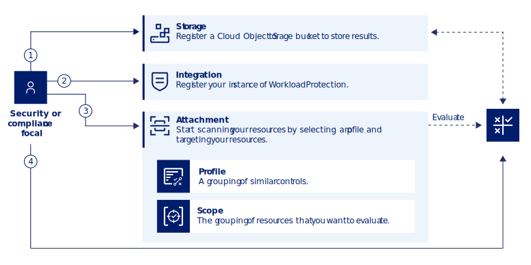

---

copyright:
  years: 2023
lastupdated: "2023-07-11"

keywords: Centralized security, workload protection, compliance monitoring, compliance, scan, sysdig, multicloud, multi-cloud, azure, amazon, aws

subcollection: security-compliance

---

{{site.data.keyword.attribute-definition-list}}

# Connecting {{site.data.keyword.sysdigsecure_short}}
{: #setup-workload-protection}

When you integrate an instance of {{site.data.keyword.sysdigsecure_full}} with {{site.data.keyword.compliance_short}}, you can run scans that validate your level of compliance to a specific predefined profile. Then, you can view all the results and a history of those results in a single location.
{: shortdesc}

To learn more about how the integration is configured, check out the following diagram.

{: caption="Figure 1. {{site.data.keyword.sysdigsecure_short}} integration flow" caption-side="bottom"}

1. In your {{site.data.keyword.sysdigsecure_full_notm}} instance, create a connection that contains the compliance data that you want to see in {{site.data.keyword.cloud_notm}} so that you can see both {{site.data.keyword.cloud_notm}} and {{site.data.keyword.sysdigsecure_short}} results in one view.
2. In your {{site.data.keyword.cloud_notm}} account, register your integration with the {{site.data.keyword.compliance_short}}.
3. Define a scope to link the connection that you created in {{site.data.keyword.sysdigsecure_short}} with the {{site.data.keyword.compliance_short}}.
4. In the background, the {{site.data.keyword.compliance_short}} creates the backend connection when the scope is created.
5. Based on the schedule that you defined in your connection, {{site.data.keyword.sysdigsecure_short}} pulls the data in your account to the {{site.data.keyword.compliance_short}}.
6. You can navigate to the Dashboard in the {{site.data.keyword.compliance_short}} UI to view your results.

## Before you begin
{: #wp-before}

Before you get started, be sure that you have the following prerequisites.

* An {{site.data.keyword.cloud_notm}} account.
* An instance of {{site.data.keyword.sysdigsecure_full_notm}} that is already configured to run scans. For more information about creating an instance from the {{site.data.keyword.cloud_notm}} catalog, see [Getting started with {{site.data.keyword.sysdigsecure_short}}](/docs/workload-protection?topic=workload-protection-getting-started).
   Be sure to copy the {{site.data.keyword.sysdigsecure_short}} dashboard URL because you need to provide it later. You must get the values of your resources (for example, cluster name and region) from your {{site.data.keyword.sysdigsecure_short}} instance.
   {: important}

* The required level of access to create and manage integrations in {{site.data.keyword.compliance_short}}. For more information, see [Assigning access](/docs/security-compliance?topic=security-compliance-access-management). To pull results from {{site.data.keyword.sysdigsecure_short}}, you must have the *administrator* platform role or higher for the {{site.data.keyword.compliance_short}} service.

## Registering the integration
{: #wp-register}

Register an integration with the {{site.data.keyword.compliance_short}}.

1. In the {{site.data.keyword.cloud_notm}} console, click the **Menu** icon  **> Security and Compliance** to access the {{site.data.keyword.compliance_short}}.
1. In the navigation, click **Integrations**.
1. In the **{{site.data.keyword.sysdigsecure_short}}** tile, click **Connect**.
1. Set up service-to-service authorization, which allows {{site.data.keyword.compliance_short}} to communicate with {{site.data.keyword.sysdigsecure_short}}.
   1. When you are prompted for service authorization, click **Authorize**.
   1. For the target service, select {{site.data.keyword.sysdigsecure_short}}. {{site.data.keyword.compliance_short}} is set as the source service. Reader access is automatically selected. Click **Review**.
   1. On the Review page, ensure that the target service and role are correct, and then click **Assign**.

   Alternatively, you can use IAM to create an authorization to allow the {{site.data.keyword.compliance_short}} service instance access to the {{site.data.keyword.sysdigsecure_short}} service instance.
   {: note}

1. On the Connect your {{site.data.keyword.sysdigsecure_short}} account page, provide a name for your connection.
1. Select the {{site.data.keyword.sysdigsecure_short}} instance, and then click **Connect**.

After the connection is successfully created, click the **Connected** tab. If you want to open the {{site.data.keyword.sysdigsecure_short}} instance dashboard, click **Dashboard URL**.

## Creating the attachment
{: #wp-attachment}

To evaluate your resources, you create an attachment. An attachment is the association between the set of resources that you want to evaluate and a profile that contains the specific controls that you want to evaluate. An attachment is how you target a specific grouping of your resources to evaluate against a specific profile.

To create an attachment, complete these steps:

1. In the {{site.data.keyword.compliance_short}} UI, navigate to the **Attachments** page, and click **Create**. A flat list of all of the attachments in your account is displayed.

	Alternatively, you can create an attachment through the **Profiles** page. On the **Attachments** tab of the profile details page, click **Create**, and then continue with the next step.
	{: tip}

1. Provide a name and description for your attachment. Be as descriptive as possible so that it's easy for other members of your team to understand what is being evaluated. Then, click **Next**.
1. Select the **Profile** and **Profile version** that you want to use for your evaluation.

1. Customize the underlying evaluations in your scan by editing the default parameters to match your specific use case.
1. Define a **Scope** to identify the resources that you want to evaluate and those that you want to **Exclude**. Then, click **Next**.
1. Select the frequency at which you want to evaluate your attachment. Options include every day, every 7 days, and every 30 days. Additionally, you can pause your scans if you need to.

Profiles are created from libraries. There is a predefined profile, but you can create a custom profile to use only the controls that you want. In other words, create a custom profile if you don’t want to use all the controls in the predefined profile.
{: tip}

For more information, see [Running an evaluation](/docs/security-compliance?topic=security-compliance-scan-resources).

## Viewing the results
{: #wp-results}

To view the results, go to the {{site.data.keyword.compliance_short}} dashboard.

{: caption="Figure 2. Example dashboard" caption-side="bottom"}

When you visit the {{site.data.keyword.compliance_short}} dashboard, three graphical representations of data are aggregated from your scans. The following data is displayed:

Success rate
:   The rate at which your configurations pass the evaluation that is conducted.

The number of evaluations conducted does not always match the number of billable evaluations, as there is no charge for assessments evaluated as unable to perform. Be sure to look for the billable evaluations in each scan result if you need to estimate your cost.
{: note}

Total controls
:   The total number of controls that have been evaluated in the past 30 days. 

Total evaluations
:   The total number of evaluations that have been run in the past 30 days. An evaluation is the check of one resource against one assessment.

For more information, see [Viewing detailed results in the dashboard](/docs/security-compliance?topic=security-compliance-results&interface=ui#view-detailed-results).

## Finding existing integrations
{: #wp-existing-integrations}

To find out if you already have a {{site.data.keyword.sysdigsecure_short}} integration registered with the {{site.data.keyword.compliance_short}}, complete these steps:

1. In the {{site.data.keyword.cloud_notm}} console, click the **Menu** icon  **> Security and Compliance** to access the {{site.data.keyword.compliance_short}}.
1. In the navigation, click **Integrations**.
1. On the Integrations page, click the **Connected** tab. Any existing {{site.data.keyword.sysdigsecure_short}} integrations are listed.
1. Click **Dashboard URL** to open your {{site.data.keyword.sysdigsecure_short}} instance.
