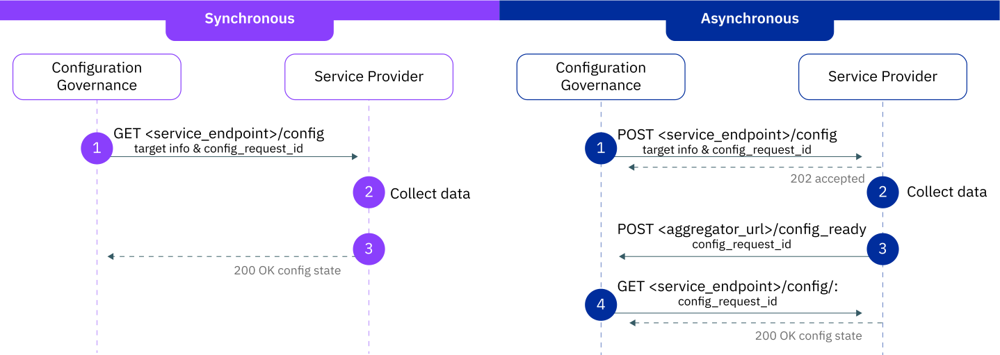
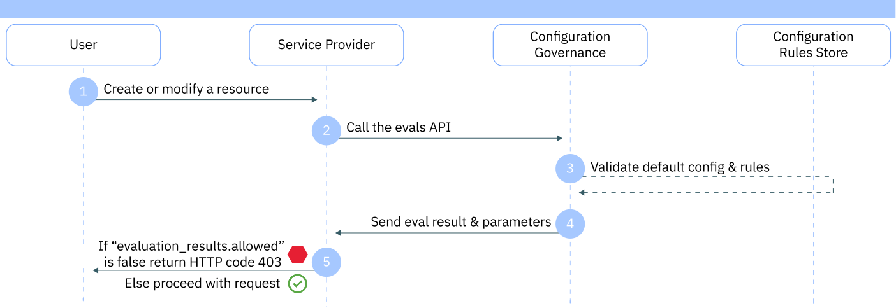

<staging>---

copyright:
  years: 2020, 2022
lastupdated: "2022-02-15"

keywords: documenting security and compliance, onboard security and compliance, onboard fortress, onboard scc, integrated services, fortress, scc, enable rules, enable scc, enable fortress

subcollection: security-compliance

content-type: tutorial
services: security-compliance

---

{:codeblock: .codeblock}
{:screen: .screen}
{:download: .download}
{:external: target="_blank" .external}
{:faq: data-hd-content-type='faq'}
{:gif: data-image-type='gif'}
{:important: .important}
{:note: .note}
{:pre: .pre}
{:tip: .tip}
{:preview: .preview}
{:deprecated: .deprecated}
{:beta: .beta}
{:term: .term}
{:shortdesc: .shortdesc}
{:script: data-hd-video='script'}
{:support: data-reuse='support'}
{:table: .aria-labeledby="caption"}
{:troubleshoot: data-hd-content-type='troubleshoot'}
{:help: data-hd-content-type='help'}
{:tsCauses: .tsCauses}
{:tsResolve: .tsResolve}
{:tsSymptoms: .tsSymptoms}
{:java: .ph data-hd-programlang='java'}
{:javascript: .ph data-hd-programlang='javascript'}
{:swift: .ph data-hd-programlang='swift'}
{:curl: .ph data-hd-programlang='curl'}
{:video: .video}
{:step: data-tutorial-type='step'}
{:tutorial: data-hd-content-type='tutorial'}
{:ui: .ph data-hd-interface='ui'}
{:cli: .ph data-hd-interface='cli'}
{:api: .ph data-hd-interface='api'}
{:release-note: data-hd-content-type='release-note'}

# Onboarding to Configuration Governance
{: #internal-onboard-config}
{: toc-content-type="tutorial"}
{: toc-services="security-compliance"}

As a service provider in {{site.data.keyword.cloud_notm}}, onboarding to the {{site.data.keyword.compliance_short}} is part of completing Service Framework requirements. The time-frame for each service varies, but is tracked as part of FS Cloud and Hamilton waves [[Wave 1]](https://github.ibm.com/ibmcloud/Portfolio-Offering/issues/182){: external} | [[Wave 2]](https://github.ibm.com/ibmcloud/Portfolio-Offering/issues/183){: external}. This tutorial can help you to onboard to Configuration Governance by walking you through defining resource kinds and configuration properties, registering with the config service, and adopting the evaluation API. Although it is not a requirement to onboard to Posture Management first, most service providers have found it easiest to start by implementing goals and then building on that to create a property / rule. For more information, see Onboarding to [Posture Management](/docs/security-compliance?topic=security-compliance-internal-onboard-monitoring).
{: shortdesc}

To learn more about the [Configuration Governance component](/docs/security-compliance?topic=security-compliance-what-is-governance#gov-works) of the {{site.data.keyword.compliance_short}}, check out our [video playlist](https://secure.video.ibm.com/channel/23887899/playlist/636374){: external} to see some example use-cases, or read more about formatting [rules and templates](/docs/security-compliance?topic=security-compliance-formatting-rules-templates) in the docs.
{: tip}

## Summary
{: #internal-config-summary}

Onboarding to Configuration Governance is a service framework requirement. To adopt Configuration Governance, {{site.data.keyword.cloud_notm}} service providers are required to fulfill seven onboarding steps:

1. Define your service configuration - Resource kinds, properties, and attributes.
2. Register your service with Configuration Governance by using the registration API.
3. Choose your Configuration Information Point pattern (CIP).
4. Authorize your CIP.
5. Adopt the evaluation API.
6. Prepare your end user documentation.
7. Promote your integration to production.


## Before you begin
{: #internal-config-prereq}

Before your service can onboard to the {{site.data.keyword.compliance_short}}, you must be integrated with IAM and registered with Global Catalog.


## Define your service configuration
{: #internal-define-kinds-properties}
{: step}

As part of the service registration, service providers define supported configurations. Each `supported_configs` object includes a resource kind. Each resource kind includes a description, a boolean that indicates whether the CIP endpoint requires the service instance CRN, attributes, and properties.

Resource properties are configuration variables to associate with the resource that an end user will use to create a rule. They are always in key/value format and we support nested properties for any sub-properties you might have. When choosing your properties, align names with your API spec. To see all of the fields that you must register with, see the [API docs](/apidocs/security-compliance-config#create-service).

Check out the following table to see some examples of resource kinds, attributes, and properties.

| Resource kind | Description | Required |
|:--------------|:------------|:---------|
| `instance` | Describes the properties that apply to service instances| Yes if the resource is an instance |
| `image` | Describes the properties that apply to container registry images | No |
| `service` | Describes the properties that apply to the entire service | No |
{: caption="Table 1. Example resource kinds" caption-side="top"}
{: #supported-table-1}
{: tab-title="Resource kind"}
{: tab-group="examples"}
{: class="simple-tab-table"}

| Attributes | Description | Required |
|:-----------|:------------|:---------|
| `resource_id` | An unique identifier associated with a resource. If present, will be logged in a [Activity Tracker evaluation event](/docs/security-compliance?topic=security-compliance-internal-onboard-config#internal-enforcement) | Strongly recommended for a better user experience |
| `resource_name` | Display name of resource. If present, will be logged in a [Activity Tracker evaluation event](/docs/security-compliance?topic=security-compliance-internal-onboard-config#internal-enforcement) and used as the display name in monitoring reports | Strongly recommended for a better user experience |
| `location` | Geographic location as tracked in global catalog | No |
{: caption="Table 1. Example target attributes" caption-side="top"}
{: #supported-table-2}
{: tab-title="Target attributes"}
{: tab-group="examples"}
{: class="simple-tab-table"}

| Property | Description | Required |
|:-----------|:------------|:---------|
| `private_network_only` | A boolean that indicates whether access to an instance is enabled only through a private network. | Yes, if the control is `Disable Public Endpoint` |
{: caption="Table 1. Example property" caption-side="top"}
{: #supported-table-3}
{: tab-title="Properties"}
{: tab-group="examples"}
{: class="simple-tab-table"}

## Register your service
{: #internal-register}
{: step}

Service providers integrate with the Configuration Governance component by using the [services registration API](/apidocs/security-compliance/config#create-service). To register your service in staging, complete the following steps.

1. Optional: create a [service ID](/apidocs/iam-identity-token-api#create-a-service-id) and [API key](/apidocs/iam-identity-token-api#create-an-api-key) to manage the service registration.
2. Follow the instructions [here](https://github.ibm.com/project-fortress/adoption/tree/onboarding-staging/adopter-requests){: external} to receive authorization to call the service registration API.
3. Register your service by using the [services registration API](/apidocs/security-compliance-config#create-service).

Authorization for your service to call the service registration API and the evaluation API are granted in the form of an IAM policy. These policies are created when you submit your request.
{: note}


## Choose your CIP pattern
{: #internal-cip}
{: step}

The Configuration Information Point (CIP) is a versioned endpoint that is defined by service providers and in order to retrieve resource states for the purposes of monitoring. The CIP can be global or regional. There are two supported CIP patterns: synchronous and asynchronous. Each have a mutator for account vs instance level resources. Service providers are required to implement **one** pattern, which is defined in the CIP object in the service registration. But, the pattern that is implemented is the choice of the service provider.

Service providers must:

- Implement a CIP pattern of their choice.
- Version your CIP endpoint. For example, /v1/config.
- Implement pagination in accordance with the [{{site.data.keyword.cloud_notm}} API handbook](/docs/api-handbook?topic=api-handbook-pagination).
- Implement rate-limiting as appropriate for your service's capacity. The aggregator uses the `advisory_call_limit`, which you set as part of your service registration as a throttling mechanism to not overload the CIP endpoint, along with incremental retries to handle rate-limiting errors.
- Return all query parameters decoded, including `config_request_id`. They are URI encoded.
- Understand the resources that you return a configuration state for, based on the target request that you receive from the aggregator.


### CIP Flows
{: #internal-cip-flows}

The following diagram describes both the synchronous and asynchronous flows for retrieving resource states.

{: caption="Figure 1. The CIP request flow patterns" caption-side="bottom"}

| Synchronous request flow |
|:-----------|
| 1. Configuration Governance sends a request to the service provider's CIP to get the resource state of a target. Learn more by [viewing the API](https://pages.github.ibm.com/project-fortress/adoption/#/Synchronous%20Pattern/get_v2_config){: external}.  \n 2. Service provider collects the requested resource state.  \n 3. Service provider returns the resource state to the Configuration Governance component. |
{: caption="Table 2. Synchronous CIP pattern flow" caption-side="top"}
{: #sync}
{: tab-title="Synchronous"}
{: tab-group="cip-flows"}
{: class="simple-tab-table"}

| Asynchronous request flow |
|:-----------|
| 1. Configuration Governance sends a request to the service provider’s CIP to request resource state of a target. [Learn more about the API specs](https://pages.github.ibm.com/project-fortress/adoption/#/Asynchronous%20Pattern/post_v1_config){: external}.  \n 2. Service provider asynchronously collects the requested resource state.  \n 3. Service provider sends a request to Configuration Governance to signal that the resource state collection on the requested target is complete.  \n 4. Configuration Governance sends a request to the service provider’s CIP to fetch the resource state of the requested target. [Learn more about the API specs](https://pages.github.ibm.com/project-fortress/adoption/#/Asynchronous%20Pattern/get_v1_config__config_request_id_){: external}. |
{: caption="Table 2. Asynchronous CIP pattern flow" caption-side="top"}
{: #async}
{: tab-title="Asynchronous"}
{: tab-group="cip-flows"}
{: class="simple-tab-table"}

The client for the CIP requests has a 60 second timeout. If it takes longer than 60 seconds to retrieve a resource state, then you must choose the asynchronous pattern.
{: note}

## Authorize the CIP
{: #internal-authorization}
{: step}

Service providers must authorize calls to the CIP by using the IAM PDP interface. To do so, [add a new platform action](/docs/security-compliance?topic=security-compliance-internal-onboard-faq#internal-faq-map-action) to your IAM service definition in the form `service_name.config.read` (`crn:v1:bluemix:public:iam::::role:ConfigReader`). This action is used as part of the IAM authorization check. In order to retrieve the resource state from any account, the resource that is used in the check has a [global scope](/docs/get-coding?topic=get-coding-iam-control). The access token that is used by the aggregator is [scoped](/docs/get-coding?topic=get-coding-token-scoping) to the CIP service in order to prevent anyone from using the same token to retrieve sensitive information from a different service provider's CIP.

### Action to be added to service registration
{: #service-reg-action}

For more information, see [the registration docs](/docs/get-coding?topic=get-coding-setup-iam).

```json
{
  "id": "<service-name>.config.read",
  "displayName": {
    "default": "Configuration Information Point API access"
  },
  "roles": [
    "crn:v1:bluemix:public:iam::::role:ConfigReader"
  ]
}
```
{: screen}

### Authz request body
{: #authz-request-body}

If your service is a composite service, the resource CRN should be formatted as follows: `crn:v1:staging:public:<parent-service>:global:::<child-service>:`. For more information, see the [IAM policy decision API docs](/apidocs/iam-policy-decision-point-api).

```json
[
  {
    "subject": { // from the token
      "attributes": {"id": "", "scope": ""}
    },
    "resource": {
      "crn": "crn:v1:staging:public:<service-name>:global::::"
    },
    "action": "<service-name>.config.read"
  }
]
```
{: screen}

When onboarding to production, the resource CRN should have `bluemix` instead of `staging`.
{: note}

## Adopt the evaluation API
{: #internal-eval-api}
{: step}

As an adopter, your service calls the Configuration Governance [evaluation API](/apidocs/security-compliance-config#create-evals) to validate configuration changes that are made in your service. Use the `requested_config` to specify the source that requested the configuration change. If the requested changes are compliant with the configuration rules that are enabled in an account, then the service provider can use the properties that are returned as part of the `updated_config` to enact the requested changes. If the changes are not compliant, the service provider blocks the request. Check out the following diagram and description to see the request flow.

{: caption="Figure 2. Example request flow starting with an end user" caption-side="bottom"}

1. An end user makes a request to create or modify a resource that is owned by the service provider.
2. The service provider makes a request to the `evals endpoint` with the `requested_config`.
3. Configuration Governance validates the user's request against any rules that might be in place.
4. Configuration Governance returns the evaluation result to the service provider.
5. Depending on the result, the service provider either blocks the action or allows the request to proceed.

To make a call to the `Evals API`, check out the current specifications in the [Cloud API docs](/apidocs/security-compliance-config#create-evals).


### Inspecting the results
{: #internal-enforcement}

When a user creates a config rule, they specify how they want IBM Cloud to react when an action is flagged in an account that is not compliant with the rule. As a service provider, you need to parse the eval results for the `evaluation_results.allowed` field. For example, check out this snippet from the response.

```json
"evaluation_results": {
  "compliant": false,
  "allowed": false
},
```
{: screen}

If the response returned for the `evaluation_results.allowed` field is `false`, block the requested action in your service from being completed and return an error message. If the response is `true`, then allow the request to proceed with the request.

Example error message:

```plaintext
403 Forbidden: The request cannot be completed as it is not compliant with a configuration rule that is enabled in your account. For more information, see the Security and Compliance Center or contact your account administrator or security focal.

Transaction ID: ab643cd135ef2gh3i3456j754vw78xyz
```
{: screen}


## Prepare end user documentation
{: #internal-config-docs}
{: step}

The final step of Configuration Governance onboarding is to [prepare your end user documentation](/docs/security-compliance?topic=security-compliance-doc-scc). Your content team must [Review rule descriptions](/docs/security-compliance?topic=security-compliance-doc-scc#scc-review-rules) and update your docs with the [{{site.data.keyword.compliance_short}} template](https://github.ibm.com/cloud-docs-internal/writing/blob/draft/content-kit/manage-scc-template.md). As part of Configuration Governance, your docs must include the `Managing security and compliance with _service_name_` and `Governing _service_name_ resource configuration` sections.

## Promote your integration to production
{: #internal-config-next}
{: step}

Now that you've registered your service, you are ready to submit a request for production. To register your service in production, complete the following steps:

1. Optional: create a [service ID](/apidocs/iam-identity-token-api#create-a-service-id) and [API key](/apidocs/iam-identity-token-api#create-an-api-key) to manage the service registration in production. **Note**: This service ID and API key are different than the ones that you created for staging.
2. Follow the instructions [here](https://github.ibm.com/project-fortress/adoption/tree/onboarding-production/adopter-requests){: external} to receive authorization to call the service registration API.
3. Let the adopters team know by posting in [#scc-adopters](https://ibm-cloudplatform.slack.com/archives/C0116MQSHRS){: external} that you're ready to promote your integration. They will complete a final review and give approval before the authorization is granted. A short call might be required. The review will include:

   * verify service registration descriptions, property names and types are accurate
   * view enforcement working in the UI, verify the error message displayed to the user, and verify a Transaction ID is being sent when calling the evals API
   * view monitoring working in the UI for a compliant and noncompliant resource

4. Promote your updated IAM service definition from staging to production in RMC.
5. Register your service by using the [services registration API](/apidocs/security-compliance-config#create-service).
6. Promote your end user documentation to production.


Use the `service_listing_enabled` field in the service registration to dark launch.
{: tip}


</staging>
