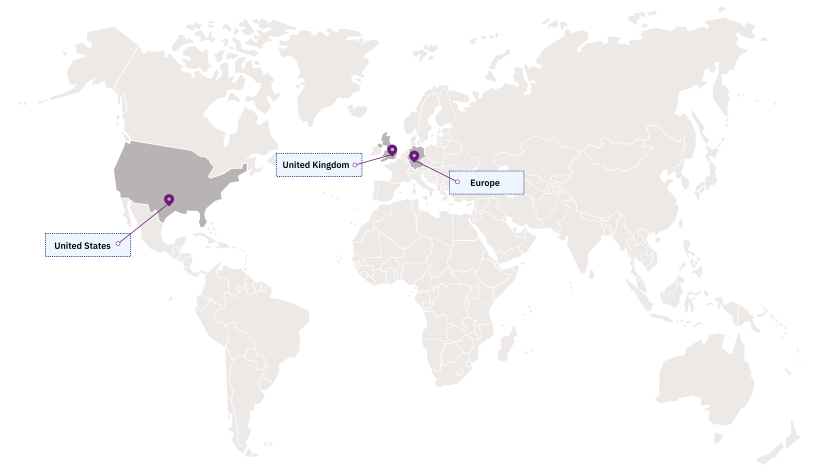

---

copyright:
  years: 2017, 2022
lastupdated: "2022-05-23"

keywords: security and compliance center locations, available locations, scc endpoints, security and compliance center endpoints, regions, scc regions

subcollection: security-compliance

---

{:codeblock: .codeblock}
{:screen: .screen}
{:download: .download}
{:external: target="_blank" .external}
{:faq: data-hd-content-type='faq'}
{:gif: data-image-type='gif'}
{:important: .important}
{:note: .note}
{:pre: .pre}
{:tip: .tip}
{:preview: .preview}
{:deprecated: .deprecated}
{:beta: .beta}
{:term: .term}
{:shortdesc: .shortdesc}
{:script: data-hd-video='script'}
{:support: data-reuse='support'}
{:table: .aria-labeledby="caption"}
{:troubleshoot: data-hd-content-type='troubleshoot'}
{:help: data-hd-content-type='help'}
{:tsCauses: .tsCauses}
{:tsResolve: .tsResolve}
{:tsSymptoms: .tsSymptoms}
{:java: .ph data-hd-programlang='java'}
{:javascript: .ph data-hd-programlang='javascript'}
{:swift: .ph data-hd-programlang='swift'}
{:curl: .ph data-hd-programlang='curl'}
{:video: .video}
{:step: data-tutorial-type='step'}
{:tutorial: data-hd-content-type='tutorial'}
{:ui: .ph data-hd-interface='ui'}
{:cli: .ph data-hd-interface='cli'}
{:api: .ph data-hd-interface='api'}
{:release-note: data-hd-content-type='release-note'}

# Locations
{: #locations}

You can use the {{site.data.keyword.compliance_short}} APIs for DevOps automation, customization, and management of your service instances. To understand availability of the service, you can review the following connectivity options.
{: shortdesc}

For more information about how your data is stored and processed in the available locations or how to change your location, see [Storing and encrypting data in the {{site.data.keyword.compliance_short}}](/docs/security-compliance?topic=security-compliance-mng-data).
{: note}

## Available locations
{: #available-locations}

{{site.data.keyword.compliance_short}} is available in the following locations and is an `EU-Supported` service. To store and process your data in the EU, select "European Union" as your location.

{: caption="Figure 1. {{site.data.keyword.compliance_short}} availability" caption-side="bottom"}

## Service endpoints
{: #service-endpoints}

If you're managing your service instances of {{site.data.keyword.compliance_short}} programmatically, see the following table to determine which API endpoints to use when you connect to the APIs. 

| API | Endpoint  |
|--------|-----------|
| Posture Management | `https://asap.compliance.cloud.ibm.com/alpha`|
| Configuration Governance | `https://compliance.cloud.ibm.com/config`|
| Admin | `https://compliance.cloud.ibm.com/admin` |
{: caption="Table 1. Formatting for the available APIs" caption-side="top"}
{: #us-endpoints}
{: tab-title="United States"}
{: tab-group="regions"}
{: class="simple-tab-table"}

| API | Endpoint  |
|--------|-----------|
| Posture Management | `https://eu.compliance.cloud.ibm.com/posture`|
| Configuration Governance | `https://compliance.cloud.ibm.com/config`|
| Admin | `https://compliance.cloud.ibm.com/admin` |
{: caption="Table 1. Formatting for the available APIs" caption-side="top"}
{: #eu-endpoints}
{: tab-title="Europe"}
{: tab-group="regions"}
{: class="simple-tab-table"}

