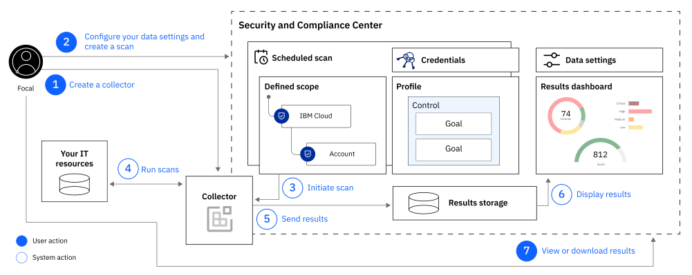
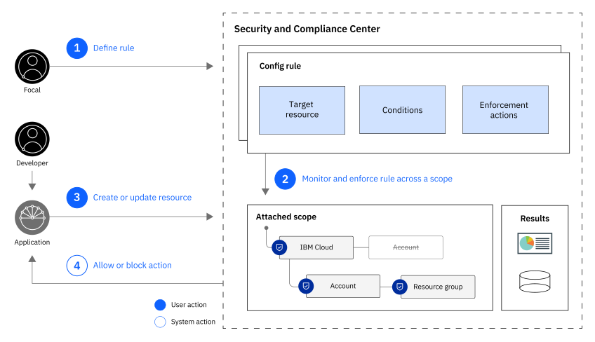
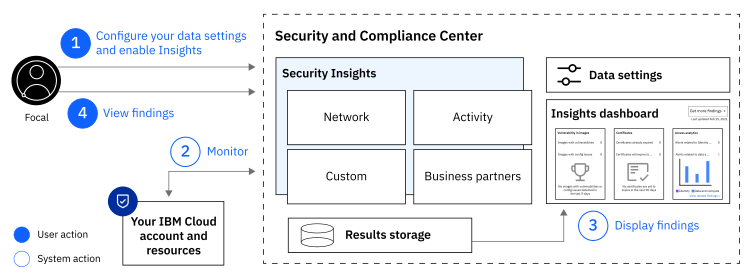

---

copyright:
  years: 2021
lastupdated: "2021-06-17"

keywords: best practices security and compliance, secure development, security strategy, insights, governance

subcollection: security-compliance

---

{:codeblock: .codeblock}
{:screen: .screen}
{:download: .download}
{:external: target="_blank" .external}
{:faq: data-hd-content-type='faq'}
{:gif: data-image-type='gif'}
{:important: .important}
{:note: .note}
{:pre: .pre}
{:tip: .tip}
{:preview: .preview}
{:deprecated: .deprecated}
{:beta: .beta}
{:term: .term}
{:shortdesc: .shortdesc}
{:script: data-hd-video='script'}
{:support: data-reuse='support'}
{:table: .aria-labeledby="caption"}
{:troubleshoot: data-hd-content-type='troubleshoot'}
{:help: data-hd-content-type='help'}
{:tsCauses: .tsCauses}
{:tsResolve: .tsResolve}
{:tsSymptoms: .tsSymptoms}
{:java: .ph data-hd-programlang='java'}
{:javascript: .ph data-hd-programlang='javascript'}
{:swift: .ph data-hd-programlang='swift'}
{:curl: .ph data-hd-programlang='curl'}
{:video: .video}
{:step: data-tutorial-type='step'}
{:tutorial: data-hd-content-type='tutorial'}
{:ui: .ph data-hd-interface='ui'}
{:cli: .ph data-hd-interface='cli'}
{:api: .ph data-hd-interface='api'}

# Meeting your security and compliance goals
{: #overview}

For highly regulated industries, such as financial services, achieving continuous security within a cloud environment is an important first step toward protecting customer and application data. Historically, that process has been difficult and manual, which placed your organization at risk. But, with {{site.data.keyword.cloud_notm}} you can integrate automatic security checks into every day workflows that are designed to minimize risk.
{: shortdesc}

## Defining your strategy
{: #strategy}

Security and compliance are two concepts that are often spoken of interchangeably. But, there are some significant differences between them. For example, compliance regulations change slowly and are generally measured as a snapshot in time. Whereas security threats are constant and always changing. Depending on the role that you fill in your organization, you might focus on ensuring compliance to industry regulations or you might focus more on mitigating incoming security threats.

Most often, as a compliance focal, you need to adhere to multiple regulations or laws at once. You are responsible for understanding and implementing the controls that are required for your business. You also have a responsibility to gather evidence that proves to external auditors that your compliance checks are in place and in continuous compliance. To get started, you can [configure a managed collector](/docs/security-compliance?topic=security-compliance-ibm-collector) or [manually create and install one](/docs/security-compliance?topic=security-compliance-collector-manual) to assess your available resources and their configuration.

As a security focal, your focus is threat detection and mitigation. To address your main concerns, you need to be sure that everyone in your organization is following the mandated guidelines. By building security checks into everyday workflows, you can regulate the way that resources can be provisioned and configured across all of {{site.data.keyword.cloud_notm}}. To get started, [define a rule](/docs/security-compliance?topic=security-compliance-rules).

## How it works
{: #how-it-works}

The {{site.data.keyword.compliance_short}} is comprised of three different components: Posture Management, Configuration Governance, and Security Insights. Each component is designed to help you to be secure and compliant in different ways.

### Posture Management
{: #posture-management}

When you work with the {{site.data.keyword.compliance_short}}, you interact with several interrelated components, including profiles, config rules, and scopes. Check out the following diagram to see how the components work together to help you manage and validate compliance in {{site.data.keyword.cloud_notm}}.

{: caption="Figure 1. How the Posture Management components work together" caption-side="bottom"}

As a security or compliance focal, you create credentials and install a collector to get started. Then, you create profiles and scopes to start validating specific sections of your business by using specific regulations or requirements. With everything configured, the {{site.data.keyword.compliance_short}} works in the background to monitor for potential risk by scanning your resources on a schedule that you determined. When the scans of your resources are complete, the service does a quick calculation to determine your security and compliance score before displaying the score and your detailed results in a dashboard. From the dashboard, you can download a detailed report that you can use to provide evidence to stakeholders or external auditors.

&ast;*Posture Management is available for {{site.data.keyword.cloud_notm}}, Amazon Web Services, Microsoft Azure, Google Cloud Platform, and on-premises environments.*

### Configuration Governance
{: #config-governance}

By creating config rules, you can standardize resource configuration across your accounts. Config rules are guardrails for how your resources can be provisioned and configured. By attaching the rules to a scope, you can monitor and enforce your rules in only the areas that you want to target. For example, if you wanted to disable public access for your production accounts but allow it in a testing account, you can do that. Additionally, you can create templates for select {{site.data.keyword.cloud_notm}} services that help you to define your preferred default property values for resources. Through rule enforcement and customized defaults, you can code with confidence that your configurations follow the guidelines that you put in place, which significantly decreases the likelihood of a misconfiguration-related security issue.

{: caption="Figure 2. How the Configuration Governance components work together" caption-side="bottom"}

&ast;*Configuration Governance is available for {{site.data.keyword.cloud_notm}} only.*

### Security Insights
{: #security-insights}

With Security Insights, you can continuously monitor and analyze your {{site.data.keyword.cloud_notm}} resources and applications for potential risks that might impact your environment. With Security Insights, you get access to threat detection, security risk prevention, and suggested remediation steps that can help to mitigated issued findings, sent through customized alert notifications, that can give you a more comprehensive understanding of your current security status. Check out the following table to learn more about the different capabilities.

{: caption="Figure 3. A visual representation of the components of Security Insights." caption-side="bottom"}

<dl>
  <dt>Activity Insights</dt>
    <dd>By comparing user activity that is logged by {{site.data.keyword.at_short}} against predefined rule packages, you can identify suspicious behavior as it relates to your {{site.data.keyword.cloud_notm}} resources, which can help to prevent malicious attacks on your applications.</dd>
  <dt>Network Insights</dt>
    <dd>By monitoring and analyzing your VPC flow logs, you can identify suspicious behavior through your the network communication between your VPC interfaces. For example, you can identify Virtual Server Instances that might be compromised or attempts to compromise your VSIs.</dd>
  <dt>Custom insights</dt>
    <dd>To view all of your security alerts in one place, you can integrate your own security tools with the {{site.data.keyword.compliance_short}} by using the Findings API.</dd>
  <dt>Business partners</dt>
    <dd>If you work with one of our business partners such as Caveonix, Twistlock, or NeuVector, you can easily integrate your findings with the {{site.data.keyword.compliance_short}} to further assess the risk and compliance posture of your workloads that are deployed on IBM Cloud.</dt>
</dl>

&ast;*Security Insights is available for {{site.data.keyword.cloud_notm}} only.* 
