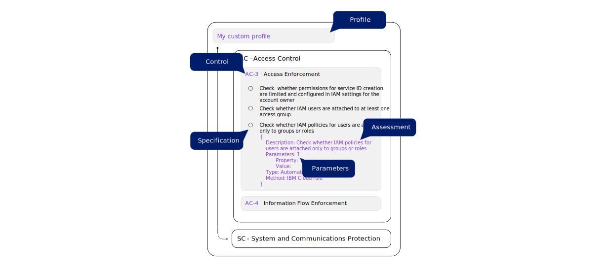
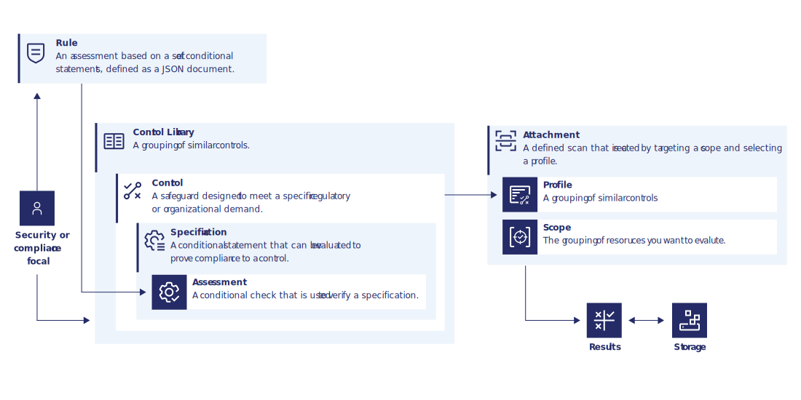

---

copyright:
  years: 2020, 2023
lastupdated: "2023-07-05"

keywords: security and compliance, secure development, security strategy

subcollection: security-compliance

---

{{site.data.keyword.attribute-definition-list}}

# How does {{site.data.keyword.compliance_short}} work?
{: #posture-management}

When you work with {{site.data.keyword.compliance_full}}, you interact with several different entities and can take multiple user paths through the service. Learn more about each entity by reviewing the following definitions and user flows.

## Terminology
{: #terms}

Control
:   A technical, administrative, or physical safeguard that is designed to meet a set of defined security and privacy requirements. Controls exist to prevent, detect, or lessen the ability of a threat to exploit a vulnerability.

Control library
:   A collection of predefined or custom controls. Control libraries show all the controls in your accounts that are available to be evaluated. A library is helpful for organizing and versioning of your controls. A library is structured as follows. 

	{: caption="Figure 1. Understanding control libraries" caption-side="bottom"}

Profile
:   A group of controls that are related to a specific compliance objective.

	Although very similar in structure to a control library, a profile can be attached to a set of resources and be evaluated. When you create the attachment, you can set the parameters that define the way that the evaluation is done.

	{: caption="Figure 2. Understanding profiles in the new architecture" caption-side="bottom"}

Specification
:   A statement that defines the specific security and privacy requirements that a control must meet. For example, `Check whether App ID Cloud Directory users aren't able to update their own accounts`.

Assessment
:   The actual evaluation of a configuration for compliance with applicable standards. An assessment can be either automated or manual depending on the control. Currently, the only available type of assessment is an {{site.data.keyword.cloud_notm}} rule. 

Rule
:   A set of conditional statements that are used to determine whether a resource configuration is in compliance. To evaluate a rule, you must associate it with a profile through an assessment.

Parameter
:   The specific configuration property that is evaluated. Each parameter is assigned a value by default that can be customized when an attachment is created. For example, if a control evaluates which region that a resource exits in, you can specify the region that you want to check for by defining the parameter.

Scope
:   The group of resources that you want to evaluate. In the new API-based architecture, a scope can be an Enterprise, Account group, Account, or Resource group.

Attachment
:   The connection between a profile and scope that defines the way that {{site.data.keyword.compliance_short}} conducts an evaluation. An attachment is formed by selecting the grouping of resources that you want to evaluate and a profile. Then, you specify the parameters that you want to evaluate for. Attachments are evaluated once per day or can be initiated as needed.

Report
:   The information that is returned by an evaluation is known as a report. For a breakdown of the information in the report, see [Understanding results](/docs/security-compliance?topic=security-compliance-results).

## Understanding the user flow
{: #user-flow}

Now that you have an understanding of the various entities that exist within {{site.data.keyword.compliance_short}}, how do they work together? The following diagram details the user flows that you might take when you are working with {{site.data.keyword.compliance_short}}. 

{: caption="Figure 1. Understanding the user flow for {{site.data.keyword.compliance_short}}" caption-side="bottom"}

1. As a security or compliance focal, choose a predefined profile that is most suitable for your organization. Optionally you can customize the profile by creating custom rules, adding or removing rules, or building your own profile based on the catalog of controls. 
2. To start scanning your resources, create an attachment of the profile to the scope of resources you want to scan. You can optionally customize parameters of the controls when you create the attachment.
3. After the attachment is created, your resources are evaluated one time per day by {{site.data.keyword.compliance_short}}.
4. As results are returned, they are forwarded to a Cloud Object Storage bucket that you own.
5. Results are shown in the {{site.data.keyword.compliance_short}} dashboard. 

