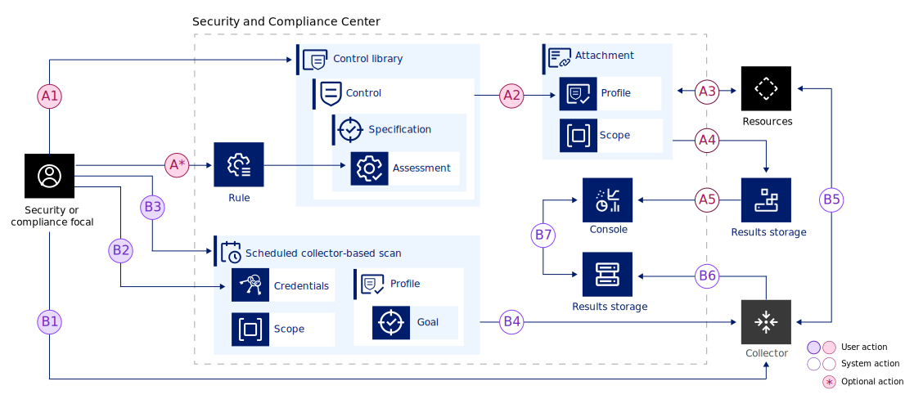

---

copyright:
  years: 2020, 2023
lastupdated: "2023-02-09"

keywords: security and compliance, secure development, security strategy

subcollection: security-compliance

---

{:codeblock: .codeblock}
{:screen: .screen}
{:download: .download}
{:external: target="_blank" .external}
{:faq: data-hd-content-type='faq'}
{:gif: data-image-type='gif'}
{:important: .important}
{:note: .note}
{:pre: .pre}
{:tip: .tip}
{:preview: .preview}
{:deprecated: .deprecated}
{:beta: .beta}
{:term: .term}
{:shortdesc: .shortdesc}
{:script: data-hd-video='script'}
{:support: data-reuse='support'}
{:table: .aria-labeledby="caption"}
{:troubleshoot: data-hd-content-type='troubleshoot'}
{:help: data-hd-content-type='help'}
{:tsCauses: .tsCauses}
{:tsResolve: .tsResolve}
{:tsSymptoms: .tsSymptoms}
{:java: .ph data-hd-programlang='java'}
{:javascript: .ph data-hd-programlang='javascript'}
{:swift: .ph data-hd-programlang='swift'}
{:curl: .ph data-hd-programlang='curl'}
{:video: .video}
{:step: data-tutorial-type='step'}
{:tutorial: data-hd-content-type='tutorial'}
{:ui: .ph data-hd-interface='ui'}
{:cli: .ph data-hd-interface='cli'}
{:api: .ph data-hd-interface='api'}
{:release-note: data-hd-content-type='release-note'}

# How does Security and Compliance center work?
{: #posture-management}

With {{site.data.keyword.compliance_full}}, you can specify specific regulatory or organizational controls that you need to meet for compliance purposes. Then you can use {{site.data.keyword.compliance_short}} to prove that your organization is compliant with those controls by assessing your resource configurations. When the assessment is complete, you can view your results in a graphical dashboard. 
{: shortdesc}

A new experience for {{site.data.keyword.compliance_short}} is here! The service architecture has been updated to provide more transparency into the evaluations that are conducted. Currently, {{site.data.keyword.cloud_notm}} resources are available to be evaluated in the new format. As additional functionality becomes available, information will be provided. 
{: note}

## Understanding user flows
{: #user-flows}

Now that you have an understanding of each entity individually, how do they work together? As part of some recent architectural changes in {{site.data.keyword.compliance_short}}, you have the option to use either an API or collector-based approach when you are working with the service. The following diagram details the two different user flows that you might take when you are working with {{site.data.keyword.compliance_short}}. Currently, if you're working with {{site.data.keyword.cloud_notm}} resources, the evaluation process integrated with the platform and conducted through API calls. Permissions are granted through IAM. If you're working in an environment other than {{site.data.keyword.cloud_notm}}, such as Amazon Web Services or Microsoft Azure, or if you're working with the OSCO profile you must use the collector-based flow.

{: caption="Figure 1. Understanding the user flows in {{site.data.keyword.compliance_short}}" caption-side="bottom"}

| User flow A |
|:--------------|
| 1. As a security or compliance focal, choose a predefined profile that is most suitable for your organization. Optionally you can customize the profile by creating custom rules, adding or removing rules, or building your own profile based on the catalog of controls.  \n 2. To start scanning your resources, create an attachment of the profile to the scope of resources you want to scan. You can optionally customize parameters of the controls when you create the attachment.  \n 3. After the attachment is created, your resources are evaluated one time per day by {{site.data.keyword.compliance_short}}.  \n 4. As results are returned, they are forwarded to a Cloud Object Storage bucket that you own.  \n 5. Results are shown in the {{site.data.keyword.compliance_short}} dashboard. |
{: caption="Table 1. Understanding user flows" caption-side="top"}
{: #scc-user-flows-api}
{: tab-title="IBM Cloud"}
{: tab-group="user-flows"}
{: class="simple-tab-table"}

| User flow B |
|:--------------|
| 1. To get started as a security or compliance focal, you create and deploy a collector to infrastructure that has network connectivity to your resources.  \n 2. For the collector to read your resource configuration data, you must provide credentials that have the appropriate level of access.  \n 3. When you're ready to start evaluating, you target a set of resources by defining a scope and then scheduling your scan.  \n 4. The collector watches to see when it is time to scan.  \n 5. The collector evaluates your resources.  \n 6. When the scan is complete, results are forwarded to a database that is owned by {{site.data.keyword.compliance_short}} and are kept for 180 days.  \n 7. Results are visible in the {{site.data.keyword.compliance_short}} console on the **Hybrid cloud results** page. |
{: caption="Table 1. Understanding user flows" caption-side="top"}
{: #scc-user-flows-collector}
{: tab-title="Hybrid cloud"}
{: tab-group="user-flows"}
{: class="simple-tab-table"}

### How does the functionality differ?
{: #functionality}
{: support}

Depending on the evaluation flow that you're working in, your experience with the service differs. Review the following table to see how the functionality that is offered in each flow differs. As more functionality is released in the new architecture, this table will be updated.

|            | {{site.data.keyword.cloud_notm}} | Collector-based |
|------------|-----------|-----------------|
| Availability | {{site.data.keyword.cloud_notm}} | {{site.data.keyword.cloud_notm}}, Amazon Web Services, Google Cloud Platform, Microsoft Azure, and On-premises |
| Integrations | | Tanium and OSCO |
| Enterprise account support | Available by default | Requires setup |
| Setup | Integrated with {{site.data.keyword.cloud_notm}} - Create an attachment to start evaluating | Requires setup of collectors and credentials |
| Results storage | Customer-owned | IBM-owned |
| Control parameters | Customizable by attachment | Customizable by account |
| Custom assessments | Write simple declarative rules | |
| Versioning | Supported for controls and profiles | Requires a new profile or control be created |
| Search | Ability to search and filter controls and results by component, scope, category, and status | Searchable by control name |
{: row-headers}
{: caption="Table 2. Functionality comparison" caption-side="top"}

## Understanding scope hierarchy
{: #evaluation-hierarchy}

A scope defines which resources in your accounts are evaluated. It is defined when you create an attachment by selecting the parent account or resource group that you want to evaluate. Anything that exists within that account or group is evaluated. So, for example, if you create an attachment at the Enterprise level, then all of the account groups and accounts within them are included in your evaluation. If you don't want to evaluate a specific account, you can always exclude it from your scope when you create the attachment. When an account is excluded, any of it's child acccounts or groups are also excluded. However, as new accounts are added to your Enterprise, they are automatically evaluated according to the parent accounts attachment.

Check out the following diagram to see how three attachments can coexist within an enterprise.

{: caption="Figure 2. Attachment hierarchy" caption-side="bottom"}

Attachment A
:   In Attachment A, the target scope is the full enterprise. As you can see, all account groups and accounts that exist within the enterprise are evaluated. That is, unless they have been purposefully excluded. 

Attachment B
:   The target scope of Attachment B is a specific account group within an enterprise. As you can see, the resources in the account group are now being evaluated against the profile selected during Attachment A and are evaluated according to the profile selected when Attachment B was created.

Attachment C
:   The target scope of Attachment C is an individual account. This attachment was created in the account, outside of the context of the enterprise. As you can see, the account is now evaluated against the profile that was selected in attachment A, but the resource groups within the account are only evaluated against the profile that was selected when Attachment C was created.

To view the results of an evaluation, you look in the account where the attachment was created. If you were to use the previous image as an example, attachment A and B's results would exist within the Enterprise account and the Enterprise account is charged for the evaluation. However, attachment C's results would exist within the individual account. 

