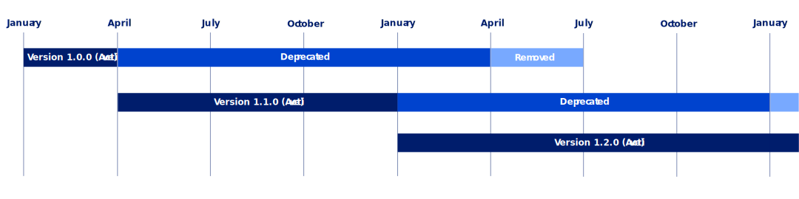

---

copyright:
  years: 2023
lastupdated: "2023-12-07"

keywords: best practices, security and compliance, governance, profile, predefined profiles, profile versioning, benchmark, controls, goals, security, compliance

subcollection: security-compliance

---

{{site.data.keyword.attribute-definition-list}}

# Managing profile versions 
{: #profile-versioning}

With profile versioning, you can upgrade to the latest version of an {{site.data.keyword.compliance_full}} profile as updates are released.
{: shortdesc}

As of 1 April 2024, profile versions that were created more than 90 days ago will be deprecated if a newer version of the profile is available. After 365 days elapse, a deprecated profile version is removed and all attachments that use this version are removed from your {{site.data.keyword.compliance_short}} instance.
{: important}

{: caption="Figure 1. Profile versioning timeline" caption-side="bottom"}

For example, if version 1.0.0 of a profile is released in January 2025 and then version 1.1.0 is released in April 2025, version 1.1.0 becomes the latest version of the profile. Because 90 days have elapsed since version 1.0.0 was released, this profile version is immediately deprecated when version 1.1.0 is released. Version 1.0.0 will be removed in April 2026, 365 days after deprecation.

Alternatively, if version 1.1.0 of the profile is released in February 2025, version 1.0.0 remains active until 90 days elapse from the date that it was released. Then, version 1.0.0 is deprecated. Profile version 1.0.0 will be removed 365 days after deprecation.

If you have at least one attachment for a version of a profile and [{{site.data.keyword.en_short}}](/docs/security-compliance?topic=security-compliance-event-notifications#event-notifications-enable) is enabled, you automatically receive profile version notifications with the latest release updates. As updates are released, you can upgrade to the latest version of a profile.
{: tip}

## What happens when a deprecated profile version expires?
{: #expired-profile-versions}

When the deprecated version of the profile expires:

* Support for the profile is removed.
* Evaluations of any attachments that use this profile are stopped.
* Attachments are scheduled for deletion. 

You can still view the results for your attachments through the Security and Compliance dashboard, or by pulling them from your Cloud Object Storage bucket. But, you cannot see your attachment in the list of attachments in the UI.
{: tip}

## Upgrading an attachment to a new profile version
{: #upgrade-profile-versions}

If you are using an active version of the profile and {{site.data.keyword.en_short}} is enabled in your {{site.data.keyword.compliance_short}} instance, you are notified when a new profile version is released. After a new profile version is released, the previous version remains active only if it was created less than 90 days before the new version was released. 90 days after the new profile version is released, the previous version is deprecated.

When the active version is deprecated, you are notified about the upcoming removal at deprecation time (365 days before removal), and at 90 days, 60 days, 30 days, 10 days, and 1 day before removal. Your final notification informs you that the profile version was removed. After you upgrade your attachment to use the new profile version, you will not receive any further notifications.

You can upgrade your attachment to use the new profile version anytime during the deprecation period, while the version is active.

1. In the {{site.data.keyword.compliance_short}} UI, navigate to the **Attachments** page.
2. Find the row for the attachment that you want to upgrade to use the new profile version and click **Upgrade** in the **Updates** column.
3. Validate the default parameter values and update any values, as required.
4. The attachment is migrated to the latest version of the profile. This operation cannot be undone.

You cannot attach new attachments to a deprecated profile version, or [build a custom profile](/docs/security-compliance?topic=security-compliance-build-custom-profiles#create-profile-ui) by pulling the controls from the library of a deprecated profile version.
{: tip}

