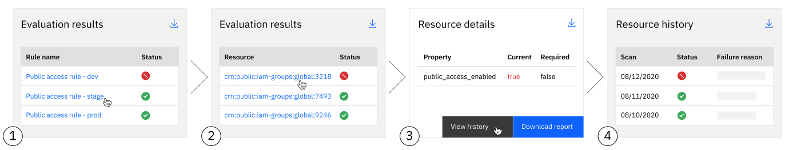

---

copyright:
  years: 2021
lastupdated: "2021-09-22"

keywords: evaluation results, rule results, configuration results, resource configuration, 

subcollection: security-compliance

---

{:codeblock: .codeblock}
{:screen: .screen}
{:download: .download}
{:external: target="_blank" .external}
{:faq: data-hd-content-type='faq'}
{:gif: data-image-type='gif'}
{:important: .important}
{:note: .note}
{:pre: .pre}
{:tip: .tip}
{:preview: .preview}
{:deprecated: .deprecated}
{:beta: .beta}
{:term: .term}
{:shortdesc: .shortdesc}
{:script: data-hd-video='script'}
{:support: data-reuse='support'}
{:table: .aria-labeledby="caption"}
{:troubleshoot: data-hd-content-type='troubleshoot'}
{:help: data-hd-content-type='help'}
{:tsCauses: .tsCauses}
{:tsResolve: .tsResolve}
{:tsSymptoms: .tsSymptoms}
{:java: .ph data-hd-programlang='java'}
{:javascript: .ph data-hd-programlang='javascript'}
{:swift: .ph data-hd-programlang='swift'}
{:curl: .ph data-hd-programlang='curl'}
{:video: .video}
{:step: data-tutorial-type='step'}
{:tutorial: data-hd-content-type='tutorial'}
{:ui: .ph data-hd-interface='ui'}
{:cli: .ph data-hd-interface='cli'}
{:api: .ph data-hd-interface='api'}

# Viewing evaluation results
{: #results}

With the {{site.data.keyword.compliance_full}}, your {{site.data.keyword.cloud_notm}} resources are continuously evaluated for potential issues. From the {{site.data.keyword.compliance_short}} UI, you can investigate further to address any noncompliant results.
{: shortdesc}

## Before you begin
{: #before-evaluation-results}

Before you get started, be sure that you have the required level of access to view and manage results. To view results, you need the viewer platform role or higher. For more information, see [Assigning access](/docs/security-compliance?topic=security-compliance-access-management).

## Understanding your results
{: #understand-results}

To access the evaluation results for your rules, go to the **Menu** icon  **> Security and Compliance > View results**.

From the details page, you can view a summary of your evaluation results for any existing rules that are attached to scopes. When an issue is flagged that you want to know more about, you can drill into the results to get to your wanted level of information. At each level, you can download a detailed report with the information that is available at that level. Check out the following image to see the level of detail that you can achieve by investigating.

{: caption="Figure 1. Navigating to specific results" caption-side="bottom"}

1. Investigate noncompliant rules.

   In this example, **Public access rule - staging** is a failing rule that must be further investigated. When you select a rule, a new page opens that shows the compliance results about the resources that the rule was evaluated against.

2. View the resources that were evaluated by using the rule.

   On the page that opens, you see a list of the resources that the rule is attached to. To view the details for a specific resource, select the name of the resource. 

2. View the details of a specific resource.

   After a specific resource is selected, a **Details** pane opens that contains all of the information for that resource. For example, the unique identifier and details for account where the resource is located. You can also see any noncompliant properties and information about their wanted state. In this example, the `public_enabled_access` property check is noncompliant because its existing value doesn't meet the conditions of the rule. To further investigate, you can click **View history**.

3. View the history of a specific resource.

   When you select **View history**, a new page opens that shows the full history of results for the resource that you previously selected. Historical results can be used in compliance audits to prove that issues are fixed within a designated timeframe. 

## Downloading a report
{: #download-report-config}

With the {{site.data.keyword.compliance_short}}, your results are kept for 7 days. In preparation for an audit or to maintain a longer history, you might want to download your detailed evidence. 

When you download a report, you can see results for the information that is detailed in the following table.

| Result             | Description                                              |
| ------------------ | -------------------------------------------------------- |
| `id`               | The ID that uniquely identifies the rule.                |
| `name`             | The human-readable alias that is assigned to the rule.   |
| `description`      | The extended description that is assigned to the rule.   |
| `type`             | The type of rule. Rules that you create are `user_defined`. Rules that are created by IBM are `service_defined`. |
| `evaluated_from`   | The start time of the last scan.                         |
| `evaluated_to`     | The completion time of the last scan.                    |
| `status`           | The status of compliance at the time of the last scan.   |
| `results_total`    | The total number of results.                             |
| `results_passes`   | The number of results that are found to be compliant.    |
| `results_failures` | The number of results that are found to be noncompliant. |
| `results_errors`   | The number of results that returned an error.            |
{: caption="Table 1. Understanding your results" caption-side="top"}

