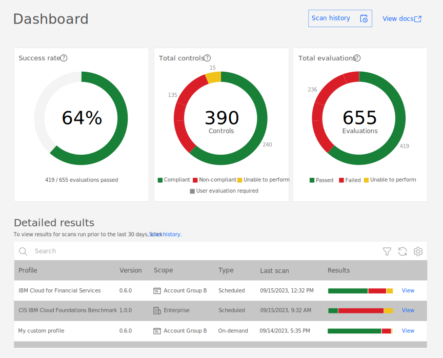
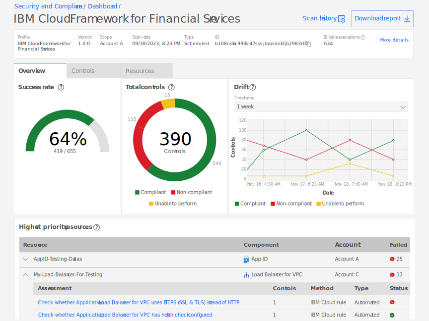

---

copyright:
  years: 2020, 2023
lastupdated: "2023-08-17"

keywords: custom profiles, user-defined, controls, goals, security, compliance

subcollection: security-compliance

---

{{site.data.keyword.attribute-definition-list}}


# Viewing results 
{: #results}

With {{site.data.keyword.compliance_full}}, you can view the results of a compliance evaluation in the dashboard or by using the API.
{: shortdesc}


## Before you begin
{: #before-results}

Before you get started, be sure that you have the required level of access to view results. To view results, you need the [**Operator** platform role or higher](/docs/security-compliance?topic=security-compliance-access-management). You must also have access to the credentials that are needed to access your resource configurations.

## Understanding the dashboard
{: #understand-dashboard}

As you evaluate your resources, the results are returned via the service UI in graphical and detailed formats.

{: caption="Figure 2. Example dashboard" caption-side="bottom"}

When you visit the dashboard, there are three graphical representations of data that has been aggregated from your scans. You see the:

Success rate
:   The rate at which your configurations pass the evaluation that is conducted. **Note:** The number of evaluations conducted does not always match the number of billable evaluations, as there is no charge for assessments evaluated as unable to perform. Be sure to look for the billable evaluations in each scan result if you need to estimate your cost.

Total controls
:   The total number of controls that have been evaluated in the past 30 days. 

Total evaluations
:   The total number of evaluations that have been run in the past 30 days. An evaluation is the check of one resource against one assessment.


## Viewing detailed results in the dashboard
{: #view-detailed-results}
{: ui}

To view the information of a scan, you can use the {{site.data.keyword.compliance_short}} UI.

You can filter results by tag. Tags are defined at the platform level. For help creating tags, see [Working with tags](/docs/account?topic=account-tag).
{: tip}

1. In the {{site.data.keyword.cloud_notm}} console, click the **Menu** icon  **> Security and compliance** to access {{site.data.keyword.compliance_short}}.
2. Click **Dashboard**.
3. In the **Detailed results** section, find the row for the specific **Scope** and **Profile** combination that you want to view results for and click **View** in the **Results** column.

A page opens with an **Overview** of your results. To further investigate, you can view the results by **Control** or by **Resource**. Check out the following table to see what information is available in each tab.

| | Description |
|:---|:---------|
| Overview | On the overview tab, you are provided with a graphical representation of your compliance for your selected scan.  \n {: caption="Figure 2. Example overview tab results" caption-side="bottom"}  \n  **Success rate**: The rate at which your configurations pass the evaluation that is conducted.  \n  **Total controls**: The total number of controls that were evaluated during this scan.  \n  **Drift**: The difference in results for your selected evaluation timeframe. |
| Controls | On the **Controls** tab, you are provided with an overview of the controls that were evaluated. The controls and their compliance status are listed for the time that the scan was done.
| Resources | On the **Resources** tab, you are provided with the results for each specific resource that was evaluated.  \n {: caption="Figure 3. Example results tab results" caption-side="bottom"}  \n In the **JSON** tab, you can see the assessment definition. In the **Parameters** tab, you can see the parameters that are relevant to that resource. In the **Non-compliant properties** tab, you are able to view which properties are non-compliant to begin remediating any issues that are found. In the **Controls** tab, you are able to view which controls that the assessment is associated with. |
{: caption="Table 1. Understanding detailed results" caption-side="top"}
{: row-headers}


## Viewing detailed results with the API
{: #view-detailed-results-api}
{: api}

To get a report summary, you can use the {{site.data.keyword.compliance_short}} API.

```bash
curl -X GET 
  --location --header "Authorization: Bearer {iam_token}" 
  --header "Accept: application/json"
"https://us-south.compliance.cloud.ibm.com/instances/{instance_id}/v3/reports/{report_id}/summary"
```
{: pre}
{: curl}

<sdk-go>

```go
(securityAndComplianceCenterApi *SecurityAndComplianceCenterApiV3) GetReportSummary(getReportSummaryOptions *GetReportSummaryOptions) (result *ReportSummary, response *core.DetailedResponse, err error)
```
{: codeblock}
{: go}

</sdk-go>sdk-java>

```java


```
{: codeblock}
{: java}

</sdk-java>

A successful response returns the detailed report from your scan, along with other metadata. For more information about the required and optional request parameters, check out the [API docs](/apidocs/security-compliance#get-report-summary).


### Understanding statuses
{: #status}

When you view results in {{site.data.keyword.compliance_short}}, each evaluation produces a result of `pass`, `fail`, `unable to perform`, or `user_evaluation_required`. Check out the following table to learn more about what each result means.

| Result | Description |
|:-------|:------------|
| Pass | Your resource was compliant with the defined standard. |
| Fail | Your resource was not compliant with the defined standard. |
| Unable to perform | The assessment could not be performed. Potential reasons include the resource not existing in your account, a misconfiguration, or an error on behalf of {{site.data.keyword.compliance_short}}. |
| User evaluation required | The assessment has not yet been automated. To validate that you are meeting the standard, you must check your resource manually. |
{: caption="Table 2. Understanding result statuses}


## Downloading a report
{: #download-report}
{: ui}

If you need to keep your results for long periods of time, or provide information to key stakeholders, you can download a report.

1. In the {{site.data.keyword.cloud_notm}} console, click the **Menu** icon  **> Security and compliance** to access {{site.data.keyword.compliance_short}}.
2. Click **Dashboard**.
3. Find the row for the specific **Scope** and **Profile** combination that you want to view results for and click the **Results** link. A page with the details of the latest evaluation opens.
4. Click **Download report**.

A CSV with your evaluation results is downloaded to your local system.
