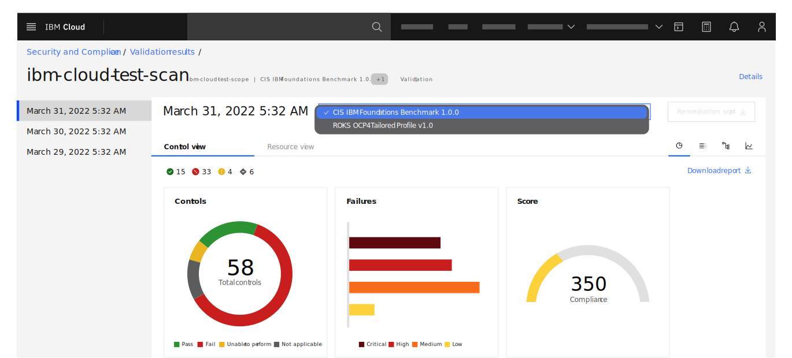

---

copyright:
  years: 2020, 2022
lastupdated: "2022-06-14"

keywords: scan ibm resources, compliance scan, evaluation, evaluate compliance

subcollection: security-compliance

content-type: tutorial
services: security-compliance
completion-time: 10m

---

{:codeblock: .codeblock}
{:screen: .screen}
{:download: .download}
{:external: target="_blank" .external}
{:faq: data-hd-content-type='faq'}
{:gif: data-image-type='gif'}
{:important: .important}
{:note: .note}
{:pre: .pre}
{:tip: .tip}
{:preview: .preview}
{:deprecated: .deprecated}
{:beta: .beta}
{:term: .term}
{:shortdesc: .shortdesc}
{:script: data-hd-video='script'}
{:support: data-reuse='support'}
{:table: .aria-labeledby="caption"}
{:troubleshoot: data-hd-content-type='troubleshoot'}
{:help: data-hd-content-type='help'}
{:tsCauses: .tsCauses}
{:tsResolve: .tsResolve}
{:tsSymptoms: .tsSymptoms}
{:java: .ph data-hd-programlang='java'}
{:javascript: .ph data-hd-programlang='javascript'}
{:swift: .ph data-hd-programlang='swift'}
{:curl: .ph data-hd-programlang='curl'}
{:video: .video}
{:step: data-tutorial-type='step'}
{:tutorial: data-hd-content-type='tutorial'}
{:ui: .ph data-hd-interface='ui'}
{:cli: .ph data-hd-interface='cli'}
{:api: .ph data-hd-interface='api'}
{:release-note: data-hd-content-type='release-note'}

# Step 4: Scan your resources and view results
{: #ibm-scan}
{: toc-content-type="tutorial"}
{: toc-services="security-compliance"}
{: toc-completion-time="10m"}

This tutorial is part 4 of a 4-part tutorial series that guides you through configuring the {{site.data.keyword.compliance_short}} to scan your {{site.data.keyword.cloud_notm}} resources for compliance.

You can choose to wait for your next scheduled scan, or you can run one on-demand to be sure that all of your configurations are done correctly. When your scan completes, you can view your results in the {{site.data.keyword.compliance_short}} UI. 

{: caption="Figure 1. Collector deployment" caption-side="bottom"}

## Before you begin
{: #ibm-scan-before}

To complete this tutorial, you must have completed [part 3](/docs/security-compliance?topic=security-compliance-ibm-credential-map). 

## Run an on-demand scan
{: #ibm-on-demand-scan}
{: step}

1. In the {{site.data.keyword.cloud_notm}} console, click the **Menu** icon  **> Security and Compliance** to access the {{site.data.keyword.compliance_short}}.
2. In **Manage Posture > Configure > Scopes** and select the scope that you previously created in part 2 of this tutorial series.
3. From the **Actions** drop-down, select **On-demand scan**.
4. Select **Validation**.
5. Select a **Profile** and then click **Create**.

## View your results
{: #ibm-results}
{: step}

When the scan is complete, you can return to the {{site.data.keyword.compliance_short}} UI and view your results. 

1. In the {{site.data.keyword.cloud_notm}} console, click the **Menu** icon  **> Security and Compliance** to access the {{site.data.keyword.compliance_short}}.
2. Go to the **Manage Posture > Assess > Validation results** page.
3. Select the scan that you want to view results for. The results that you see are displayed similarly to the following image.

{: caption="Figure 2. Viewing your validation results in the UI" caption-side="bottom"}

