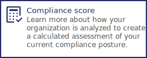

---

copyright:
  years: 2020, 2022
lastupdated: "2022-05-13"

keywords: getting started with the security and compliance center, get started, security, compliance

subcollection: security-compliance

content-type: tutorial
completion-time: 10m

---

{:codeblock: .codeblock}
{:screen: .screen}
{:download: .download}
{:external: target="_blank" .external}
{:faq: data-hd-content-type='faq'}
{:gif: data-image-type='gif'}
{:important: .important}
{:note: .note}
{:pre: .pre}
{:tip: .tip}
{:preview: .preview}
{:deprecated: .deprecated}
{:beta: .beta}
{:term: .term}
{:shortdesc: .shortdesc}
{:script: data-hd-video='script'}
{:support: data-reuse='support'}
{:table: .aria-labeledby="caption"}
{:troubleshoot: data-hd-content-type='troubleshoot'}
{:help: data-hd-content-type='help'}
{:tsCauses: .tsCauses}
{:tsResolve: .tsResolve}
{:tsSymptoms: .tsSymptoms}
{:java: .ph data-hd-programlang='java'}
{:javascript: .ph data-hd-programlang='javascript'}
{:swift: .ph data-hd-programlang='swift'}
{:curl: .ph data-hd-programlang='curl'}
{:video: .video}
{:step: data-tutorial-type='step'}
{:tutorial: data-hd-content-type='tutorial'}
{:ui: .ph data-hd-interface='ui'}
{:cli: .ph data-hd-interface='cli'}
{:api: .ph data-hd-interface='api'}
{:release-note: data-hd-content-type='release-note'}

# Monitor resources with an IBM-managed collector
{: #monitor-ibm-collector}
{: toc-content-type="tutorial"}
{: toc-completion-time="10m"}

With {{site.data.keyword.compliance_full}}, you can embed security checks into your every day workflows to help monitor for security and compliance. By monitoring for risks, you can identify security vulnerabilities and quickly work to mitigate the impact. This tutorial focuses on the steps that are required to start scanning your cloud-based resources with the {{site.data.keyword.compliance_short}} in {{site.data.keyword.cloud_notm}} by using an IBM-managed collector. 
{: shortdesc}

## Before you begin
{: #monitor-ibm-before}

To complete the getting started tutorial, use a [Pay-As-You-Go or Subscription](/docs/account?topic=account-accounts) {{site.data.keyword.cloud_notm}} account where you are the owner or have [full Administrator access](/docs/account?topic=account-assign-access-resources).

Be sure that you also have the following requirements:

- A [service ID API key](/docs/account?topic=account-serviceidapikeys) with **Read** access permissions for the resources that you want to scan.

## Create a collector
{: #create-ibm-collector}
{: step}

A collector is a software module that is packaged as a container image that scans your resources and validates their configurations. To learn more about collectors and how the communication takes place, see [What is a collector?](/docs/security-compliance?topic=security-compliance-collector).

IBM-managed collectors are created on IBM-owned infrastructure and are maintained by the {{site.data.keyword.compliance_short}}. If your organization doesn't allow managed collectors, you can always create and install your own. For more information, see [Manually administering collectors](/docs/security-compliance?topic=security-compliance-collector-manual).
{: note}

1. In the {{site.data.keyword.cloud_notm}} console, click the **Menu** icon  **> Security and compliance** to access the {{site.data.keyword.compliance_short}}.
1. On the [**Manage Posture > Configure > Collectors** page](/security-compliance/collectors) of the {{site.data.keyword.compliance_short}}, click **Create**.
1. Give your collector a name and description.

   It is helpful to ensure that the name is unique across your organization so that its intended purpose is clear to other members of your team.

1. If you have a passphrase enabled, the **Existing passphrase** field displays. Enter your passphrase. If you do not have a passphrase enabled, the field will not display.
1. Click **Next**.
1. In the **Managed by** field, select **IBM**. 
1. **UBI** is selected as the default container **image type**.

   Universal Base Images (UBI) are OCI-compliant container-based operating system images. They cannot be used with Windows OS.

1. By default, the **Private** endpoint type is selected.

   A collector requires constant communication with the service to validate your current posture. By default, a private endpoint is used for communication in all IBM-managed collectors.

1. Click **Create**. When the collector is created successfully, the status updates to **Installing**.

When your collector is ready, the status updates to **Active**.

## Add credentials
{: #monitor-ibm-credentials}
{: step}

The credentials that you add to the service must allow the collector to read your resource configurations.

1. In the navigation, click [**Manage Posture > Configure > Credentials**](https://{DomainName}/security-compliance/credentials).
2. Click **Create**.
3. Give your credential a meaningful name and description.
4. Select **Discovery/Collection**.
5. Click **Next**.
6. Select **{{site.data.keyword.cloud_notm}}**.
7. Paste your API key into the **IBM API key** field. For help with creating an API key, see [Understanding API keys](/docs/account?topic=account-manapikey).

   Your API key must have reader access permissions to the resources that you want to scan.
   {: note}

8. Verify your updates and click **Create**. The credential is added to a list of available credentials. 

## Create a scope
{: #monitor-ibm-scope}
{: step}

Target the resources that you want to validate by creating a scope and scheduling a scan. To create a scope, select an environment, select your collector, and select the credentials that are required to access your targeted resources. Then, you can schedule a scan to discover and validate your resource configurations.

1. In the {{site.data.keyword.cloud_notm}} console, click the **Menu** icon  **> Security and Compliance** to access the {{site.data.keyword.compliance_short}}.
2. In **Manage Posture > Configure > Scopes**, click **Create**.
3. Give your scope a name and description and then click **Next**.

   Be sure to give a detailed name as you use this field later to configure scans and remediation.
4. Select an **Environment** from the drop-down list.

   If you choose On-premises, you can select from multiple options to discover your resources. For example, you can [schedule a discovery scan](/docs/security-compliance?topic=security-compliance-schedule-scan), import resources from a file, or connect to a third party. Supported format for imported files is `.json`. Max file size is 30 MB.
5. From the **Credentials** drop-down, select a credential that you previously added to the service and then click **Next**.

   If you have not yet added a credential, you can use the following steps to add one and then select it from the drop-down.

   1. Click **Create**. A side panel opens.
   2. Provide a name and description.
   3. Select a **Purpose** and then click **Next**.
   4. Select a **Credential type**.
   5. Provide the information that is requested. For more information about each type of secret, see [Understanding credentials](/docs/security-compliance?topic=security-compliance-permissions#understand-credentials).
   6. Click **Create**.
   7. Repeat step 5.

6. From the table, select the [collector](/docs/security-compliance?topic=security-compliance-collector) or collectors that you want to use to gather configuration data and then click **Next**.
7. Create an attachment between your scope and profile by scheduling a scan. 

   1. Give your scan a name and description.
   2. Select a **Scan type**.
   3. From the **Profile** drop-down, select the profile that you want to use to evaluate your configuration.
   4. **Enable** or **Disable** the profiles that are associated with your integrated resources. For more information about integrations see the [integrations tab of the UI](/security-compliance/integrations){: external}.
   5. If applicable: Select a remediation type.

      Only some environments are configured to provide automatic remediation. For more information, see [Remediating issues](/docs/security-compliance?topic=security-compliance-remediation).

   6. The scan will automatically occur when the scope is created. To schedule additional scans select the **Frequency** at which you want them to be run and the date when you want the scan to **End**.

8. Click **Next** and review your selections.
9. Click **Create**. 

## Next steps
{: #monitor-ibm-next}

You did it! Now you can choose to map more credentials to your collector so that you can scan more resources or you can learn more about the way that security and compliance score is calculated to better understand your results. 

     

