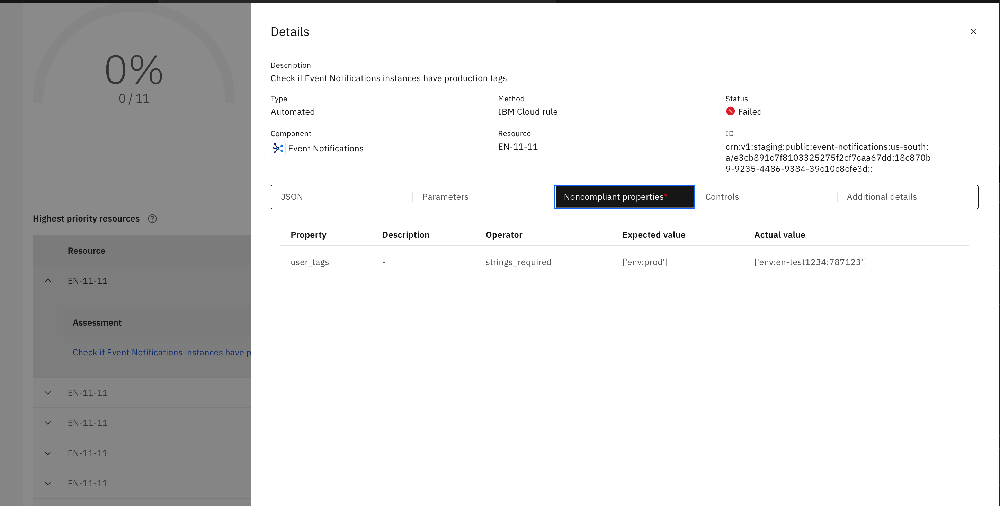

---

copyright:
  years: 2021, 2025
lastupdated: "2025-05-16"

keywords: customize rules, parameters, customize parameters, customize goals, security and compliance, tags

subcollection: security-compliance

content-type: tutorial
services: security-compliance
completion-time: 15m

---

{{site.data.keyword.attribute-definition-list}}

# Evaluate resources based on {{site.data.keyword.cloud_notm}} tags
{: #tutorial-tags}
{: toc-content-type="tutorial"}
{: toc-services="security-compliance"}
{: toc-completion-time="15m"}

As of 16 June 2025, you cannot create new instances in this version of this product. All of the functionality is now available in the updated experience of {{site.data.keyword.sysdigsecure_full}}. For more information, see [the transition documentation](/docs/security-compliance?topic=security-compliance-scc-transition). 
{: important}

In {{site.data.keyword.cloud_notm}}, resources can be tagged based on the needs of your organization. For example, all of the resources that are deployed in a production environment might have a specific tag, or you might add access tags to help control user access to your resources. In this tutorial, you will learn how to configure {{site.data.keyword.compliance_short}} to monitor a group of resources by tag.

## Summary of steps
{: #tutorial-tags-summary}

This tutorial walks you through the process of creating a custom rule and using it to create a custom control library. Next, you create a custom profile by pulling from your newly created library. Then, you create an attachment by selecting that profile and targeting only the resources that have the `env:prod` platform tag associated with them. You also define the schedule of the resource scanning as part of creating the attachment.

## Before you begin
{: #tutorial-tags-before}

Before you get started with this tutorial, be sure you have the prerequisites:

* An {{site.data.keyword.cloud_notm}} account.
* The required level of access to create and manage objects within {{site.data.keyword.compliance_short}}. To complete this tutorial you must have the [**Editor** platform role or higher](/docs/security-compliance?topic=security-compliance-access-management) for the {{site.data.keyword.compliance_short}} service. 
* An existing platform tag.

## Create a custom rule
{: #tutorial-tag-create-rule}
{: step}

Services that support resource tags have additional configuration properties such as `user_tags`, `service_tags` and `access_tags`. You can create custom rules by using one or more of these properties.

1. In the {{site.data.keyword.cloud_notm}} console, go to the **Resource list** page and select your instance of {{site.data.keyword.compliance_short}}.
2. In your instance of {{site.data.keyword.compliance_short}}, go to the **Controls** > **Rules** page and click **Create**.
3. Enter a Description. For example: `Check if Event Notifications instances have production tags`
4. Select **Event Notifications** as the service in the **Target your resource** section

   {: caption="Example of setting the target resource" caption-side="bottom"}

5. In the **Configure your properties** section, make the following selections.
   1. Select **user_tags** as the property.
   2. Select **strings_required** as the operator.
   3. Enter **env:prod** as the value.
   4. Click **Add to rule**.

      {: caption="Example of configuring resource properties" caption-side="bottom"}

6. Review the JSON of your rule to ensure that it is correct.

   {: caption="Example of the rule JSON" caption-side="bottom"}

7. Click **Next**.
8. Review the full rule definition and click **Create**.

Now you have a custom rule to check if Event Notifications resources have `env:prod` tag.

{: caption="Example of custom rule" caption-side="bottom"}

## Create a custom control library
{: #tutorial-tag-create-library}
{: step}

For {{site.data.keyword.compliance_short}} to use the control that you created, you must add it to a library. To create a custom control library, you can use the following steps.

1. Click **Controls > Control libraries** from the navigation menu in the {{site.data.keyword.compliance_short}} UI.
2. Click **Create**
3. Provide a **Name** and **Description** for your library. For example, your name might be `Monitor resources based on custom rules`. Then, click **Next**.
4. Add controls to your control library.
   1. Click **Create** in the **Group by control** section.
   2. Provide the details of your control.

   {: caption="Example of custom control" caption-side="bottom"}

   3. Add specifications to your control.
      1. Click **Add**.
      2. Enter a description.
      3. Select **Event Notifications** as the component.
      4. Select the rule that you created in the first step.
      5. Click **Create**.

         {: caption="Example of control specification" caption-side="bottom"}

5. Click **Create**.

{: caption="Example of custom control" caption-side="bottom"}

Your control library has a single control in this example. You can always add additional controls as needed. 

## Create a custom profile
{: #tutorial-tag-create-profile}
{: step}

To start evaluating your resources against your rule, you must add it to a profile. Controls can only be added to a profile from an existing library.

1. Click **Profiles** from the navigation menu in {{site.data.keyword.compliance_short}}. 

   If you are in the details page of the control library that you created, you can also click **Action > Create profile** to get to the next page.
   {: tip}

2. Click **Create**.
3. Provde a **Name** and **Description** for the profile. For example, your name might be `Monitoring resources by using tags`.
4. Add controls to your custom profile.
   1. Click **Add**.
   2. Select the **Custom** tab to view your custom control library.
   3. Select the control library that you created in the previous step.

      {: caption="Example of selecting a custom control" caption-side="bottom"}
    
   4. Select the control that you previously created.
   5. Click **Next**.

5. Review the profile and click **Create** when you're ready.

Now your custom rule is available within a profile to start evaluating your resources.

{: caption="Example of a custom profile" caption-side="bottom"}

## Evaluate your resources
{: #tutorial-tag-scan-resources}
{: step}

In {{site.data.keyword.compliance_short}}, evaluating your resources is done through an attachment. An attachment is a connection between a specific profile and a grouping of resources that is known as a scope. To initiate scanning of your resources, you can use the following steps to create an attachment.

1. Click **Profiles** from the navigation menu in {{site.data.keyword.compliance_short}}. 

   If you are in the details page of the control library that you created, you can also click **Action > Create profile** to get to the next page.
   {: tip}

1. In the profile details page, click on **Attachments** tab
2. Click on **Create** from the attachments table
3. Provide an attachment Name for example `Monitor resources using Tags` and click on **Next**
4. Since there are no parameters click on **Next**
5. Select the scope for the attachment and click on **Next**
6. If you want to go with the default scan settings (Scan running daily) then click on **Next** else modify the settings
7. Review and click on **Create**

   {: caption="Example of an attachment" caption-side="bottom"}

## Next steps
{: #tutorial-tag-create-next}

When the scan completes, your results become available in the {{site.data.keyword.compliance_short}} dashboard. Review the results to see the resources that are not compliant.

{: caption="Example of the result" caption-side="bottom"}
