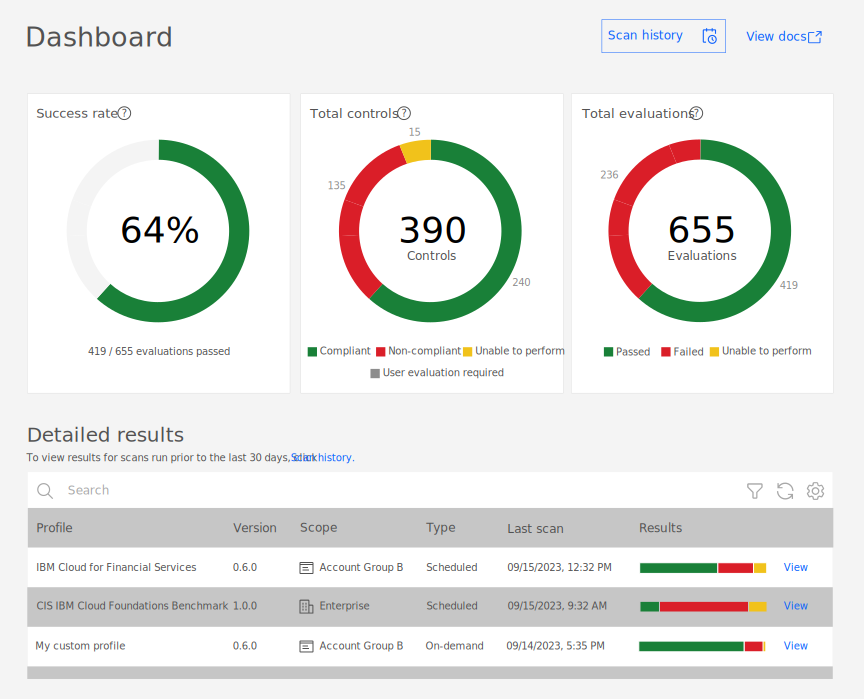

---

copyright:
  years: 2020
lastupdated: "2020-10-06"

keywords: compliance posture, security posture, audit evidence, security scan, evaluation results, scan results, scan results, compliance, score, security and compliance score

subcollection: security-compliance

---

{:codeblock: .codeblock}
{:screen: .screen}
{:download: .download}
{:external: target="_blank" .external}
{:faq: data-hd-content-type='faq'}
{:gif: data-image-type='gif'}
{:important: .important}
{:note: .note}
{:pre: .pre}
{:tip: .tip}
{:preview: .preview}
{:deprecated: .deprecated}
{:beta: .beta}
{:term: .term}
{:shortdesc: .shortdesc}
{:script: data-hd-video='script'}
{:support: data-reuse='support'}
{:table: .aria-labeledby="caption"}
{:troubleshoot: data-hd-content-type='troubleshoot'}
{:help: data-hd-content-type='help'}
{:tsCauses: .tsCauses}
{:tsResolve: .tsResolve}
{:tsSymptoms: .tsSymptoms}
{:java: .ph data-hd-programlang='java'}
{:javascript: .ph data-hd-programlang='javascript'}
{:swift: .ph data-hd-programlang='swift'}
{:curl: .ph data-hd-programlang='curl'}
{:video: .video}
{:step: data-tutorial-type='step'}
{:tutorial: data-hd-content-type='tutorial'}

# Viewing your current posture
{: #view-posture}

With the {{site.data.keyword.compliance_full}}, you can view the results of the validations for each scope that you defined in a single dashboard. You can see how the results of your scans affect your overall security and compliance score.
{: shortdesc}

## Understanding your security and compliance score
{: #understand-scores}

Your security and compliance score is an analytical assessment of your organization's current posture. The {{site.data.keyword.compliance_short}} assigns each goal a severity level when it is created. The goals can be `Critical`, `High`, `Medium`, and `Low`. Critical goals have a much greater impact to your compliance and security scores than a low severity goal.
{: shortdesc}

{: caption="Figure 1. Example security and compliance score breakdown" caption-side="bottom"}

**How is my security and compliance score calculated?**

Your security and compliance score is the weighted average of the goals that passed and failed determined by the severity of the goals. For example, say you have two goals. One is a high severity and one is low. If the high severity goal passed but the low severity goal failed, your compliance score would still be high. If the high severity goal failed but the low severity goal passed, your compliance score would be significantly impacted.

**How can I raise my security and compliance score?**

If you're not happy with your score, you can raise it by addressing the issues that are flagged. To make the biggest difference, try starting with the highest severity issues on the most significant resources. 

## Before you begin
{: #before-scan-results}

Before you get started, be sure that you have the required level of access to view and manage results. To view results, you need the viewer platform role or higher. For more information, see [Assigning access](/docs/security-compliance?topic=security-compliance-access-management).

## Viewing your dashboard
{: #view-dashboard}

In the {{site.data.keyword.compliance_short}}, you can see a graphical view of your current posture. Check out the following table to see the information that is displayed in the dashboard.

| Tile | Description |
|:------------|:------------| 
| Security and compliance score | A weighted average of your results. Your score is displayed for a specific profile and scope combination. To see information for another scope or profile, click the **Configuration** icon on the tile to select a new combination. |
| Scopes validated | The number of scopes in your account that are defined and the number that were validated. |
| Profiles validated | The number of profiles in your account that are available and the number that were validated. |
| Validations | The total number of validations run for your account. The tile also contains information about how many are recurring and how many were run once as an on-demand scan. |
|Most at risk resources | The resources in a scope that are the biggest detractor from your scores. To see information for another scope or profile, click the **Configuration** icon on the tile to select a new combination. |
| Results | The total number of scans and their results for your account displayed by date. |
{: caption="Table 1. Understanding the dashboard" caption-side="top"}

You can update the number of days that you want to see by selecting **Today**, **Yesterday**, or the **Last 7**, **15**, or **30 days**.
{: tip}

## Viewing validation results
{: #view-validations}

To see the results of a validation scan, you can use the {{site.data.keyword.compliance_short}} UI.

1. In the {{site.data.keyword.cloud_notm}} console, click the **Menu** icon  **> Security and compliance** to access the {{site.data.keyword.compliance_short}}.
2. In the navigation, click **Validate > Scans > Results**. A list of your scans that have associated results is shown.
3. In the **Validation results** table, click the **Name** of the scan. 

  A page opens with the detailed results of your scan. You can choose to view your results **By resource** or **By control**. Depending on your choice, your view options differ. Check out the following table to see your options.

  <table>
    <caption>Table 2. Understanding the way you can view your results</caption>
    <tr>
      <th>View</th>
      <th>Availability</th>
      <th>Description</th>
    </tr>
    <tr>
      <td>Chart</td>
      <td>By control</td>
      <td>A graphical display of the resource results including your security and compliance score for that scan.</td>
    </tr>
    <tr>
      <td>List</td>
      <td>By resource and control</td>
      <td>A list of the individual resources that were scanned. The result is displayed in numerical order based on goal ID.</td>
    </tr>
    <tr>
      <td>Tree</td>
      <td>By resource and control</td>
      <td>A nested tree display of the resources that were scanned. The results is displayed in numerical order based on the goal ID.</td>
    </tr>
    <tr>
      <td>Drift</td>
      <td>By control</td>
      <td>A graphical display of the change in results between each scan that is run.</td>
    </tr>
  </table>

4. Optional: Initiate remediation by clicking the **Remediation** icon or open a ticket to address any issues by clicking the **Bug** icon.
5. Optional: Export the results.

  <table>
    <tr>
      <th>Report type</th>
      <th>Description</th>
      <th>File type</th>
    </tr>
    <tr>
      <td>Detailed</td>
      <td>All of the control and resource information; organized by control.</td>
      <td><code>.xlxs</code> and <code>.pdf</code></td>
    </tr>
    <tr>
      <td>Delta</td>
      <td>The change between two selected detail reports.</td>
      <td><code>.pdf</code></td>
    </tr>
  </table>

## Viewing discovery and fact collection results
{: #view-discovery-collection}

To see the results of a discovery or fact collection scan, you can use the {{site.data.keyword.compliance_short}} UI. 

The scan results that are displayed by default are the most recent. To see previous scan results, use the timeline to select the specific scan that you want to view.
{: tip}

1. In the {{site.data.keyword.cloud_notm}} console, click the **Menu** icon  **> Security and compliance** to access the {{site.data.keyword.compliance_short}}.
2. In the navigation, click **Configure > Scopes**. A list of the scopes that are associated with your account is shown.
3. In the **Scopes** table, click the **Name** of the scope that you want to view results for. A page opens with detailed information about the available resources in that scope and their configurations. 
4. Select **Fact collection** or **Discovery** from the drop-down to adjust the results that you see. Check out the following table to learn more about your options for viewing results.

  <table>
    <caption>Table 3. Understanding what each view provides</caption>
    <tr>
      <th>View</th>
      <th>Description</th>
    </tr>
    <tr>
      <td>List</td>
      <td>A list of the individual resources that were scanned. The result is displayed in numerical order based on goal ID.</td>
    </tr>
    <tr>
      <td>Tree</td>
      <td>A nested tree display of the resources that were scanned. The results is displayed in numerical order based on the goal ID.</td>
    </tr>
    <tr>
      <td>Topology</td>
      <td>The topology of the resources that were scanned.</td>
    </tr>
  </table>

5. Optional: **Download facts** to keep a snapshot of your resource configurations at that point in time.

## Downloading a report
{: #download-report}

If you need to keep your results for long periods of time, or provide information to key stakeholders, you can download a report that details your security and compliance score for selected scopes.

1. In the {{site.data.keyword.cloud_notm}} console, click the **Menu** icon  **> Security and compliance** to access the {{site.data.keyword.compliance_short}}.
2. In the navigation, click **Dashboard**.
3. Click **Reports**. A side panel opens.
4. Select the scope or scopes that you want to download a report for.
5. Click **Next**.
6. Select the timeframe for which you want to download the scores.
7. Click **Generate report**.

