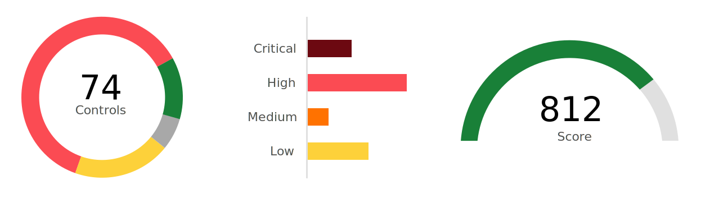

---

copyright:
  years: 2020, 2022
lastupdated: "2022-05-25"

keywords: compliance posture, security posture, audit evidence, security scan, evaluation results, scan results, scan results, compliance, score, compliance score

subcollection: security-compliance

---

{:codeblock: .codeblock}
{:screen: .screen}
{:download: .download}
{:external: target="_blank" .external}
{:faq: data-hd-content-type='faq'}
{:gif: data-image-type='gif'}
{:important: .important}
{:note: .note}
{:pre: .pre}
{:tip: .tip}
{:preview: .preview}
{:deprecated: .deprecated}
{:beta: .beta}
{:term: .term}
{:shortdesc: .shortdesc}
{:script: data-hd-video='script'}
{:support: data-reuse='support'}
{:table: .aria-labeledby="caption"}
{:troubleshoot: data-hd-content-type='troubleshoot'}
{:help: data-hd-content-type='help'}
{:tsCauses: .tsCauses}
{:tsResolve: .tsResolve}
{:tsSymptoms: .tsSymptoms}
{:java: .ph data-hd-programlang='java'}
{:javascript: .ph data-hd-programlang='javascript'}
{:swift: .ph data-hd-programlang='swift'}
{:curl: .ph data-hd-programlang='curl'}
{:video: .video}
{:step: data-tutorial-type='step'}
{:tutorial: data-hd-content-type='tutorial'}
{:ui: .ph data-hd-interface='ui'}
{:cli: .ph data-hd-interface='cli'}
{:api: .ph data-hd-interface='api'}
{:release-note: data-hd-content-type='release-note'}

# Viewing your current posture
{: #view-posture}

With the {{site.data.keyword.compliance_full}}, you can view the results of the validations for each scope that you defined in a single dashboard. You can see how the results of your scans affect your overall compliance score.
{: shortdesc}

## Understanding your compliance score
{: #understand-scores}

Your compliance score is an analytical assessment of your organization's current posture. The {{site.data.keyword.compliance_short}} assigns each goal a severity level when it is created. The goals can be `Critical`, `High`, `Medium`, and `Low`. Critical goals have a much greater impact to your compliance and security scores than a low severity goal.
{: shortdesc}

{: caption="Figure 1. Example compliance score breakdown" caption-side="bottom"}

### How is my compliance score calculated?
{: #score-calculation}

Your compliance score is the weighted average of the goals that passed and failed determined by the severity of the goals. For example, say you have two goals. One is a high severity and one is low. If the high severity goal passed but the low severity goal failed, your score would still be high. If the high severity goal failed but the low severity goal passed, your compliance score would be significantly impacted.

### How can I raise my compliance score?
{: #score-improve}

To improve your score, address the security and compliance issues that are found. To make the biggest difference, start with the highest severity issues on your most significant resources. 

## Understanding the dashboard 
{: #view-dashboard}

In the {{site.data.keyword.compliance_short}}, you can see a graphical view of your current posture. To view results, you need the viewer platform role or higher. For more information, see [Assigning access](/docs/security-compliance?topic=security-compliance-access-management).

To navigate to the dashboard: 

1. In the {{site.data.keyword.cloud_notm}} console, click the **Menu** icon  **> Security and compliance** to access the {{site.data.keyword.compliance_short}}.
2. Click **Dashboard**. Check out the following table to see the information that is displayed in the dashboard.

   | Tile | Description |
   |:------------|:------------| 
   | compliance score | A weighted average of your results. Your score is displayed for a specific environment. To see information for another environment, use the drop-down to select a new environment. |
   | Scopes validated | The number of scopes in your account that are defined and the number that were validated.|
   | Collector status | The status of the collectors that exist in your account. |
   | Total validations | The total number of validations run for your account. The tile also contains information about how many are recurring and how many were run once as an on-demand scan. |
   | Most at risk resources | The resources in your selected environment that are the biggest detractor from your score. To see information for another environment, use the drop-down to select a new environment. |
   | Control validation results | The total number of scans and their results for your account displayed by date. |
   {: caption="Table 1. Understanding the dashboard" caption-side="top"}

You can update the period of time that information is displayed for by selecting **Today**, **Yesterday**, or the **Last 7**, **15**, or **30 days** from the dropdown.
{: tip}

## Viewing validation results
{: #view-validations}

To see the results of a validation scan, you can use the {{site.data.keyword.compliance_short}} UI.

1. In the {{site.data.keyword.cloud_notm}} console, click the **Menu** icon  **> Security and compliance** to access the {{site.data.keyword.compliance_short}}.
2. In the navigation, click **Validate > Scans > Results**. A list of your scans that have associated results is shown.
3. In the **Validation results** table, click the **Name** of the scan. 

   A page opens with the detailed results of your scan. You can choose to view your results **By resource** or **By control**. Depending on your choice, your view options differ. Check out the following table to see your options.

   | View | Availability | Description |
   | --------- | ----------- | ----------- |
   | Chart | By control | A graphical display of the resource results including your compliance score for that scan. |
   | List | By resource and control | A list of the individual resources that were scanned. The result is displayed in numerical order based on goal ID. |
   | Tree | By resource and control | A nested tree display of the resources that were scanned. The results is displayed in numerical order based on the goal ID. |
   | Drift | By control | A graphical display of the change in results between each scan that is run. |
   {: caption="Table 2. Understanding result display options" caption-side="top"}

4. Optional: Initiate remediation by clicking the **Remediation** icon or open a ticket to address any issues by clicking the **Bug** icon.
5. Optional: Export the results.

   | Report type | Description | File type |
   | --------- | ----------- | ----------- |
   | Detailed | All the control and resource information; organized by control. | Microsoft Excel (`.xlsx`) and PDF (`.pdf`) |
   | Delta | The change between two selected detail reports. | PDF (`.pdf`) |
   {: caption="Table 3. Understanding export options" caption-side="top"}
  

## Viewing discovery and fact collection results
{: #view-discovery-collection}

To see the results of a discovery or fact collection scan, you can use the {{site.data.keyword.compliance_short}} UI. 

The scan results that are displayed by default are the most recent. To see previous scan results, use the timeline to select the specific scan that you want to view.
{: tip}

1. In the {{site.data.keyword.cloud_notm}} console, click the **Menu** icon  **> Security and compliance** to access the {{site.data.keyword.compliance_short}}.
2. In the navigation, click **Configure > Scopes**. A list of the scopes that are associated with your account is shown.
3. In the **Scopes** table, click the **Name** of the scope that you want to view results for. A page opens with detailed information about the available resources in that scope and their configurations. 
4. Select **Fact collection** or **Discovery** from the drop-down to adjust the results that you see. Check out the following table to learn more about your options for viewing results.

   | View | Description |
   | --------- | ----------- |
   | List | A list of the individual resources that were scanned. The result is displayed in numerical order based on goal ID. |
   | Tree | A nested tree display of the resources that were scanned. The results is displayed in numerical order based on the goal ID. |
   | Topology | The topology of the resources that were scanned. |
   {: caption="Table 4. Understanding what each view provides" caption-side="top"}

5. Optional: **Download facts** to keep a snapshot of your resource configurations at that point in time.

## Downloading a report
{: #download-report}

If you need to keep your results for long periods of time, or provide information to key stakeholders, you can download a report that details your compliance score for selected scopes.

1. In the {{site.data.keyword.cloud_notm}} console, click the **Menu** icon  > **Security and Compliance**.
2. In the **Manage posture** section, click **Assess > Scans**.
3. Click **Generate a report**.
4. Select the scans the scope that you want to download a report for.
5. Select the information that you want to include in your report.
6. Provide a start and end date for the evidence that you want included in your report.
7. Click **Generate report**. The file downloads to your local system.

